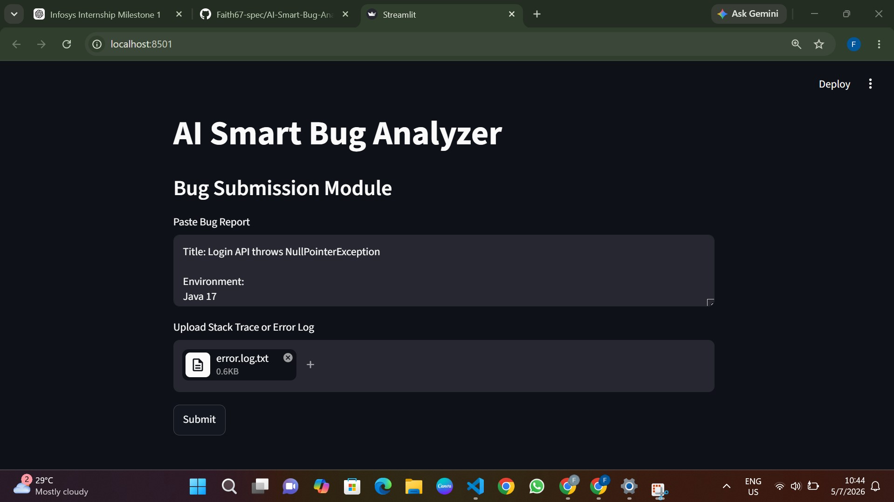
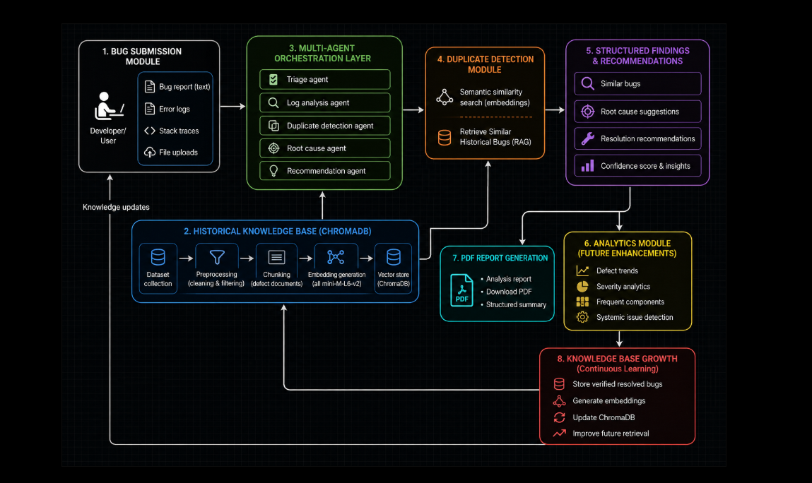
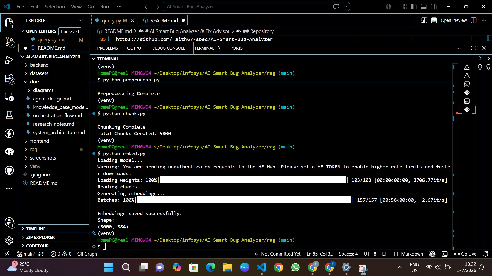
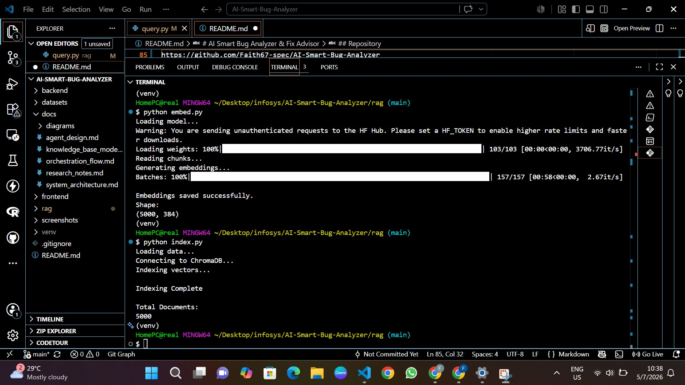
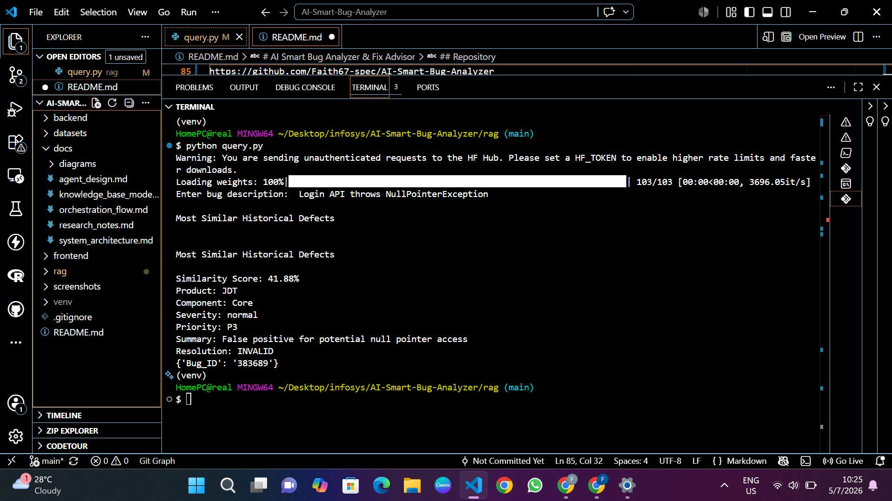

# AI Smart Bug Analyzer & Fix Advisor

## Overview

AI Smart Bug Analyzer & Fix Advisor is an intelligent defect analysis platform that leverages Retrieval-Augmented Generation (RAG), semantic similarity techniques, and historical defect repositories to analyze software bugs, detect duplicates, identify root causes, and recommend potential fixes.

This project is being developed as part of the Infosys Internship Program.

---

# Milestone 1 Objectives

Milestone 1 focuses on building the foundational components of the system, including:

✔ Defect Analysis Research

✔ System Architecture Design

✔ Agent Responsibility Definition

✔ Knowledge Base Design

✔ Bug Submission Module

✔ Historical Defect Knowledge Base

✔ Retrieval-Augmented Generation Pipeline

✔ Semantic Similarity Search

---

# Features Implemented

### Bug Submission Module

Supports:

- Direct bug report input
- Error log upload
- Stack trace upload
- Text file upload

Built using:

- Streamlit

---

### Historical Defect Knowledge Base

Dataset Source:

- Eclipse Bugzilla Dataset

Original Dataset Size:

- 10,000 bug reports

Selected Dataset:

- 5,000 bug reports

Selection Strategy:

A representative subset of 5,000 defects was selected to satisfy project requirements while maintaining efficient embedding generation and retrieval performance.

---

### RAG Pipeline

Workflow:

```text
Dataset Collection
        ↓
Preprocessing
        ↓
Chunking
        ↓
Embedding Generation
        ↓
ChromaDB Indexing
        ↓
Similarity Search
        ↓
Historical Defect Retrieval
```

---

# System Architecture

Modules used in the project:

### 1. Bug Submission Module

Paste or upload:

- Bug reports
- Stack traces
- Error logs

---

### 2. Historical Defect Knowledge Base

Stores historical defects from:

- Eclipse
- Mozilla
- Apache

Supports:

- Chunking
- Embedding generation
- Semantic retrieval

---

### 3. Multi-Agent Orchestration

Agents:

- Triage Agent
- Log Analysis Agent
- Root Cause Agent
- Duplicate Agent
- Remediation Agent

---

### 4. Duplicate Detection Module

Uses semantic similarity techniques for:

- Duplicate bug detection
- Historical defect retrieval
- Similarity matching

---

### 5. Structured Findings Module

Displays:

- Similar bugs
- Root cause suggestions
- Resolution recommendations

---

### 6. Analytics Module

Future enhancement:

- Severity trends
- Frequent defects
- Systemic issue detection

---

# Technology Stack

| Component | Technology |
|-----------|------------|
| Programming Language | Python |
| Backend Framework | FastAPI |
| Frontend Prototype | Streamlit |
| Embedding Model | all-MiniLM-L6-v2 |
| Vector Database | ChromaDB |
| RAG Framework | LangChain |
| Similarity Technique | Cosine Similarity |
| Dataset | Eclipse Bugzilla |
| Storage | SQLite |
| Version Control | GitHub |

---

# Project Structure

```text
AI-Smart-Bug-Analyzer/

│
├── backend/
│
├── datasets/
│   └── eclipse/
│       └── eclipse.csv
│
├── docs/
│   ├── research_notes.md
│   ├── system_architecture.md
│   ├── orchestration_flow.md
│   ├── agent_design.md
│   ├── knowledge_base_model.md
│   │
│   └── diagrams/
│       ├── system_architecture.png
│       ├── orchestration_flow.png
│       └── knowledge_base_model.png
│
├── frontend/
│   └── app.py
│
├── rag/
│   ├── preprocess.py
│   ├── chunk.py
│   ├── embed.py
│   ├── index.py
│   ├── query.py
│   │
│   ├── data/
│   │   ├── processed.csv
│   │   ├── chunks.csv
│   │   └── embeddings.npy
│   │
│   └── chroma_db/
│
├── screenshots/
│
├── .gitignore
│
├── README.md
│
└── requirements.txt
```

---

# Similarity Search Example

Input:

```text
Login API throws NullPointerException
```

Retrieved Results:

```text
Result 1

Similarity Score: 94%

Product: JDT

Component: UI

Summary:
NullPointerException getting thread group name.

Resolution:
FIXED
```

---

# Screenshots

### Bug Submission Module



---

### System Architecture



---

### Embedding Generation



---

### ChromaDB Indexing



---

### Similarity Retrieval



---

# Milestone 1 Progress

| Task | Status |
|-------|--------|
| Research | ✅ |
| Architecture Design | ✅ |
| Agent Design | ✅ |
| Knowledge Base Design | ✅ |
| Bug Submission Module | ✅ |
| Dataset Collection | ✅ |
| Preprocessing | ✅ |
| Chunking | ✅ |
| Embedding Generation | ✅ |
| ChromaDB Indexing | ✅ |
| Similarity Search | ✅ |

---

# Unique Enhancements

Additional features incorporated into the implementation:

- Similarity Score computation
- Confidence-based retrieval ranking
- Modular multi-agent architecture
- Extensible analytics framework
- Scalable RAG pipeline

---

# Future Work

Planned enhancements:

- Severity prediction
- Root cause classification
- Automated fix recommendation
- Defect analytics dashboard
- Agent monitoring interface

---

# Repository

GitHub Repository:

https://github.com/Faith67-spec/AI-Smart-Bug-Analyzer

---

# Authors

Infosys Internship Project

AI Smart Bug Analyzer & Fix Advisor

Milestone 1