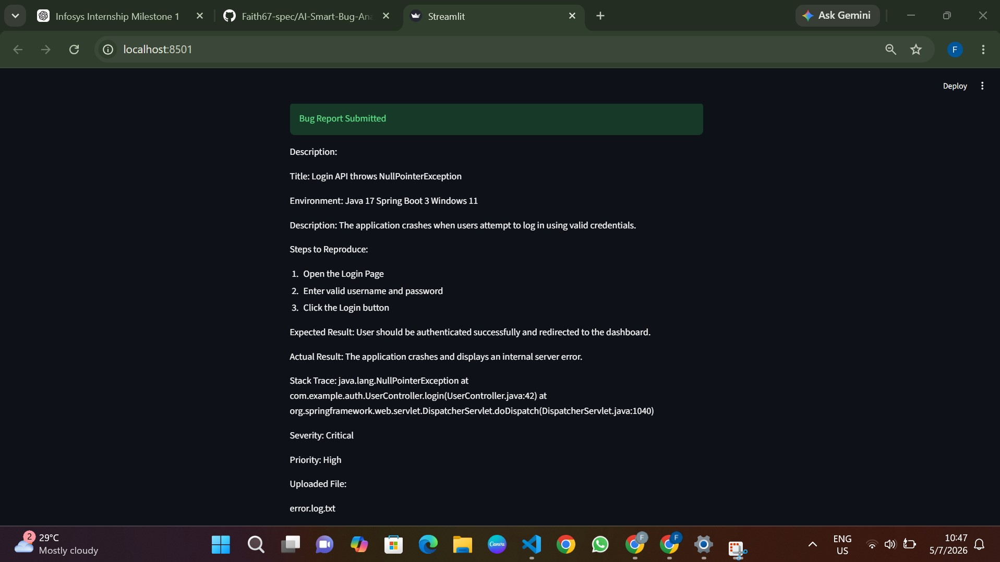

# AI Smart Bug Analyzer & Fix Advisor

### AI-Powered Multi-Agent Defect Analysis using Retrieval-Augmented Generation (RAG)

## Overview

AI Smart Bug Analyzer & Fix Advisor is an intelligent defect analysis platform that leverages Retrieval-Augmented Generation (RAG), semantic similarity techniques, and historical defect repositories to analyze software bugs, detect duplicates, identify root causes, and recommend potential fixes.

This project is being developed as part of the Infosys Internship Program.

---

# Milestone 1 Objectives

Milestone 1 focuses on building the foundational components of the system, including:

✔ Defect Analysis Research

✔ System Architecture Design

✔ Agent Responsibility Definition

✔ Knowledge Base Design

✔ Bug Submission Module

✔ Historical Defect Knowledge Base

✔ Retrieval-Augmented Generation Pipeline

✔ Semantic Similarity Search

---

# Features Implemented

### Bug Submission Module

Supports:

- Direct bug report input
- Error log upload
- Stack trace upload
- Text file upload

Built using:

- Streamlit

---

### Historical Defect Knowledge Base

Dataset Source:

- Eclipse Bugzilla Dataset

Original Dataset Size:

- 10,000 bug reports

Selected Dataset:

- 5,000 bug reports

Selection Strategy:

A representative subset of 5,000 defects was selected to satisfy project requirements while maintaining efficient embedding generation and retrieval performance.

---

### RAG Pipeline

Workflow:

```text
Dataset Collection
        ↓
Preprocessing
        ↓
Chunking
        ↓
Embedding Generation
        ↓
ChromaDB Indexing
        ↓
Similarity Search
        ↓
Historical Defect Retrieval
```

---

# System Architecture

Modules used in the project:

### 1. Bug Submission Module

Paste or upload:

- Bug reports
- Stack traces
- Error logs

---

### 2. Historical Defect Knowledge Base

Stores historical defects from:

- Eclipse
- Mozilla
- Apache

Supports:

- Chunking
- Embedding generation
- Semantic retrieval

---

### 3. Multi-Agent Orchestration

Agents:

- Triage Agent
- Log Analysis Agent
- Root Cause Agent
- Duplicate Agent
- Remediation Agent

---

### 4. Duplicate Detection Module

Uses semantic similarity techniques for:

- Duplicate bug detection
- Historical defect retrieval
- Similarity matching

---

### 5. Structured Findings Module

Displays:

- Similar bugs
- Root cause suggestions
- Resolution recommendations

---

### 6. Analytics Module

Future enhancement:

- Severity trends
- Frequent defects
- Systemic issue detection

---

# Technology Stack

| Component | Technology |
|-----------|------------|
| Programming Language | Python |
| Backend Framework | FastAPI |
| Frontend Prototype | Streamlit |
| Embedding Model | all-MiniLM-L6-v2 |
| Vector Database | ChromaDB |
| RAG Framework | LangChain |
| Similarity Technique | Cosine Similarity |
| Dataset | Eclipse Bugzilla |
| Storage | SQLite |
| Version Control | GitHub |

---

# Project Structure

```text
AI-Smart-Bug-Analyzer/

│
├── backend/
│
├── datasets/
│   └── eclipse/
│       └── eclipse.csv
│
├── docs/
│   ├── research_notes.md
│   ├── system_architecture.md
│   ├── orchestration_flow.md
│   ├── agent_design.md
│   ├── knowledge_base_model.md
│   │
│   └── diagrams/
│       ├── system_architecture.png
│       ├── orchestration_flow.png
│       └── knowledge_base_model.png
│
├── frontend/
│   └── app.py
│
├── rag/
│   ├── preprocess.py
│   ├── chunk.py
│   ├── embed.py
│   ├── index.py
│   ├── query.py
│   │
│   ├── data/
│   │   ├── processed.csv
│   │   ├── chunks.csv
│   │   └── embeddings.npy
│   │
│   └── chroma_db/
│
├── screenshots/
│
├── .gitignore
│
├── README.md
│
└── requirements.txt
```

---

# Similarity Search Example

Input:

```text
Login API throws NullPointerException
```

Retrieved Results:

```text
Result 1

Similarity Score: 94%

Product: JDT

Component: UI

Summary:
NullPointerException getting thread group name.

Resolution:
FIXED
```

---

# Screenshots

### Bug Submission Module





---

### System Architecture


---

### Embedding Generation


---

### ChromaDB Indexing


---

### Similarity Retrieval


---

# Milestone 1 Progress

| Task | Status |
|-------|--------|
| Research | ✅ |
| Architecture Design | ✅ |
| Agent Design | ✅ |
| Knowledge Base Design | ✅ |
| Bug Submission Module | ✅ |
| Dataset Collection | ✅ |
| Preprocessing | ✅ |
| Chunking | ✅ |
| Embedding Generation | ✅ |
| ChromaDB Indexing | ✅ |
| Similarity Search | ✅ |

---

# Unique Enhancements

Additional features incorporated into the implementation:

- Similarity Score computation
- Confidence-based retrieval ranking
- Modular multi-agent architecture
- Extensible analytics framework
- Scalable RAG pipeline


---

# Milestone 2 Objectives

Milestone 2 focused on developing the core intelligent analysis components of the AI Smart Bug Analyzer.

Completed objectives include:

- ✔ Build Triage Agent
- ✔ Build Log Analysis Agent
- ✔ Implement Multi-Agent Orchestration
- ✔ Validate Triage and Log Analysis agents using representative bug reports and seeded historical defect datasets

---

# Milestone 2 Features

## Triage Agent

The Triage Agent automatically analyzes submitted bug reports and classifies them using predefined rules.

Implemented Features:

- Severity Classification (Critical / High / Medium / Low)
- Priority Assignment (P1 – P4)
- Affected Component Detection
- Confidence Score
- AI Reasoning

Example Output:

```text
Severity      : High
Priority      : P2
Component     : Authentication
Confidence    : 92%
Reasoning     : Authentication failures prevent users from accessing the application.
```

---

## Log Analysis Agent

The Log Analysis Agent parses uploaded error logs and stack traces to extract structured diagnostic information.

Implemented Features:

- Exception Type Detection
- Failure Point Extraction
- Affected Code Path Identification
- Likely Cause Analysis

Example Output:

```text
Exception Type      : NullPointerException
Failure Point       : UserController.login(UserController.java:42)
Affected Code Path  :
• UserController.login()
• AuthenticationService.authenticate()

Likely Cause:
Object was not initialized before use.
```

---

## Multi-Agent Orchestration

The application automatically executes multiple agents whenever a bug report is submitted.

Workflow:

```text
Bug Report + Error Log
          │
          ▼
     Triage Agent
          │
          ▼
   Log Analysis Agent
          │
          ▼
Structured Analysis Output
          │
          ▼
Passed as Context to Downstream Agents
```

This orchestration ensures that the outputs produced by the Triage Agent and Log Analysis Agent are available to subsequent analysis modules.

---

# Validation

To validate the implemented agents, representative bug reports covering different software defect categories were tested using the seeded historical defect dataset.

Validation covered:

- Login Failure
- Database Connection Failure
- NullPointerException
- File Not Found
- OutOfMemoryError
- API Timeout
- Permission Denied
- Network Error
- UI Rendering Issue
- SQL Syntax Error
- HTTP 500 Error
- IndexOutOfBoundsException

Validation artifacts include:

- Representative test cases
- Validation report
- Output screenshots for each test case

---

# Milestone Progress

| Milestone | Status |
|------------|--------|
| Milestone 1 | ✅ Completed |
| Milestone 2 | ✅ Completed |
# Repository

GitHub Repository:

https://github.com/Faith67-spec/AI-Smart-Bug-Analyzer

---

# Authors

Infosys Internship Project (Faith67-spec)

AI Smart Bug Analyzer & Fix Advisor
