  # CREATION OF INTELLIGENT BUG DIAGNOSIS PLATFORM WITH FIX RECOMMENDATION ASSISTANCE
### Group 2
### PROJECT REPORT

# TABLE OF CONTENTS

- [CREATION OF INTELLIGENT BUG DIAGNOSIS PLATFORM WITH FIX RECOMMENDATION ASSISTANCE](#creation-of-intelligent-bug-diagnosis-platform-with-fix-recommendation-assistance)
    - [Group 2](#group-2)
    - [PROJECT REPORT](#project-report)
- [TABLE OF CONTENTS](#table-of-contents)
  - [1. ABSTRACT](#1-abstract)
- [2. INTRODUCTION](#2-introduction)
  - [2.1 Background](#21-background)
  - [2.2 Motivation](#22-motivation)
- [3. PROBLEM STATEMENT](#3-problem-statement)
- [4. OBJECTIVES](#4-objectives)
- [5. SCOPE OF THE PROJECT](#5-scope-of-the-project)
- [6. EXISTING SYSTEM](#6-existing-system)
  - [6.1 Limitations of the Existing Approach](#61-limitations-of-the-existing-approach)
- [7. PROPOSED SYSTEM](#7-proposed-system)
- [8. SYSTEM COMPONENTS](#8-system-components)
  - [8.1 Streamlit Frontend](#81-streamlit-frontend)
  - [8.2 Bug Analysis Orchestrator](#82-bug-analysis-orchestrator)
  - [8.3 Triage Agent](#83-triage-agent)
  - [8.4 Log Analysis Agent](#84-log-analysis-agent)
  - [8.5 Root Cause Agent](#85-root-cause-agent)
  - [8.6 RAG and Similar Bug Retrieval](#86-rag-and-similar-bug-retrieval)
  - [8.7 Recommendation Agent](#87-recommendation-agent)
  - [8.8 Analytics Module](#88-analytics-module)
  - [8.9 Knowledge Base Growth Module](#89-knowledge-base-growth-module)
  - [8.10 PDF Report Generator](#810-pdf-report-generator)
- [9. SYSTEM ARCHITECTURE](#9-system-architecture)
  - [9.1 Presentation Layer](#91-presentation-layer)
  - [9.2 Orchestration Layer](#92-orchestration-layer)
  - [9.3 AI Agent Layer](#93-ai-agent-layer)
  - [9.4 Retrieval and Knowledge Base Layer](#94-retrieval-and-knowledge-base-layer)
  - [9.5 Analytics Layer](#95-analytics-layer)
  - [9.6 Reporting Layer](#96-reporting-layer)
    - [9.7 Overall System Architecture](#97-overall-system-architecture)
  - [9.8 End-to-End Component Interaction](#98-end-to-end-component-interaction)
- [10. TECHNOLOGY STACK](#10-technology-stack)
  - [10.1 Frontend Technology](#101-frontend-technology)
    - [Streamlit](#streamlit)
  - [10.2 Programming Language](#102-programming-language)
    - [Python](#python)
  - [10.3 Artificial Intelligence and NLP](#103-artificial-intelligence-and-nlp)
    - [Sentence Transformers](#sentence-transformers)
    - [AI Analysis Components](#ai-analysis-components)
  - [10.4 Retrieval and Vector Database](#104-retrieval-and-vector-database)
    - [ChromaDB](#chromadb)
  - [10.5 Historical Dataset](#105-historical-dataset)
    - [Eclipse Bugzilla Dataset](#eclipse-bugzilla-dataset)
  - [10.6 Data Processing](#106-data-processing)
    - [Pandas](#pandas)
    - [NumPy](#numpy)
  - [10.7 Reporting](#107-reporting)
    - [PDF Generation](#pdf-generation)
  - [10.8 Development Environment](#108-development-environment)
- [11. SYSTEM IMPLEMENTATION](#11-system-implementation)
  - [11.1 Bug Submission](#111-bug-submission)
  - [11.2 Bug Analysis Orchestration](#112-bug-analysis-orchestration)
  - [11.3 Bug Triage](#113-bug-triage)
  - [11.4 Log and Exception Analysis](#114-log-and-exception-analysis)
  - [11.5 Root Cause Analysis](#115-root-cause-analysis)
  - [11.6 Historical Defect Retrieval](#116-historical-defect-retrieval)
  - [11.7 Fix Recommendation](#117-fix-recommendation)
  - [11.8 Defect Pattern Analytics](#118-defect-pattern-analytics)
  - [11.9 Knowledge Base Growth](#119-knowledge-base-growth)
  - [11.10 PDF Report Generation](#1110-pdf-report-generation)
- [12. RETRIEVAL-AUGMENTED GENERATION (RAG) IMPLEMENTATION](#12-retrieval-augmented-generation-rag-implementation)
  - [12.1 Historical Defect Data Preparation](#121-historical-defect-data-preparation)
  - [12.2 Embedding Generation](#122-embedding-generation)
  - [12.3 ChromaDB Vector Storage](#123-chromadb-vector-storage)
  - [12.4 Semantic Retrieval](#124-semantic-retrieval)
  - [12.5 Similar Bug Presentation](#125-similar-bug-presentation)
  - [12.6 Knowledge Base Growth and RAG](#126-knowledge-base-growth-and-rag)
- [13. DEFECT PATTERN ANALYTICS MODULE](#13-defect-pattern-analytics-module)
  - [13.1 Analytics Data Storage](#131-analytics-data-storage)
  - [13.2 Defect Pattern Dashboard](#132-defect-pattern-dashboard)
  - [13.3 Severity Analysis](#133-severity-analysis)
  - [13.4 Exception Analysis](#134-exception-analysis)
  - [13.5 Component Analysis](#135-component-analysis)
  - [13.6 Root Cause Pattern Analysis](#136-root-cause-pattern-analysis)
  - [13.7 AI-Generated Analytics Insights](#137-ai-generated-analytics-insights)
  - [13.8 Purpose of Defect Pattern Analytics](#138-purpose-of-defect-pattern-analytics)
- [14. KNOWLEDGE BASE GROWTH MECHANISM](#14-knowledge-base-growth-mechanism)
  - [14.1 Resolved Bug Submission](#141-resolved-bug-submission)
  - [14.2 Knowledge Document Creation](#142-knowledge-document-creation)
  - [14.3 Embedding Generation](#143-embedding-generation)
  - [14.4 ChromaDB Storage](#144-chromadb-storage)
  - [14.5 Future Retrieval](#145-future-retrieval)
  - [14.6 Knowledge Base Growth Verification](#146-knowledge-base-growth-verification)
- [15. END-TO-END TESTING](#15-end-to-end-testing)
  - [15.1 Testing Objectives](#151-testing-objectives)
  - [15.2 Test Approach](#152-test-approach)
  - [15.3 End-to-End Test Cases](#153-end-to-end-test-cases)
  - [15.4 Knowledge Base Growth Test](#154-knowledge-base-growth-test)
  - [15.5 Analytics Verification](#155-analytics-verification)
  - [15.6 Testing Outcome](#156-testing-outcome)
- [16. RESULTS AND FINDINGS](#16-results-and-findings)
  - [16.1 Bug Analysis Results](#161-bug-analysis-results)
      - [Test Evidence:](#test-evidence)
  - [16.2 Root Cause Analysis Results](#162-root-cause-analysis-results)
  - [16.3 Historical Defect Retrieval Results](#163-historical-defect-retrieval-results)
  - [16.4 Knowledge Base Growth Results](#164-knowledge-base-growth-results)
  - [16.5 Analytics Results](#165-analytics-results)
      - [Test evidence:](#test-evidence-1)
  - [16.6 PDF Reporting Results](#166-pdf-reporting-results)
      - [After hitting download pdf button](#after-hitting-download-pdf-button)
  - [16.7 Overall Findings](#167-overall-findings)
- [17. CHALLENGES AND LESSONS LEARNED](#17-challenges-and-lessons-learned)
  - [17.1 Challenges Encountered](#171-challenges-encountered)
    - [AI Analysis Integration](#ai-analysis-integration)
    - [Semantic Retrieval](#semantic-retrieval)
    - [Knowledge Base Growth](#knowledge-base-growth)
    - [Analytics Integration](#analytics-integration)
    - [End-to-End Integration](#end-to-end-integration)
  - [17.2 Lessons Learned](#172-lessons-learned)
    - [Importance of Modular Architecture](#importance-of-modular-architecture)
    - [Value of Historical Knowledge](#value-of-historical-knowledge)
    - [Importance of Verification](#importance-of-verification)
    - [Continuous Knowledge Improvement](#continuous-knowledge-improvement)
    - [Importance of End-to-End Testing](#importance-of-end-to-end-testing)
- [18. LIMITATIONS AND FUTURE ENHANCEMENTS](#18-limitations-and-future-enhancements)
  - [Current limitations](#current-limitations)
  - [18.1 Improved Root Cause Accuracy](#181-improved-root-cause-accuracy)
  - [18.2 Advanced Duplicate Detection](#182-advanced-duplicate-detection)
  - [18.3 Larger and More Diverse Knowledge Base](#183-larger-and-more-diverse-knowledge-base)
  - [18.4 Continuous Knowledge Base Learning](#184-continuous-knowledge-base-learning)
  - [18.5 Code Repository Integration](#185-code-repository-integration)
  - [18.6 Enhanced Analytics](#186-enhanced-analytics)
  - [18.7 Improved Recommendation Assistance](#187-improved-recommendation-assistance)
  - [18.8 Multilingual Bug Analysis](#188-multilingual-bug-analysis)
  - [18.9 Automated Testing Integration](#189-automated-testing-integration)
  - [18.10 Human-in-the-Loop Validation](#1810-human-in-the-loop-validation)
- [19. CONCLUSION](#19-conclusion)
- [20. REFERENCES](#20-references)
- [21. APPENDICES](#21-appendices)
  - [Appendix A — Project Structure](#appendix-a--project-structure)
  - [Appendix B — Example Bug Analysis](#appendix-b--example-bug-analysis)
  - [Appendix C — Knowledge Base Growth Demonstration](#appendix-c--knowledge-base-growth-demonstration)
  - [Appendix D — Screenshots and Implementation Evidence](#appendix-d--screenshots-and-implementation-evidence)
    - [D.1 Main AI Bug Analyzer Interface](#d1-main-ai-bug-analyzer-interface)
    - [D.2 Bug Submission](#d2-bug-submission)
    - [D.3 Triage Results](#d3-triage-results)
    - [D.4 Log Analysis Results](#d4-log-analysis-results)
    - [D.5 Root Cause Analysis](#d5-root-cause-analysis)
    - [D.6 Fix Recommendations](#d6-fix-recommendations)
    - [D.7 Similar Bugs / RAG Results](#d7-similar-bugs--rag-results)
    - [D.8 Defect Pattern Analytics Dashboard](#d8-defect-pattern-analytics-dashboard)
    - [D.9 Knowledge Base Growth Confirmation](#d9-knowledge-base-growth-confirmation)
    - [D.10 Retrieved Newly Stored Resolved Bug](#d10-retrieved-newly-stored-resolved-bug)
    - [D.11 Generated PDF Report](#d11-generated-pdf-report)
  - [](#)
## 1. ABSTRACT


Software defects are an unavoidable part of software development and can affect application reliability, maintainability, and development time. Traditional bug diagnosis often requires developers to manually inspect bug descriptions, application logs, stack traces, historical defect records, and previous resolutions. This process can become time-consuming, particularly when dealing with a large number of software defects.

The Creation of Intelligent Bug Diagnosis Platform with Fix Recommendation Assistance is an AI-powered platform developed to assist developers in diagnosing software defects and identifying appropriate fix recommendations. The platform uses a multi-agent architecture in which specialized AI components perform bug triage, log analysis, root cause identification, historical defect retrieval, and recommendation generation.

The platform incorporates Retrieval-Augmented Generation (RAG) to retrieve semantically similar historical software defects from a vector-based knowledge base. Historical Eclipse Bugzilla defect records are converted into vector embeddings and stored in ChromaDB, allowing newly submitted bugs to be compared with previously reported defects using semantic similarity.

The platform also provides a Defect Pattern Analytics Dashboard that identifies recurring exceptions, frequently affected components, severity distributions, and recurring root cause patterns across submitted bugs. A Knowledge Base Growth Mechanism allows verified resolved defects to be added to the vector database so that newly acquired knowledge can be reused during future analyses.

The system provides a complete bug analysis workflow covering bug submission, multi-agent analysis, historical defect retrieval, root cause identification, fix recommendation, analytics, knowledge base growth, and PDF report generation.

End-to-end testing was conducted using multiple bug submissions to validate the complete analysis pipeline and the integration of the major system components.

The resulting platform provides an integrated environment for intelligent software defect diagnosis, historical defect reuse, fix recommendation assistance, defect pattern analysis, knowledge base growth, and automated reporting.

# 2. INTRODUCTION

## 2.1 Background

Software applications frequently encounter defects during development, testing, deployment, and maintenance. These defects can range from simple validation errors to complex runtime failures involving databases, authentication, collections, file processing, and application logic.

Identifying the root cause of a software defect commonly requires developers to inspect error messages, stack traces, application logs, source code, and previously resolved issues. Developers may also need to search historical bug tracking systems to determine whether a similar defect has already been reported and resolved.

As software systems become larger and more complex, manually performing these activities can require significant time and effort. The increasing volume of software defects also makes it difficult for development teams to consistently analyse, document, and reuse previous defect knowledge.

Artificial Intelligence provides an opportunity to assist developers by automatically analysing defect information and generating useful diagnostic information. Semantic search and Retrieval-Augmented Generation (RAG) further allow AI systems to make use of historical defect knowledge when analysing new bugs.

This project therefore focuses on developing an intelligent software defect diagnosis platform that combines Artificial Intelligence, multi-agent processing, semantic vector retrieval, analytics, knowledge base growth, and fix recommendation assistance.

The platform is designed to support developers by bringing multiple stages of defect investigation into a single workflow while keeping the final diagnosis and resolution decision under human review.

---

## 2.2 Motivation

The project was motivated by the need to reduce the manual effort involved in software bug investigation and improve the reuse of historical defect knowledge.

A developer analysing a new defect may need to:

1. Understand the reported problem.
2. Determine the severity of the defect.
3. Inspect the stack trace or application logs.
4. Identify the probable root cause.
5. Search for similar historical defects.
6. Examine previous resolutions.
7. Determine an appropriate fix or remediation approach.
8. Document the investigation and its findings.

Performing these activities separately can increase investigation time and may result in previously resolved knowledge being overlooked.

The proposed platform integrates these activities into a unified workflow. It uses specialized AI components to examine different aspects of a defect, semantic retrieval to identify relevant historical defects, and analytics to identify recurring patterns across submitted bugs.

The Knowledge Base Growth Mechanism further supports continuous improvement by allowing verified resolved defects to be stored in the vector database and reused during future analyses.

# 3. PROBLEM STATEMENT

Traditional software defect diagnosis depends heavily on manual investigation, developer experience, and access to historical defect information.

The major problems associated with conventional defect diagnosis include:

* Manual inspection of bug reports and application logs.
* Difficulty identifying the probable root cause quickly.
* Difficulty analysing different stack trace and exception formats.
* Repeated investigation of defects that may already have historical solutions.
* Difficulty finding semantically similar defects when different wording is used.
* Limited reuse of previously resolved defect knowledge.
* Lack of centralized analysis of recurring defect patterns.
* Time-consuming preparation and documentation of defect analysis results.

When historical defect information is available, developers may still need to manually search through large collections of bug reports to identify relevant previous cases. Keyword-based searches can also fail when two defects describe similar problems using different terminology.

There is therefore a need for an intelligent platform that can analyse submitted bug information, identify probable causes, retrieve relevant historical defects using semantic similarity, provide fix recommendation assistance, analyse recurring defect patterns, and allow verified resolved defects to become part of the knowledge base for future analysis.

The proposed system addresses these challenges by combining a multi-agent AI architecture with Retrieval-Augmented Generation, vector-based semantic search, analytics, knowledge base growth, and automated reporting.

# 4. OBJECTIVES

The main objective of the project is to develop an intelligent platform capable of assisting developers in software defect diagnosis and fix recommendation.

The specific objectives of the project are:

1. Develop an AI-based bug triage mechanism to classify submitted defects and determine their severity.

2. Analyse application logs, exceptions, and stack traces to extract relevant diagnostic information.

3. Identify probable root causes of reported software defects.

4. Generate confidence scores for root cause hypotheses to indicate the reliability of the analysis.

5. Retrieve semantically similar historical defects using Retrieval-Augmented Generation (RAG).

6. Assist in identifying related or potentially duplicate historical defects.

7. Generate AI-assisted remediation and fix recommendations based on the available diagnostic information.

8. Provide a user-friendly interface for submitting bugs, uploading logs, and viewing analysis results.

9. Generate structured PDF reports containing the results of the bug analysis.

10. Develop a Defect Pattern Analytics Dashboard to analyse trends across submitted defects.

11. Identify recurring exceptions, frequently affected components, severity distributions, and recurring root cause patterns.

12. Implement a Knowledge Base Growth Mechanism that allows verified resolved defects to be stored back into the vector database.

13. Validate the complete system through end-to-end testing using multiple bug submissions and different defect scenarios.
# 5. SCOPE OF THE PROJECT

The project focuses on the intelligent analysis of software defect submissions containing bug descriptions, application logs, exceptions, and stack traces.

The scope of the platform includes the following capabilities:

* Bug description submission through the user interface.
* Application log file upload.
* Automated bug triage and severity classification.
* Application log and exception analysis.
* Root cause hypothesis generation.
* Confidence scoring for root cause analysis.
* Semantic retrieval of similar historical defects.
* Historical defect and resolution information display.
* AI-assisted fix and remediation recommendations.
* Defect pattern analytics.
* Knowledge base growth through verified resolved defects.
* Automated PDF report generation.
* End-to-end processing of multiple bug submissions.

The platform uses historical Eclipse Bugzilla defect data as its primary historical knowledge source. The historical records are converted into vector embeddings and stored in ChromaDB for semantic retrieval.

The platform is intended to provide decision support to developers and testers. The results generated by the AI system, including root cause hypotheses and fix recommendations, should be reviewed and verified by a human before being treated as confirmed solutions.

The project does not aim to completely replace software developers or guarantee that every generated diagnosis is correct. Instead, it aims to reduce investigation effort, improve access to historical defect knowledge, and assist developers in making informed debugging decisions.

# 6. EXISTING SYSTEM

Traditional software defect diagnosis generally follows a manual investigation process. When a defect is reported, a developer typically reviews the bug description, examines application logs and stack traces, investigates the probable cause, and searches for previously reported defects that may be related to the current problem.

A simplified workflow of the existing approach is:


In this approach, the developer is responsible for connecting information from different sources and determining the most appropriate resolution.

## 6.1 Limitations of the Existing Approach

The major limitations of the traditional approach include:

* High dependence on developer experience and manual investigation.
* Time-consuming inspection of bug reports, logs, and stack traces.
* Difficulty identifying the probable root cause quickly.
* Difficulty finding semantically similar historical defects when different terminology is used.
* Repeated analysis of defects that may already have known historical solutions.
* Limited reuse of newly resolved defect knowledge.
* Lack of centralized analysis of recurring defect patterns.
* Manual preparation and documentation of defect analysis results.

These limitations create a need for an intelligent system that can automate and assist multiple stages of the defect diagnosis process.
# 7. PROPOSED SYSTEM

The proposed system is an AI-powered intelligent bug diagnosis platform designed to assist developers throughout the software defect investigation process.

The system integrates a **multi-agent architecture**, **Retrieval-Augmented Generation (RAG)**, **semantic vector search**, **defect pattern analytics**, **knowledge base growth**, and **automated PDF reporting** into a single platform.

The proposed workflow is:


The system begins when a user submits a bug description or application log through the Streamlit interface. The Bug Analysis Orchestrator then coordinates the different analysis components.

The Triage Agent analyses the defect and determines its severity. The Log Analysis Agent examines available logs, exceptions, and stack traces. The Root Cause Agent generates a probable root cause, affected module, technical explanation, and confidence score.

The system then performs semantic retrieval against the historical defect knowledge base using RAG. Similar historical defects and their available resolution information are presented to the user as supporting evidence.

Based on the analysis and retrieved information, the Recommendation Agent generates potential remediation or fix recommendations.

The completed analysis can be presented through the user interface and generated as a PDF report. Analysis results are also stored for the Defect Pattern Analytics Dashboard.

When a bug has been verified and resolved, the Knowledge Base Growth Mechanism allows the resolved defect and its resolution information to be converted into an embedding and stored in ChromaDB. This enables the newly acquired knowledge to be retrieved during future analyses.

# 8. SYSTEM COMPONENTS

The proposed platform consists of several interconnected components. Each component performs a specific function within the overall intelligent bug diagnosis workflow.

## 8.1 Streamlit Frontend

The Streamlit frontend provides the main user interface of the platform.

It allows users to:

* Enter a bug description.
* Upload application log files.
* Start AI-based bug analysis.
* View analysis results.
* View similar historical bugs.
* View fix recommendations.
* Generate PDF reports.
* Add verified resolved bugs to the knowledge base.
* Access the Defect Pattern Analytics Dashboard.

---

## 8.2 Bug Analysis Orchestrator

The Bug Analysis Orchestrator coordinates the complete bug analysis workflow.

It receives the submitted bug description and log information and manages the execution of the different analysis components.

The orchestrator combines the outputs into a structured analysis containing:

* Triage results.
* Log analysis results.
* Root cause analysis.
* Recommendation results.
* Similar historical bugs.

This allows the individual components to perform specialized tasks while contributing to one complete defect diagnosis pipeline.

---

## 8.3 Triage Agent

The Triage Agent analyses the submitted defect and determines its severity and relevant classification information.

The resulting triage information is presented to the user as part of the AI analysis.

---

## 8.4 Log Analysis Agent

The Log Analysis Agent analyses application logs, exceptions, and stack traces associated with the submitted defect.

It extracts relevant information such as exception types and other diagnostic details that can support subsequent root cause analysis.

---

## 8.5 Root Cause Agent

The Root Cause Agent generates a probable explanation for the defect based on the available bug and log information.

The root cause analysis can include:

* Root cause hypothesis.
* Affected module.
* Technical explanation.
* Confidence score.

The confidence score provides an indication of how strongly the system supports the generated root cause hypothesis.

---

## 8.6 RAG and Similar Bug Retrieval

The RAG component provides semantic retrieval of historical software defects.

Historical Eclipse Bugzilla defect records are converted into vector embeddings and stored in ChromaDB.

When a new defect is analysed, its information is used to perform semantic vector search against the historical knowledge base.

The retrieved results include information such as:

* Historical defect details.
* Product.
* Severity.
* Component.
* Priority.
* Bug ID.
* Resolution.
* Semantic similarity score.

The results are displayed through the **Similar Bugs** section of the application.

---

## 8.7 Recommendation Agent

The Recommendation Agent generates potential fix and remediation recommendations using the available analysis information.

The recommendations are presented to the developer as AI-assisted suggestions rather than guaranteed solutions. Human verification remains important before applying a recommended fix.

---

## 8.8 Analytics Module

The Analytics Module stores information from completed bug analyses.

The stored information includes:

* Exception.
* Severity.
* Root Cause.
* Component.
* Confidence.

The module processes this information to generate statistics and visualizations for the Defect Pattern Analytics Dashboard.

The dashboard provides information about:

* Total bugs analysed.
* Average analysis confidence.
* Frequently occurring exceptions.
* Frequently affected components.
* Common root causes.
* Severity distribution.

---

## 8.9 Knowledge Base Growth Module

The Knowledge Base Growth Module allows verified resolved defects to be added to the knowledge base.

When a resolved bug is added, the system creates a document containing the bug report, root cause, and resolution information. The document is converted into a vector embedding using the Sentence Transformer model.

The resulting embedding and associated metadata are stored in ChromaDB.

This allows newly added resolved defects to participate in future semantic retrieval.

---

## 8.10 PDF Report Generator

The PDF Report Generator creates a structured report containing the results of a completed bug analysis.

The report can include:

* Bug description.
* Log information.
* Triage results.
* Log analysis.
* Root cause analysis.
* Similar historical bugs.
* Recommendations.

The generated PDF provides a documented record of the AI-assisted defect investigation.

# 9. SYSTEM ARCHITECTURE

The system follows a modular architecture in which each major function is handled by a dedicated component. The architecture integrates the user interface, analysis orchestration, AI agents, Retrieval-Augmented Generation, vector storage, analytics, knowledge base growth, and report generation.

The major architectural layers are:

1. Presentation Layer
2. Orchestration Layer
3. AI Agent Layer
4. Retrieval and Knowledge Base Layer
5. Analytics Layer
6. Reporting Layer

---

## 9.1 Presentation Layer

The presentation layer provides the interface through which users interact with the platform.

The application is implemented using Streamlit and provides access to the main bug analysis workflow and the Defect Pattern Analytics Dashboard.

The user can submit a bug description or upload an application log and initiate the AI analysis process.


---

## 9.2 Orchestration Layer

The orchestration layer manages the complete bug diagnosis workflow.

The `BugAnalysisOrchestrator` receives the submitted bug information and coordinates the different analysis components.

The orchestrator combines the outputs generated by the different components into a structured result containing:

* Triage results.
* Log analysis results.
* Recommendations.
* Root cause analysis.
* Similar historical bugs.

---

## 9.3 AI Agent Layer

The AI agent layer contains specialized components responsible for different stages of defect analysis.

The major analysis functions include:

* Bug triage.
* Log and exception analysis.
* Root cause analysis.
* Fix recommendation generation.
* Historical defect retrieval.

The specialized architecture allows individual components to focus on specific diagnostic tasks while contributing to the overall analysis.

---

## 9.4 Retrieval and Knowledge Base Layer

The retrieval and knowledge base layer provides access to historical defect information.

Historical Eclipse Bugzilla records are processed into text chunks and converted into vector embeddings using a Sentence Transformer model.

The generated embeddings are stored in ChromaDB.

When a new bug is analysed, the relevant bug information is converted into an embedding and compared against the stored historical defect vectors.

The system retrieves the most semantically similar historical defects and displays them in the Similar Bugs section.

The same layer also supports knowledge base growth. Verified resolved defects can be converted into embeddings and added to ChromaDB so that they can be retrieved during future analyses.

---

## 9.5 Analytics Layer

The analytics layer stores information generated from completed bug analyses.

The stored information includes fields such as:

* Exception.
* Severity.
* Root Cause.
* Component.
* Confidence.

The stored records are processed using Pandas to generate statistics and visualizations.

The Defect Pattern Analytics Dashboard uses these records to identify recurring defect patterns across submitted bugs.

---

## 9.6 Reporting Layer

The reporting layer is responsible for generating PDF reports for completed bug analyses.

The generated report can contain:

* Bug description.
* Log analysis.
* Triage results.
* Root cause analysis.
* Similar historical bugs.
* Fix recommendations.

This provides a structured record of the AI-assisted defect investigation.

---

### 9.7 Overall System Architecture

The overall architecture of the proposed platform illustrates how user-submitted defect information moves through the different processing, AI analysis, retrieval, reporting, analytics, and knowledge base components.

The workflow begins with bug submission, where the developer provides bug reports, error logs, stack traces, or other relevant files. The submitted information is then preprocessed and converted into vector embeddings for storage and retrieval.

The Multi-Agent Orchestration Layer coordinates specialized agents responsible for triage, log analysis, duplicate detection, root cause analysis, and recommendation generation. The RAG component retrieves semantically similar historical defects from ChromaDB and provides supporting evidence for the analysis.

The resulting findings are used to generate structured recommendations and PDF reports. Completed analyses are also used by the analytics module to identify recurring defect patterns. Verified resolved defects can be added to the knowledge base, allowing the system to reuse newly acquired knowledge in future analyses.

**Figure 4: Overall System Workflow and Architecture**


## 9.8 End-to-End Component Interaction

The complete system interaction follows a sequential process.

1. The user submits a bug description or application log through the Streamlit frontend.

2. The Bug Analysis Orchestrator receives the submitted information.

3. The Triage Agent evaluates the defect and determines its severity.

4. The Log Analysis Agent analyses available exceptions, logs, and stack traces.

5. The Root Cause Agent generates a root cause hypothesis, affected module, technical explanation, and confidence score.

6. The RAG retrieval component performs semantic search against the historical defect knowledge base stored in ChromaDB.

7. Similar historical defects are retrieved and presented to the user with their semantic similarity information.

8. The Recommendation Agent generates potential remediation and fix recommendations.

9. The completed analysis is presented through the Streamlit interface.

10. The analysis results can be included in a generated PDF report.

11. Analysis information is stored for the Defect Pattern Analytics Dashboard.

12. When a defect has been verified and resolved, the Knowledge Base Growth Mechanism stores the resolved defect in ChromaDB for future retrieval.
13. 

# 10. TECHNOLOGY STACK

The platform is implemented using a combination of web application technologies, artificial intelligence frameworks, vector database technologies, data processing libraries, and reporting tools.

## 10.1 Frontend Technology

### Streamlit

Streamlit was used to implement the interactive web-based frontend and analytics dashboard [2].

It provides the interface for:

* Bug submission.
* Log file upload.
* AI analysis initiation.
* Display of analysis results.
* Similar bug visualization.
* Analytics dashboard access.
* Knowledge base growth.
* PDF report generation.

---

## 10.2 Programming Language

### Python


Python was used as the primary programming language for implementing the application and supporting the AI, data processing, and system logic [1].

Python is used for:

* AI agent implementation.
* Data processing.
* Vector embedding generation.
* ChromaDB integration.
* Analytics.
* Application logic.
* PDF report generation.
* Streamlit frontend development.

---

## 10.3 Artificial Intelligence and NLP

### Sentence Transformers

Sentence Transformers are used to generate vector embeddings for historical bug records and newly submitted defects.

The generated embeddings allow the system to perform semantic similarity searches rather than relying only on exact keyword matching.

### AI Analysis Components

AI-based analysis components are used for:

* Bug triage.
* Log analysis.
* Root cause identification.
* Fix recommendation generation.

The specialized analysis components are coordinated by the Bug Analysis Orchestrator.

---

## 10.4 Retrieval and Vector Database

### ChromaDB

ChromaDB is used as the vector database for storing historical defect embeddings.

The database stores:

* Bug documents.
* Vector embeddings.
* Bug identifiers.
* Defect metadata.
* Resolution information.

ChromaDB enables semantic similarity search between newly submitted bugs and historical defect records.

It is also used by the Knowledge Base Growth Mechanism to store newly verified resolved defects.

---

## 10.5 Historical Dataset

### Eclipse Bugzilla Dataset

Historical Eclipse Bugzilla defect records are used as the primary historical knowledge source for the RAG component.

The dataset provides historical defect information that can be used for semantic retrieval and comparison with newly submitted bugs.

The historical records are processed into chunks and converted into embeddings before being indexed in ChromaDB.

---

## 10.6 Data Processing

### Pandas

Pandas is used for loading, processing, and analysing structured defect data.

It is used in areas such as:

* Historical defect dataset processing.
* Analytics data processing.
* Defect statistics generation.
* Dashboard data preparation.

### NumPy

NumPy is used for numerical processing and handling generated embedding vectors.

---

## 10.7 Reporting

### PDF Generation

The platform includes an automated PDF reporting component that generates structured reports from completed bug analyses.

The reports can contain the bug description, triage results, log analysis, root cause analysis, similar historical defects, and recommendations.

---

## 10.8 Development Environment

The project is developed and executed as a Python-based application with a modular project structure.

The major project areas include:

```text
AI-SMART-BUG-ANALYZER/
│
├── agents/
├── analytics/
├── assets/
├── backend/
├── datasets/
├── docs/
├── frontend/
├── rag/
├── screenshots/
├── test_cases/
├── utils/
├── venv/
│
├── .gitignore
├── LICENSE
├── README.md
└── requirements.txt
```

These modules separate the user interface, AI analysis components, retrieval functionality, analytics, reusable interface components, datasets, and application assets.

# 11. SYSTEM IMPLEMENTATION

The system was implemented as a modular Python application in which different modules are responsible for user interaction, AI-based analysis, retrieval, analytics, reporting, and knowledge base management.

## 11.1 Bug Submission

The user begins the analysis by providing a bug description through the Streamlit interface or by uploading an application log file.

The system validates the input and ensures that at least one source of bug information is available before starting the analysis.

The submitted information is then passed to the Bug Analysis Orchestrator.

---

## 11.2 Bug Analysis Orchestration

The `BugAnalysisOrchestrator` coordinates the different analysis stages.

The orchestrator receives the bug information and invokes the required analysis components. The outputs from these components are combined into a single structured result.

The resulting analysis contains:

* Triage.
* Log Analysis.
* Recommendations.
* Root Cause.
* Similar Bugs.

This structure allows the frontend to display each part of the analysis separately.

---

## 11.3 Bug Triage

The Triage component analyses the submitted defect and determines its severity.

The severity information is used by the platform to help prioritize the reported defect.

The result is displayed in the **Triage** section of the application.

---

## 11.4 Log and Exception Analysis

The Log Analysis component processes application logs and stack traces when they are available.

The component extracts relevant diagnostic information, including exception details, from the supplied log information.

The resulting information is displayed in the **Log Analysis** section.

---

## 11.5 Root Cause Analysis

The Root Cause component generates a probable explanation for the reported defect.

The output includes:

* Root cause hypothesis.
* Affected module.
* Technical explanation.
* Confidence score.

The confidence score provides an indication of the system's confidence in the generated hypothesis.

The results are displayed in the **Root Cause** section of the application.

---

## 11.6 Historical Defect Retrieval

The RAG component retrieves relevant historical defects from the ChromaDB vector database.

Historical defect records are represented as vector embeddings using the Sentence Transformer model.

When a new defect is submitted, the relevant information is embedded and compared against the historical vectors.

The system returns the most semantically similar historical defects.

The retrieved results include information such as:

* Product.
* Severity.
* Component.
* Priority.
* Bug ID.
* Resolution.
* Similarity score.

These results are displayed in the **Similar Bugs** section.

---

## 11.7 Fix Recommendation

The Recommendation component generates potential remediation suggestions based on the available bug analysis information.

The recommendations are presented to the developer as AI-assisted suggestions that can support the investigation and resolution process.

The final decision to apply a recommendation remains with the developer.

---

## 11.8 Defect Pattern Analytics

The Analytics Module stores information from completed analyses.

The stored records are used to calculate defect statistics and identify recurring patterns.

The dashboard provides information such as:

* Total number of analysed bugs.
* Average confidence.
* Most common exceptions.
* Most frequently affected components.
* Common root causes.
* Severity distribution.

This allows users to identify frequently occurring defect patterns across submitted bugs.

---

## 11.9 Knowledge Base Growth

The Knowledge Base Growth Mechanism allows a verified resolved defect to be added to the vector database.

The stored document contains information related to:

* Bug report.
* Root cause.
* Resolution or recommendations.

The document is converted into an embedding using the Sentence Transformer model.

The embedding and associated metadata are then added to the ChromaDB collection.

This enables the newly stored resolved defect to participate in future semantic retrieval.

The implemented workflow therefore supports:

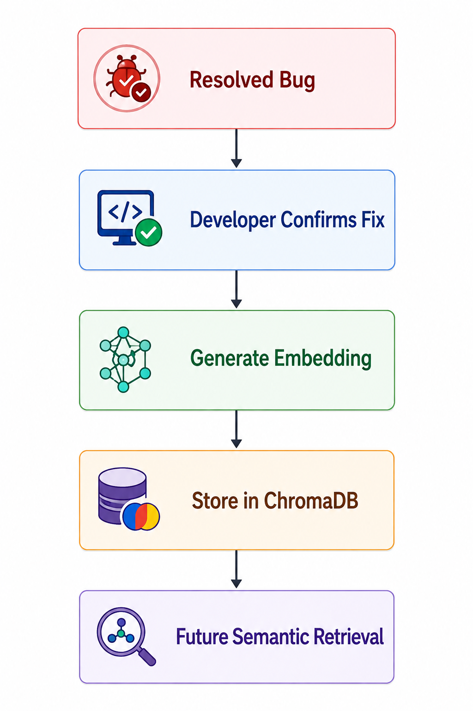

---

## 11.10 PDF Report Generation

After analysis is completed, the platform generates a structured PDF report.

The report consolidates the major outputs of the analysis, including:

* Bug information.
* Log analysis.
* Triage.
* Root cause analysis.
* Similar historical bugs.
* Recommendations.

This provides a persistent record of the completed defect investigation.

# 12. RETRIEVAL-AUGMENTED GENERATION (RAG) IMPLEMENTATION

The Retrieval-Augmented Generation (RAG) component enables the platform to use historical software defect knowledge when analysing newly submitted bugs.

Instead of relying only on the information contained in the current bug submission, the system searches the historical defect knowledge base and retrieves defects that are semantically similar to the current problem.

## 12.1 Historical Defect Data Preparation

Historical Eclipse Bugzilla defect records are loaded from the project dataset.

The relevant defect information is processed into text chunks that can be used for semantic retrieval.

The processed data contains information associated with historical defects, including bug identifiers, descriptions, severity, components, priorities, and resolutions.

---

## 12.2 Embedding Generation

Each processed defect chunk is converted into a numerical vector representation using a Sentence Transformer embedding model.

These vector representations capture the semantic meaning of the defect text.

The generated embeddings are stored alongside the corresponding defect information so that they can later be searched using vector similarity.

---

## 12.3 ChromaDB Vector Storage

ChromaDB is used to persist the generated embeddings and associated defect documents.

The vector collection used by the system is:

```text
bug_reports
```

Each stored record contains:

* A unique identifier.
* The defect document.
* The generated embedding.
* Metadata containing the historical Bug ID.

This provides the vector database required for semantic historical defect retrieval.

---

## 12.4 Semantic Retrieval

When a new bug is analysed, the submitted defect information is converted into an embedding using the same embedding model.

The generated query vector is compared against the vectors stored in ChromaDB.

The system retrieves the most semantically similar historical defects.

The retrieval results include similarity scores that indicate how closely each historical defect matches the submitted bug.

---

## 12.5 Similar Bug Presentation

The retrieved historical defects are displayed in the **Similar Bugs** section of the Streamlit application.

The interface presents information such as:

* Semantic similarity score.
* Product.
* Severity.
* Component.
* Priority.
* Bug ID.
* Resolution.
* Historical resolution summary.

This allows the developer to review previous defects that may provide useful evidence for the current investigation.

---

## 12.6 Knowledge Base Growth and RAG

The RAG implementation also supports knowledge base growth.

When a verified resolved bug is added through the **Add Resolved Bug to Knowledge Base** function, the system creates a new knowledge document containing the bug report, root cause, and resolution information.

The document is embedded and stored in ChromaDB.

The newly stored defect can subsequently be retrieved during the analysis of a similar bug.

This creates a continuous knowledge lifecycle:


This implementation demonstrates how the platform can reuse both the original historical defect dataset and newly verified defect knowledge during future analyses.

# 13. DEFECT PATTERN ANALYTICS MODULE

The Defect Pattern Analytics Module provides an overview of recurring patterns across the bugs analysed by the platform. The module uses stored analysis results to identify frequently occurring exceptions, affected components, severity levels, and root cause patterns.

The analytics functionality helps developers and project teams understand whether certain types of defects are occurring repeatedly and which areas of the application may require greater attention.

## 13.1 Analytics Data Storage

After a bug is analysed, selected information from the analysis is stored for analytics purposes.

The stored fields include:

* Exception.
* Severity.
* Root Cause.
* Component.
* Confidence.

This information is used as the basis for generating the analytics dashboard.

---

## 13.2 Defect Pattern Dashboard

The Defect Pattern Analytics Dashboard presents aggregated information from the analysed bugs.

The dashboard provides key indicators including:

* Total Bugs.
* Average Confidence.
* Top Exception.
* Top Component.
* Top Root Cause.

These indicators provide a quick overview of the current defect landscape.

---

## 13.3 Severity Analysis

The dashboard provides a severity distribution showing the number of defects classified under different severity levels.

The severity categories include:

* Critical.
* High.
* Medium.
* Low.

This allows users to identify the proportion of high-priority or high-severity defects within the analysed bug set.

---

## 13.4 Exception Analysis

The dashboard identifies the exceptions that occur most frequently across submitted bugs.

For example, repeated HTTP errors or application exceptions can indicate areas where recurring failures are occurring.

The most frequently occurring exception is highlighted as part of the dashboard insights.

---

## 13.5 Component Analysis

The component analysis identifies which application modules or components are most frequently associated with submitted defects.

The dashboard can display frequently affected components such as authentication, database-related modules, collection processing, or other identified application areas.

This information can help development teams identify components that may require additional testing or maintenance.

---

## 13.6 Root Cause Pattern Analysis

The dashboard also analyses the root cause information generated during previous bug investigations.

Frequently occurring root cause hypotheses are displayed to help identify recurring technical problems.

This provides a higher-level view of the types of failures being identified by the AI analysis system.

---

## 13.7 AI-Generated Analytics Insights

The dashboard generates summary insights from the stored defect analysis data.

These insights can identify:

* The most frequently affected component.
* The most common exception.
* The most frequently identified root cause.
* The total number of analysed defects.
* The average confidence of the generated analyses.
* The number of high-severity defects.

These insights provide a concise interpretation of the statistical information displayed in the dashboard.

---

## 13.8 Purpose of Defect Pattern Analytics

The analytics module extends the platform beyond individual bug diagnosis.

While the AI Bug Analyzer focuses on analysing one defect at a time, the analytics dashboard provides a broader view across multiple submissions.

The combination can be represented as:

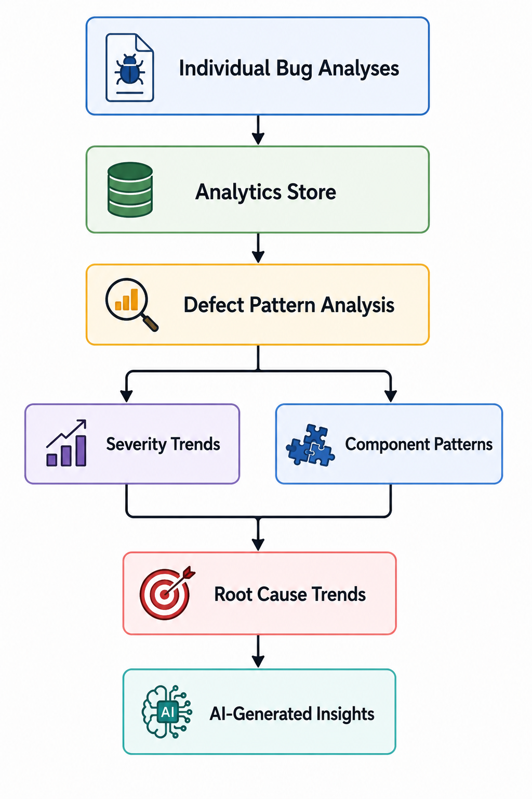


The module therefore supports identification of recurring defect patterns and provides information that can assist development teams in prioritising areas for investigation and improvement.

# 14. KNOWLEDGE BASE GROWTH MECHANISM

The Knowledge Base Growth Mechanism allows verified resolved defects to be added to the existing vector knowledge base. This enables the platform to reuse newly acquired defect knowledge during future bug analyses.

The mechanism extends the RAG component beyond the original historical Eclipse Bugzilla dataset by allowing knowledge generated and verified during actual platform usage to become part of the searchable knowledge base.

## 14.1 Resolved Bug Submission

After a bug has been analysed, the user can select:

**✔ Add Resolved Bug to Knowledge Base**

The system uses the completed analysis information to create a knowledge document for the resolved defect.

The stored information includes:

* Bug report.
* Severity.
* Affected component.
* Root cause.
* Confidence.
* Resolution or recommendation information.

---

## 14.2 Knowledge Document Creation

The verified defect information is combined into a structured document before being stored.

The document contains the bug report, identified root cause, and resolution information.

This provides sufficient contextual information for the defect to be semantically retrieved in future analyses.

---

## 14.3 Embedding Generation

The newly created knowledge document is converted into a vector embedding using the Sentence Transformer model used by the RAG system.

Using the same embedding approach ensures that the newly added defect can participate in the existing semantic retrieval process.

---

## 14.4 ChromaDB Storage

The generated embedding is stored in the existing ChromaDB `bug_reports` collection.

Metadata associated with the newly stored defect includes information such as:

* Bug ID.
* Status.
* Severity.
* Component.
* Root Cause.
* Confidence.

The defect is marked as a resolved knowledge entry so that it can be distinguished from the original historical records.

---

## 14.5 Future Retrieval

Once the resolved defect has been stored, it can be retrieved when a future bug has similar semantic characteristics.

The knowledge lifecycle is therefore:

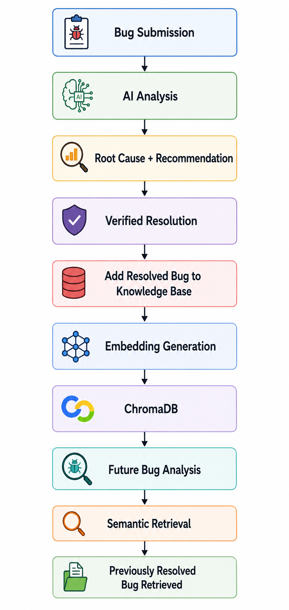


---

## 14.6 Knowledge Base Growth Verification

The knowledge base growth mechanism was verified using a resolved bug that was first analysed by the platform and then added through the **Add Resolved Bug to Knowledge Base** function.

The newly stored defect was subsequently tested by analysing the same or a very similar bug again.

During the second analysis, the newly added defect appeared as a strong semantic match in the **Similar Bugs** section.

The retrieved result showed:

* **Bug ID:** `User_Submitted`
* **Product:** `Inventory System`
* **Severity:** `High`
* **Component:** `User Authentication`
* **Semantic Similarity:** `86.99%`
* **Resolution:** `Root Cause: Invalid collection index accessed.`

This demonstrates the complete knowledge lifecycle:

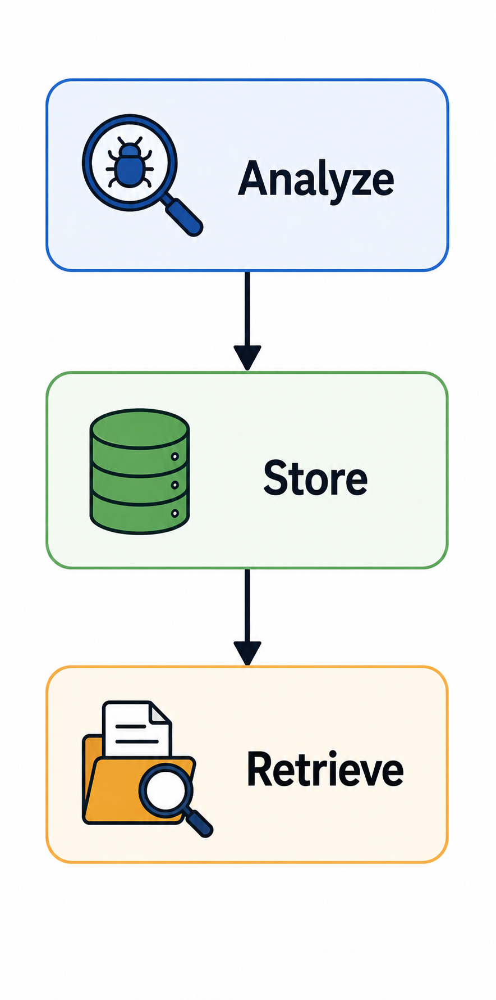


The result confirms that the newly verified defect was not only stored in ChromaDB but was also available for subsequent semantic retrieval.

# 15. END-TO-END TESTING

End-to-end testing was conducted to verify that the major components of the **Creation of Intelligent Bug Diagnosis Platform with Fix Recommendation Assistance** work together correctly as a complete system.

The testing focused on the complete workflow from bug submission through AI analysis, historical defect retrieval, recommendation generation, analytics storage, PDF report generation, and knowledge base growth.

## 15.1 Testing Objectives

The main objectives of end-to-end testing were to:

1. Verify that bugs can be submitted successfully through the Streamlit interface.
2. Verify that the multi-agent analysis pipeline executes successfully.
3. Verify that triage results are generated.
4. Verify that application logs and exceptions are analysed.
5. Verify that root cause hypotheses and confidence scores are generated.
6. Verify that similar historical defects are retrieved through RAG.
7. Verify that fix recommendations are generated.
8. Verify that analysis results are recorded for analytics.
9. Verify that PDF reports are generated successfully.
10. Verify that verified resolved bugs can be added to ChromaDB.
11. Verify that newly stored resolved bugs can be retrieved during subsequent analyses.

---

## 15.2 Test Approach

The system was tested using multiple distinct bug submissions representing different defect scenarios.

Each test followed the general workflow:


For the knowledge base growth test, an additional workflow was performed:

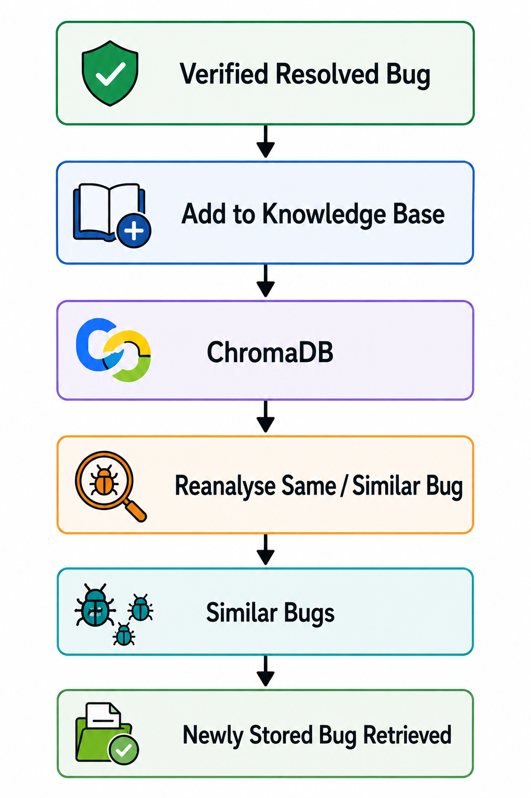


---

## 15.3 End-to-End Test Cases

The following categories were considered during system testing:

| Test Area             | Expected Result                                    |
| --------------------- | -------------------------------------------------- |
| Bug submission        | Bug description or log is accepted successfully    |
| Bug triage            | Severity and triage information are generated      |
| Log analysis          | Exception and log information are identified       |
| Root cause analysis   | Root cause hypothesis and confidence are generated |
| Similar bug retrieval | Relevant historical defects are retrieved          |
| Recommendations       | Fix recommendations are generated                  |
| Analytics             | Analysis information is stored                     |
| PDF generation        | Analysis report is generated successfully          |
| Knowledge base growth | Verified resolved bug is stored in ChromaDB        |
| Knowledge reuse       | Newly stored bug can be retrieved later            |

---

## 15.4 Knowledge Base Growth Test

A resolved bug was analysed and subsequently added to the knowledge base using the **Add Resolved Bug to Knowledge Base** function.

The application confirmed that the resolved defect was successfully added to ChromaDB.

The same or a very similar bug was then analysed again.

During the second analysis, the newly added defect appeared in the **Similar Bugs** results with a strong semantic similarity score.

The observed retrieval included:

* **Bug ID:** `User_Submitted`
* **Product:** `Inventory System`
* **Severity:** `High`
* **Component:** `User Authentication`
* **Semantic Similarity:** `86.99%`
* **Resolution:** `Root Cause: Invalid collection index accessed.`

This test demonstrated the complete:

```text
Analyze → Store → Retrieve
```

lifecycle of the Knowledge Base Growth Mechanism.

---

## 15.5 Analytics Verification

The Defect Pattern Analytics Dashboard was also verified using the stored analysis records.

The dashboard successfully displayed aggregated information including:

* Total bugs submitted.
* Average confidence.
* Top exception.
* Top component.
* Top root cause.
* Severity distribution.
* Most affected components.
* Most common root causes.
* AI-generated defect insights.

The dashboard therefore provides a system-level view of the defects analysed through the platform.

---

## 15.6 Testing Outcome

The end-to-end testing confirmed that the major components of the platform can operate together as an integrated workflow.

The testing demonstrated the following system capabilities:

* Successful bug submission.
* Multi-agent defect analysis.
* Root cause identification.
* Historical semantic retrieval.
* Fix recommendation assistance.
* Analytics generation.
* PDF report generation.
* Resolved defect storage.
* Retrieval of newly stored defect knowledge.

The testing therefore provided evidence that the implemented platform satisfies the core functional workflow defined for the project.

# 16. RESULTS AND FINDINGS

The implementation and testing of the platform demonstrated that the proposed system can support the major stages of intelligent software defect analysis.

## 16.1 Bug Analysis Results

The platform successfully processes submitted bug descriptions and application logs through the multi-agent analysis pipeline.

The analysis produces separate results for:

* Bug triage.
* Log and exception analysis.
* Root cause analysis.
* Similar historical defects.
* Fix recommendations.
  
#### Test Evidence: 
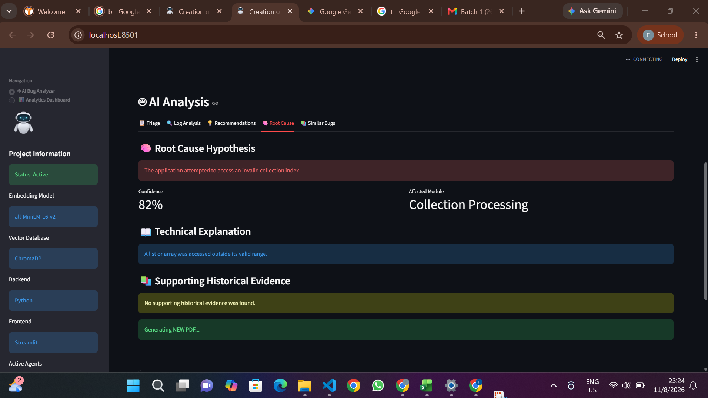

This provides developers with a structured view of the information required during defect investigation.

---

## 16.2 Root Cause Analysis Results

The Root Cause component generates a probable technical explanation for the submitted defect along with an affected module and confidence score.

For example, during testing, a collection-related defect produced the following analysis:


This demonstrates the ability of the system to convert a reported runtime problem into a structured root cause hypothesis.

---

## 16.3 Historical Defect Retrieval Results

The RAG component successfully retrieved historical defects from the Eclipse Bugzilla knowledge base.

During testing, historical matches were displayed with semantic similarity scores and supporting defect information.

For example, one historical retrieval produced a similarity score of:


for a historical JDT defect involving an authentication error.

The system also successfully retrieved newly added project-specific knowledge during the Knowledge Base Growth test.

A newly stored resolved defect achieved a semantic similarity score of:


when the same or a very similar bug was analysed again.

This demonstrates that the vector retrieval mechanism can identify both historical dataset records and newly acquired defect knowledge.

---

## 16.4 Knowledge Base Growth Results

The Knowledge Base Growth Mechanism successfully stored a verified resolved defect in ChromaDB.

The subsequent analysis of the same or similar bug retrieved the newly stored defect as the strongest semantic match.

This confirms that the knowledge base is not limited to its initial historical dataset and can be extended with verified project-specific defect knowledge.

The demonstrated lifecycle was:


---

## 16.5 Analytics Results

The Defect Pattern Analytics Dashboard successfully aggregated information from submitted bug analyses.

The dashboard provides:

* Total number of analysed bugs.
* Average confidence.
* Most common exception.
* Most frequently affected component.
* Most common root cause.
* Severity distribution.
* Component frequency analysis.
* Root cause frequency analysis.
* AI-generated defect insights.

#### Test evidence:


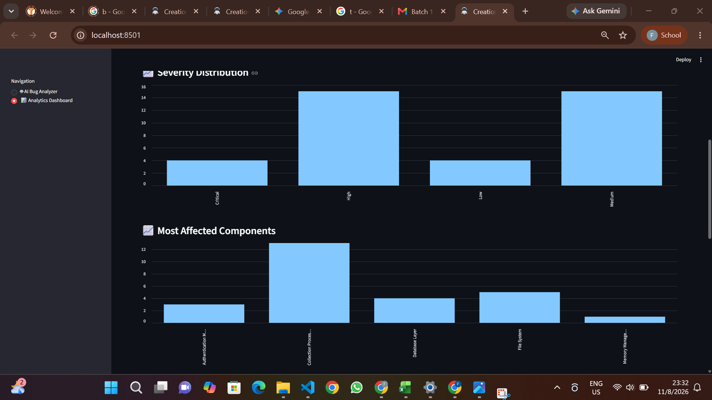

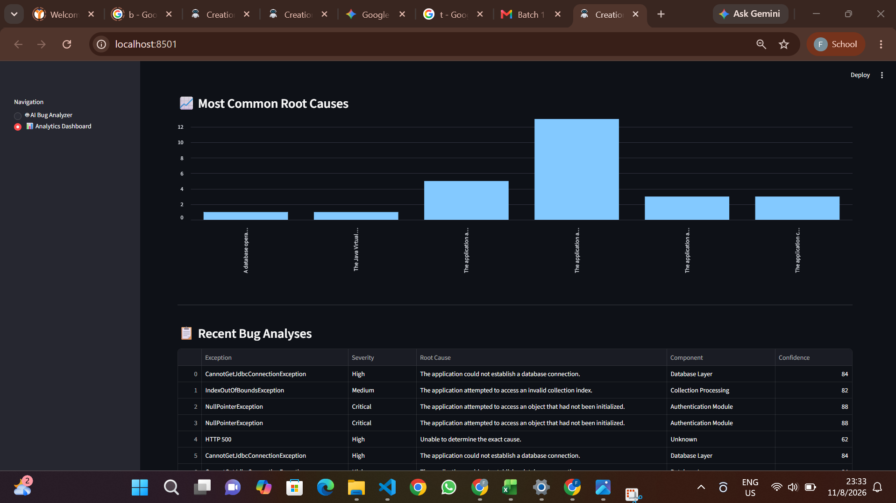

These analytics provide a broader view of defect patterns rather than focusing only on individual bug submissions.

---

## 16.6 PDF Reporting Results

The platform successfully generates structured PDF reports after completing bug analysis.

The generated reports consolidate the major analysis outputs into a single document, providing a record of the investigation.

The report can include:

* Bug description.
* Log information.
* Triage results.
* Root cause analysis.
* Similar historical defects.
* Recommendations.
  
#### After hitting download pdf button
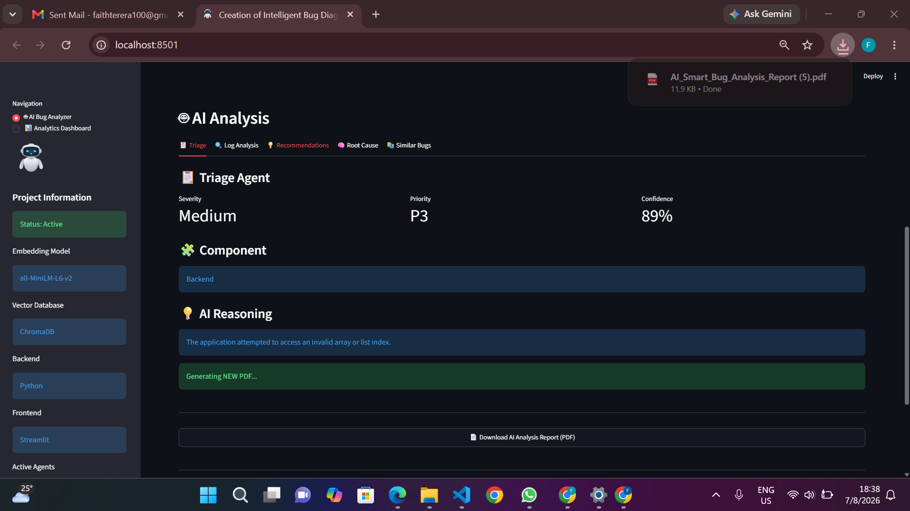

---

## 16.7 Overall Findings

The implementation and end-to-end testing demonstrate that the platform successfully integrates:

* Multi-agent AI analysis.
* Semantic historical defect retrieval.
* Root cause identification.
* Fix recommendation assistance.
* Defect pattern analytics.
* Knowledge base growth.
* Automated PDF reporting.

The results indicate that the platform can provide useful AI-assisted support for software defect investigation while allowing developers to review and validate the generated findings before taking corrective action.

# 17. CHALLENGES AND LESSONS LEARNED

## 17.1 Challenges Encountered


During the development and testing of the platform, several technical and implementation challenges were encountered.

### AI Analysis Integration

Integrating multiple AI-based analysis components into a single workflow required careful coordination of their inputs and outputs. The Bug Analysis Orchestrator was used to manage the flow of information between the different analysis stages.

### Semantic Retrieval

Implementing semantic retrieval required historical defect information to be converted into embeddings and stored in a vector database. Ensuring that the same embedding approach was used for both historical defects and newly submitted bugs was important for meaningful similarity comparisons.

### Knowledge Base Growth

Adding newly resolved defects to an existing ChromaDB collection required the system to correctly generate embeddings, store the associated document and metadata, and make the new record available for subsequent retrieval.

The functionality was verified by storing a resolved defect and then analysing a similar bug. The newly stored defect was successfully retrieved with a strong semantic similarity score.

### Analytics Integration

The analytics dashboard required analysis results to be stored consistently so that meaningful statistics could be calculated across multiple bug submissions.

### End-to-End Integration

Testing the complete workflow required verifying that the individual modules worked together correctly rather than only testing them independently.

---

## 17.2 Lessons Learned

The project provided several practical lessons in developing an AI-powered software engineering application.

### Importance of Modular Architecture

Separating the system into agents and functional modules made it easier to develop, test, and maintain individual components.

### Value of Historical Knowledge

Historical defect data can provide useful supporting evidence when analysing new software defects. Semantic retrieval allows relevant historical information to be found even when the wording of two defect reports differs.

### Importance of Verification

AI-generated root causes and recommendations should be treated as assistance rather than guaranteed solutions. Human verification remains important when determining the actual cause and resolution of a defect.

### Continuous Knowledge Improvement

The Knowledge Base Growth Mechanism demonstrated that a defect analysis platform can extend its knowledge beyond its initial dataset by storing verified resolved defects for future retrieval.

### Importance of End-to-End Testing

Testing the complete workflow helped verify the interaction between bug submission, AI analysis, RAG retrieval, recommendations, analytics, reporting, and knowledge base growth.

# 18. LIMITATIONS AND FUTURE ENHANCEMENTS

##   Current limitations


- The accuracy of the generated diagnosis and recommendations depends on the quality and completeness of the submitted bug description and application logs.
- The historical defect retrieval quality depends on the coverage and relevance of the available defect dataset.
- AI-generated root cause analysis and fix recommendations may not always be completely accurate and should therefore be reviewed by a developer before implementation.
- The current knowledge base is limited by the historical defect records available to the system.
- The platform primarily supports software defects that can be described through textual information and application logs.
- The system does not directly modify source code or automatically deploy fixes.
- Analytics results depend on the availability and consistency of stored bug analysis records.
- The system was evaluated within the scope of the implemented project environment and available test data.

These limitations provide opportunities for further development and improvement of the platform.

## 18.1 Improved Root Cause Accuracy

Future versions could incorporate additional code-level context, including source code, repository information, dependency versions, and application configuration. This could provide the AI agents with more evidence when generating root cause hypotheses.

## 18.2 Advanced Duplicate Detection

The duplicate detection capability could be further improved by combining semantic similarity with additional factors such as:

* Exception type.
* Affected component.
* Stack trace similarity.
* Historical resolution.
* Bug severity.

This could improve the identification of defects that represent the same underlying issue.

## 18.3 Larger and More Diverse Knowledge Base

The knowledge base could be expanded using additional historical defect datasets from different software projects and programming environments.

A larger knowledge base could improve the ability of the RAG component to find relevant historical solutions for a wider range of defect types.

## 18.4 Continuous Knowledge Base Learning

The current Knowledge Base Growth Mechanism can be extended into a controlled continuous learning workflow in which verified resolutions from development teams are automatically incorporated after approval.

This would allow the system's searchable defect knowledge to grow over time.

## 18.5 Code Repository Integration

Future versions could integrate with source code repositories and issue tracking platforms.

Potential integrations could allow the system to:

* Retrieve relevant source code.
* Link analysis results to issues.
* Track bug status.
* Associate fixes with commits.
* Retrieve previous pull requests related to similar defects.

## 18.6 Enhanced Analytics

The analytics dashboard could be extended with additional metrics such as:

* Defect trends over time.
* Mean time to resolution.
* Defects by project or release.
* Defects by developer or team.
* Recurring defect clusters.
* Resolution effectiveness.
* RAG retrieval accuracy.

These metrics could provide deeper insight into software quality and maintenance trends.

## 18.7 Improved Recommendation Assistance

Future recommendation components could provide more detailed remediation guidance by considering source code context, historical fixes, dependency information, and project-specific coding practices.

Recommendations could also be ranked according to confidence and supporting historical evidence.

## 18.8 Multilingual Bug Analysis

The platform could be extended to support bug reports submitted in multiple natural languages. This would make the system more accessible to development teams working across different regions and languages.

## 18.9 Automated Testing Integration

Future versions could connect the platform with automated testing systems so that detected defects can be analysed automatically from test failures and continuous integration pipelines.

This could create a workflow such as:

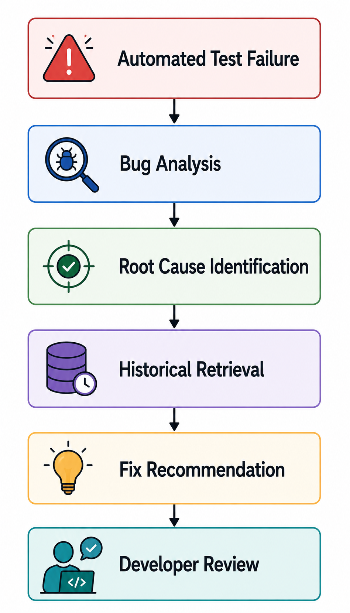


## 18.10 Human-in-the-Loop Validation

A future version could introduce explicit developer feedback mechanisms allowing users to mark AI-generated results as:

* Correct.
* Partially correct.
* Incorrect.
* Resolved.
* Duplicate.

Such feedback could be used to improve analytics, recommendation quality, and future knowledge base management.

# 19. CONCLUSION

The **Creation of Intelligent Bug Diagnosis Platform with Fix Recommendation Assistance** was developed to provide an integrated approach to software defect investigation and resolution assistance.

The platform combines a multi-agent AI architecture with Retrieval-Augmented Generation, semantic vector search, defect pattern analytics, knowledge base growth, and automated reporting. This allows developers to submit a defect and receive structured information covering triage, log analysis, root cause analysis, similar historical defects, and fix recommendations.

The implementation of the RAG component demonstrated the ability to retrieve semantically similar defects from the Eclipse Bugzilla historical knowledge base. The Knowledge Base Growth Mechanism further demonstrated that verified resolved defects can be stored in ChromaDB and subsequently retrieved when a similar defect is analysed.

The Defect Pattern Analytics Dashboard provides a broader view of submitted defects by identifying recurring exceptions, frequently affected components, severity distributions, and common root cause patterns. This extends the platform from individual defect diagnosis to overall defect trend analysis.

End-to-end testing confirmed the integration of the major system components, including bug submission, multi-agent analysis, historical retrieval, recommendation generation, analytics, PDF reporting, and knowledge base growth. The successful retrieval of a newly stored resolved defect provided evidence of the complete **Analyze → Store → Retrieve** knowledge lifecycle.

Overall, the project demonstrates how Artificial Intelligence and semantic retrieval can be combined to assist software development teams in investigating defects, reusing historical knowledge, identifying recurring problems, and generating structured diagnostic reports.

The platform is intended as a decision-support system rather than a replacement for human developers. AI-generated diagnoses and recommendations should therefore be reviewed and validated by developers before being used for actual software fixes.

# 20. REFERENCES

[1] Python Software Foundation, “Python 3 Documentation,” Python Software Foundation. [Online]. Available: https://docs.python.org/3/. [Accessed: Aug. 11, 2026].

[2] Streamlit Inc., “Streamlit Documentation,” Streamlit. [Online]. Available: https://docs.streamlit.io/. [Accessed: Aug. 11, 2026].

[3] Chroma, “Chroma Documentation,” Chroma. [Online]. Available: https://docs.trychroma.com/. [Accessed: Aug. 11, 2026].

[4] UKPLab, “Sentence Transformers Documentation,” Sentence Transformers. [Online]. Available: https://www.sbert.net/. [Accessed: Aug. 11, 2026].

[5] P. Lewis et al., “Retrieval-Augmented Generation for Knowledge-Intensive NLP Tasks,” in *Advances in Neural Information Processing Systems*, vol. 33, 2020.

[6] pandas development team, “pandas Documentation,” pandas. [Online]. Available: https://pandas.pydata.org/docs/. [Accessed: Aug. 11, 2026].

[7] NumPy Developers, “NumPy Documentation,” NumPy. [Online]. Available: https://numpy.org/doc/. [Accessed: Aug. 11, 2026].

[8] Eclipse Foundation, “Eclipse Bugzilla,” Eclipse Foundation. [Online]. Available: https://bugs.eclipse.org/bugs/. [Accessed: Aug. 11, 2026].

[9] M. W. Godfrey and Q. Tu, “Evolution in Open Source Software: A Case Study,” in *Proceedings of the International Conference on Software Maintenance*, 2000.

[10] ReportLab, “ReportLab Documentation,” ReportLab. [Online]. Available: https://docs.reportlab.com/. [Accessed: Aug. 11, 2026].

# 21. APPENDICES

The appendices provide supporting material demonstrating the implementation and operation of the platform.

## Appendix A — Project Structure

The major project modules are organized as follows:

```text
AI-Smart-Bug-Analyzer/
│
├── backend/
│   └── app/
     
│
├── agents/
│   └── orchestrator.py
│
├── rag/
│   └── knowledge_base_growth.py
│
├── analytics/
│   ├── analytics_store.py
│   └── analytics_dashboard.py
│
├── frontend/
│   ├── app.py
│   ├── components/
│  
│
├── assets/
│
├── datasets/
│
└── test_cases/
```

## Appendix B — Example Bug Analysis

An example analysis can contain the following outputs:


## Appendix C — Knowledge Base Growth Demonstration

The knowledge base growth functionality was demonstrated through the following workflow:


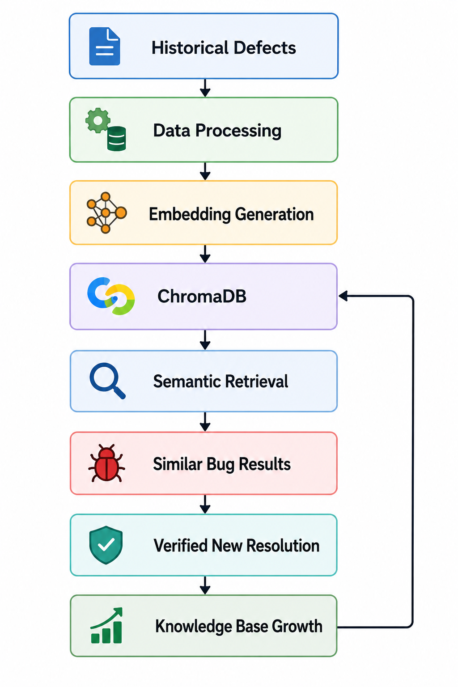


The newly stored defect was successfully retrieved as a strong semantic match during subsequent analysis.

## Appendix D — Screenshots and Implementation Evidence

### D.1 Main AI Bug Analyzer Interface

**Figure D1: Main AI Bug Analyzer Interface**


---

### D.2 Bug Submission

**Figure D2: Bug Submission Interface**


---

### D.3 Triage Results

**Figure D3: Triage Analysis Results**


---

### D.4 Log Analysis Results

**Figure D4: Log Analysis Results**


---

### D.5 Root Cause Analysis

**Figure D5: Root Cause Analysis**


---

### D.6 Fix Recommendations

**Figure D6: Fix Recommendations**


---

### D.7 Similar Bugs / RAG Results

**Figure D7: Similar Historical Bugs Retrieved Using RAG**


---

### D.8 Defect Pattern Analytics Dashboard

**Figure D8: Defect Pattern Analytics Dashboard**

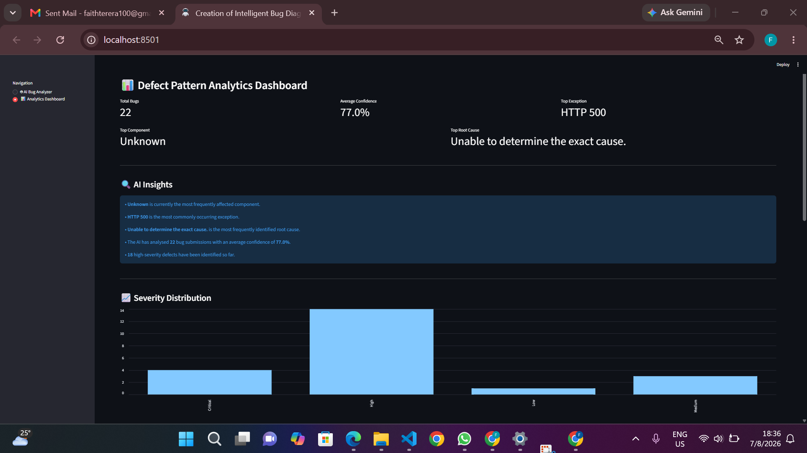

---

### D.9 Knowledge Base Growth Confirmation

**Figure D9: Knowledge Base Growth Confirmation**

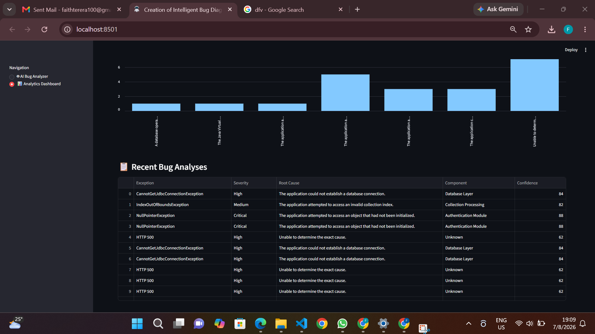

---

### D.10 Retrieved Newly Stored Resolved Bug

**Figure D10: Newly Stored Bug Retrieved Through RAG**


---

### D.11 Generated PDF Report

**Figure D11: Generated PDF Analysis Report**


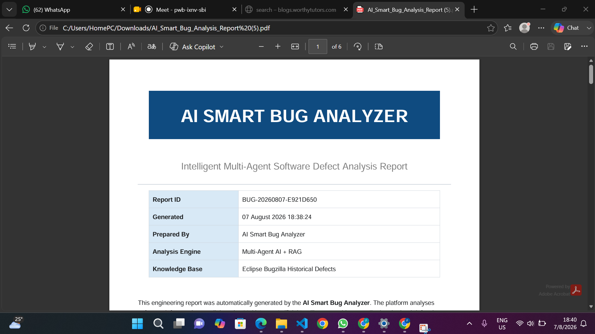


---


