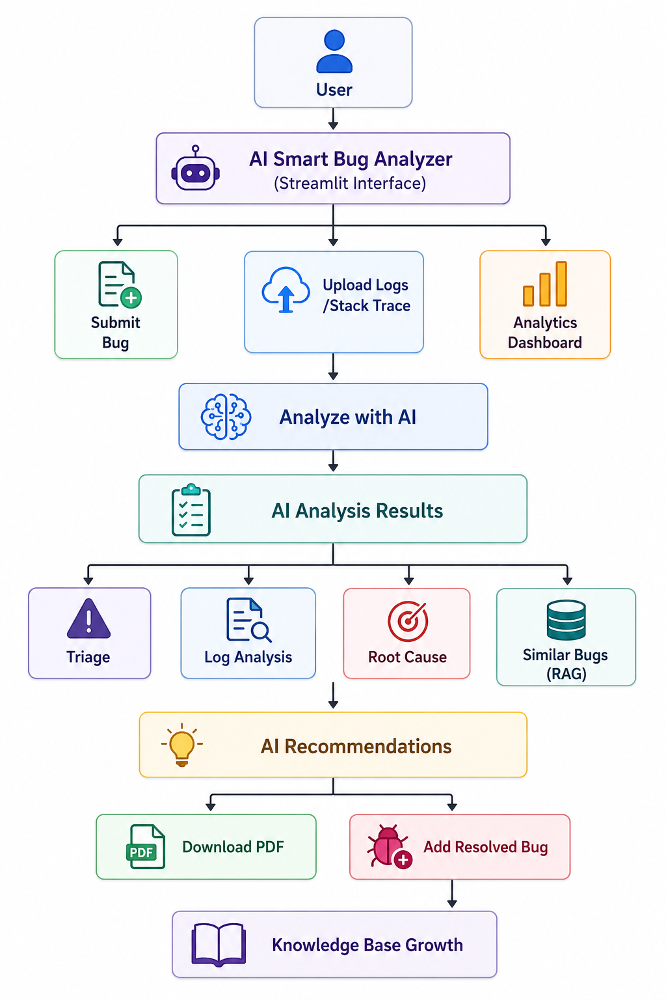
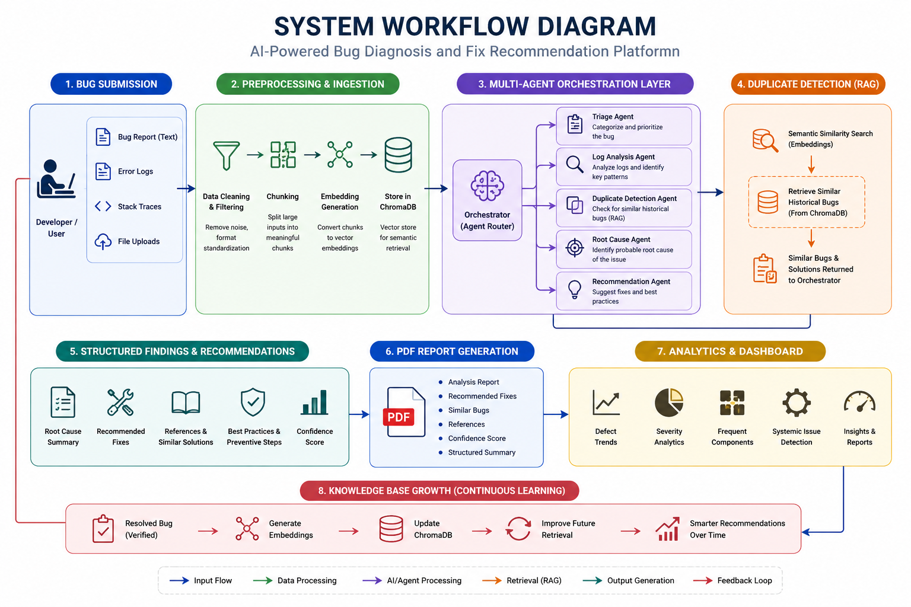
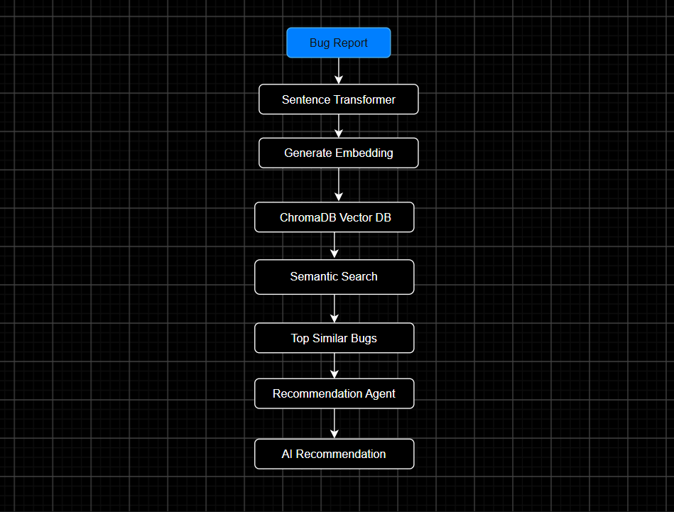

---

## TECHNICAL DOCUMENTATION

## CREATION OF INTELLIGENT BUG DIAGNOSIS PLATFORM WITH FIX RECOMMENDATION ASSISTANCE

### Group 2

---

# TABLE OF CONTENTS

- [TABLE OF CONTENTS](#table-of-contents)
- [1. SYSTEM OVERVIEW](#1-system-overview)
  - [1.1 Project Overview](#11-project-overview)
  - [1.2 Purpose of the Documentation](#12-purpose-of-the-documentation)
  - [1.3 Main System Capabilities](#13-main-system-capabilities)
- [2. SYSTEM REQUIREMENTS](#2-system-requirements)
  - [2.1 Hardware Requirements](#21-hardware-requirements)
  - [2.2 Software Requirements](#22-software-requirements)
  - [2.3 Technology Stack](#23-technology-stack)
- [3. SYSTEM ARCHITECTURE](#3-system-architecture)
  - [3.1 Frontend Layer](#31-frontend-layer)
  - [3.2 Application and Orchestration Layer](#32-application-and-orchestration-layer)
  - [3.3 AI Agent Layer](#33-ai-agent-layer)
  - [3.4 Retrieval and Knowledge Base Layer](#34-retrieval-and-knowledge-base-layer)
  - [3.5 Analytics and Reporting Layer](#35-analytics-and-reporting-layer)
  - [3.6 End-to-End Workflow](#36-end-to-end-workflow)
- [4. SYSTEM COMPONENTS](#4-system-components)
  - [4.1 Streamlit Frontend](#41-streamlit-frontend)
  - [4.2 Bug Submission Module](#42-bug-submission-module)
- [5. IMPLEMENTATION](#5-implementation)
  - [5.1 Frontend Implementation](#51-frontend-implementation)
  - [5.2 Bug Submission Implementation](#52-bug-submission-implementation)
  - [5.3 Bug Analysis Orchestrator](#53-bug-analysis-orchestrator)
  - [5.4 Triage Agent](#54-triage-agent)
  - [5.5 Log Analysis Agent](#55-log-analysis-agent)
  - [5.6 Root Cause Agent](#56-root-cause-agent)
  - [5.7 Similar Bug / RAG Implementation](#57-similar-bug--rag-implementation)
  - [5.8 Recommendation Agent](#58-recommendation-agent)
  - [5.9 Analytics Implementation](#59-analytics-implementation)
  - [5.10 Knowledge Base Growth Implementation](#510-knowledge-base-growth-implementation)
  - [5.11 PDF Report Generation](#511-pdf-report-generation)
  - [5.12 Error Handling](#512-error-handling)
- [6. USER GUIDE](#6-user-guide)
  - [6.1 Starting the Application](#61-starting-the-application)
  - [6.2 Accessing the Bug Analyzer](#62-accessing-the-bug-analyzer)
  - [6.3 Submitting a Bug](#63-submitting-a-bug)
  - [6.4 Uploading Logs](#64-uploading-logs)
  - [6.6 Viewing Triage Results](#66-viewing-triage-results)
  - [6.7 Viewing Log Analysis](#67-viewing-log-analysis)
  - [6.8 Viewing Root Cause Analysis](#68-viewing-root-cause-analysis)
  - [6.9 Viewing Similar Bugs](#69-viewing-similar-bugs)
  - [6.11 Generating the PDF Report](#611-generating-the-pdf-report)
  - [6.12 Viewing the Analytics Dashboard](#612-viewing-the-analytics-dashboard)
  - [6.13 Knowledge Base Growth](#613-knowledge-base-growth)
  - [6.14 Verifying Knowledge Base Retrieval](#614-verifying-knowledge-base-retrieval)
  - [6.15 Reviewing the Complete Analysis](#615-reviewing-the-complete-analysis)
- [7. TESTING AND VALIDATION](#7-testing-and-validation)
  - [7.1 Testing Strategy](#71-testing-strategy)
  - [7.2 Unit Testing](#72-unit-testing)
  - [7.4 End-to-End Testing](#74-end-to-end-testing)
  - [7.5 Functional Testing](#75-functional-testing)
  - [7.7 Performance Testing](#77-performance-testing)
  - [7.8 Security Testing](#78-security-testing)
  - [7.9 Usability Testing](#79-usability-testing)
  - [7.10 Validation Results](#710-validation-results)
  - [7.11 Testing Evidence](#711-testing-evidence)
- [8. RESULTS AND PERFORMANCE](#8-results-and-performance)
  - [8.1 Bug Analysis Results](#81-bug-analysis-results)
  - [8.2 RAG / Similar Bug Results](#82-rag--similar-bug-results)
  - [8.3 Recommendation Results](#83-recommendation-results)
  - [8.4 Analytics Results](#84-analytics-results)
  - [8.5 Knowledge Base Growth Results](#85-knowledge-base-growth-results)
  - [8.7 End-to-End System Results](#87-end-to-end-system-results)
  - [8.6 PDF Report Results](#86-pdf-report-results)
  - [8.7 Overall System Results](#87-overall-system-results)
  - [8.8 Limitations and Observations](#88-limitations-and-observations)
- [9. SYSTEM ARCHITECTURE AND DESIGN](#9-system-architecture-and-design)
  - [9.1 Architecture Overview](#91-architecture-overview)
  - [9.10 Data Flow](#910-data-flow)
  - [9.11 Component Responsibilities](#911-component-responsibilities)
  - [9.12 Technology Architecture](#912-technology-architecture)
  - [9.13 Deployment Architecture](#913-deployment-architecture)
  - [9.14 Scalability and Maintainability](#914-scalability-and-maintainability)
  - [9.15 System Design Summary](#915-system-design-summary)
- [10. CONCLUSION AND FUTURE ENHANCEMENTS](#10-conclusion-and-future-enhancements)
  - [10.1 Conclusion](#101-conclusion)
  - [10.2 Future Enhancements](#102-future-enhancements)
- [APPENDICES](#appendices)
  - [Appendix A — Project Structure](#appendix-a--project-structure)
  - [Appendix H — Project Configuration and Execution Summary](#appendix-h--project-configuration-and-execution-summary)
  - [Appendix I — Abbreviations and Technical Terms](#appendix-i--abbreviations-and-technical-terms)
  - [Appendix J — Figure and Diagram Reference](#appendix-j--figure-and-diagram-reference)
  - [Appendix K — Final Demonstration Checklist](#appendix-k--final-demonstration-checklist)
  - [Appendix L — Final Submission Verification](#appendix-l--final-submission-verification)
    - [Documentation](#documentation)
    - [Supporting Evidence](#supporting-evidence)
    - [Final Quality Check](#final-quality-check)
  - [Appendix M — Project Repository and Source Code](#appendix-m--project-repository-and-source-code)
  - [Appendix N — References to Project Resources](#appendix-n--references-to-project-resources)
  - [Appendix O — Known Limitations](#appendix-o--known-limitations)
  - [Appendix P — Glossary](#appendix-p--glossary)
  - [Appendix Q — Final Documentation Structure](#appendix-q--final-documentation-structure)
- [REFERENCES](#references)
   - [10.1 Project Directory Structure](#101-project-directory-structure)
   - [10.2 Important Files and Modules](#102-important-files-and-modules)
   - [10.3 Data Flow](#103-data-flow)
   - [10.4 Configuration and Dependencies](#104-configuration-and-dependencies)

11. [References](#11-references)

12. [Appendices](#12-appendices)
   - [Appendix A — Application Screenshots](#appendix-a--application-screenshots)
   - [Appendix B — Example Bug Analysis](#appendix-b--example-bug-analysis)
   - [Appendix C — Testing Evidence](#appendix-c--testing-evidence)
   - 
  # 1. SYSTEM OVERVIEW

## 1.1 Project Overview

The Intelligent Bug Diagnosis Platform with Fix Recommendation Assistance is an AI-powered software defect analysis system designed to assist developers in investigating and understanding software bugs.

The system accepts a bug description and, when available, application logs. The submitted information is processed through a structured analysis workflow consisting of multiple specialized AI components.

The platform provides the following main capabilities:

- Bug submission and analysis.
- Bug triage and severity assessment.
- Application log and exception analysis.
- Root cause analysis.
- Retrieval of similar historical defects.
- AI-assisted fix recommendations.
- Defect pattern analytics.
- Knowledge base growth through verified resolved bugs.
- PDF report generation.

The overall system workflow is:



## 1.2 Purpose of the Documentation

This technical documentation provides a practical description of the Intelligent Bug Diagnosis Platform with Fix Recommendation Assistance.

The documentation is intended to help developers and project members understand the system structure, implementation, configuration, operation, and maintenance of the application.

It covers:

- The system requirements and technology stack.
- The overall system architecture.
- The main system components and their responsibilities.
- The RAG and historical defect retrieval process.
- Installation and configuration procedures.
- Application usage procedures.
- Testing and validation procedures.
- Troubleshooting and maintenance guidelines.
- Project structure and important technical files.

The documentation focuses on the technical operation of the implemented system rather than repeating the project background, objectives, results, and conclusions presented in the main project report.

## 1.3 Main System Capabilities

The Intelligent Bug Diagnosis Platform provides an integrated workflow for analysing software defects and assisting developers in their investigation.

The main capabilities of the system are:

- **Bug Submission:** Allows users to enter a bug description and provide relevant information for analysis.
- **Bug Triage:** Analyses the submitted defect and provides structured triage information such as severity and affected component.
- **Log Analysis:** Processes uploaded application logs and identifies relevant errors, exceptions, and diagnostic information.
- **Root Cause Analysis:** Uses the available bug information and analysis results to identify a probable root cause.
- **Similar Bug Retrieval:** Searches the historical defect knowledge base using semantic similarity to identify related defects.
- **Fix Recommendation:** Generates AI-assisted recommendations based on the diagnostic results and historical evidence.
- **Defect Pattern Analytics:** Provides analytical information about previously analysed defects, including severity, components, exceptions, and root cause patterns.
- **Knowledge Base Growth:** Allows verified resolved defects to be added to the knowledge base for use in future retrieval.
- **PDF Report Generation:** Produces a structured PDF report containing the results of a completed bug analysis.

The overall capability flow can be represented as:


# 2. SYSTEM REQUIREMENTS

## 2.1 Hardware Requirements

The Intelligent Bug Diagnosis Platform can be developed and executed on a standard computer suitable for Python-based application development.

Recommended hardware includes:

- **Processor:** Modern multi-core processor.
- **Memory:** Minimum 8 GB RAM recommended.
- **Storage:** Sufficient storage for the application, Python environment, historical defect dataset, ChromaDB data, and generated reports.
- **Network:** Internet connection when using externally hosted AI services or downloading required dependencies.
- **Display:** Standard monitor capable of running a web browser for the Streamlit interface.

The exact hardware requirements may vary depending on the AI model, dataset size, and number of defects being processed.

## 2.2 Software Requirements

The system requires the following software environment:

- Python 3.x
- Streamlit
- ChromaDB
- Sentence Transformers
- Pandas
- NumPy
- PDF generation library
- Web browser
- Required Python packages listed in the project's dependency configuration.

The application is designed to run as a Python-based Streamlit application.

## 2.3 Technology Stack

The main technologies used by the platform are:

| Technology | Purpose |
|---|---|
| Python | Application logic, AI integration, and data processing |
| Streamlit | Web-based user interface and dashboard |
| AI Model | Bug analysis, root cause analysis, and recommendations |
| Sentence Transformers | Semantic embedding generation |
| ChromaDB | Vector storage and similarity retrieval |
| Pandas | Data processing and analytics |
| NumPy | Numerical operations |
| PDF Generation Library | Generation of bug analysis reports |

The technologies work together to support the complete workflow from bug submission through analysis, historical retrieval, recommendation generation, analytics, and report generation.


# 3. SYSTEM ARCHITECTURE

The Intelligent Bug Diagnosis Platform follows a layered architecture in which the user interface, application orchestration, AI agents, retrieval system, analytics, and reporting components work together to process software defects.

The architecture separates the major responsibilities of the system so that each component can perform a specific function while remaining part of the overall bug analysis workflow.

## 3.1 Frontend Layer

The frontend layer provides the user interface through Streamlit.

It allows users to:

- Enter bug descriptions.
- Upload application logs.
- Start the bug analysis process.
- View triage results.
- View log and exception analysis.
- View root cause analysis.
- Review similar historical bugs.
- View fix recommendations.
- Access defect analytics.
- Generate PDF reports.
- Add verified resolved bugs to the knowledge base.

The frontend communicates with the application and orchestration layer to submit information and display the generated results.

## 3.2 Application and Orchestration Layer

The application and orchestration layer controls the overall bug analysis workflow.

The Bug Analysis Orchestrator receives the submitted bug information and coordinates the different analysis components.

The general workflow is:



## 3.3 AI Agent Layer

The AI Agent Layer contains the specialized agents responsible for analysing different aspects of a submitted software defect.

Each agent performs a specific analysis task and contributes its output to the overall bug diagnosis process.

The main AI agents are:

- **Triage Agent:** Analyses the submitted defect and provides structured triage information such as severity and affected component.
- **Log Analysis Agent:** Analyses uploaded application logs and identifies relevant errors, exceptions, and diagnostic information.
- **Root Cause Agent:** Uses the available bug description, log analysis, and other diagnostic information to identify a probable root cause.
- **Recommendation Agent:** Generates AI-assisted fix recommendations using the diagnostic results and relevant historical defect information.

The agents operate as part of the orchestrated analysis workflow:

```text
                Bug Information
                       |
                       v
              AI Agent Layer
                       |
       +---------------+---------------+
       |               |               |
       v               v               v
    Triage          Log Analysis    Root Cause
     Agent             Agent          Agent
       |               |               |
       +---------------+---------------+
                       |
                       v
              Historical Evidence
                       |
                       v
             Recommendation Agent
                       |
                       v
              Fix Recommendations 

```
## 3.4 Retrieval and Knowledge Base Layer

The Retrieval and Knowledge Base Layer provides access to historical software defect information that can be used during the analysis of newly submitted bugs.

Historical defect records are stored in the knowledge base and represented as semantic embeddings. ChromaDB is used to store and retrieve these vector representations.

When a new bug is submitted, the relevant bug information is converted into an embedding and compared with the stored historical defect embeddings.

The retrieval workflow is:



## 3.5 Analytics and Reporting Layer

The Analytics and Reporting Layer provides additional functionality for reviewing completed bug analyses and generating structured reports.

The analytics module collects information from completed analyses and processes it to identify useful defect patterns.

The analytics functionality can provide information such as:

- Bug severity distribution.
- Frequently affected components.
- Recurring exceptions.
- Root cause patterns.
- Analysis confidence information.

The reporting component uses the completed analysis results to generate a structured PDF report.

The workflow is:

```text
Completed Bug Analysis
        |
        +-------------------+
        |                   |
        v                   v
   Analytics Module    PDF Report Generator
        |                   |
        v                   v
 Defect Patterns       PDF Analysis Report
 ```

 ## 3.6 End-to-End Workflow

The complete system workflow describes how a software defect moves through the platform from initial submission to final analysis and reporting.

The overall process is:

```text
User
 |
 v
Submit Bug Description
 |
 v
Upload Logs (Optional)
 |
 v
Bug Analysis Orchestrator
 |
 +-------------------+
 |                   |
 v                   v
Triage Agent     Log Analysis Agent
 |                   |
 +---------+---------+
           |
           v
    Root Cause Agent
           |
           v
   Generate Bug Embedding
           |
           v
    ChromaDB Search
           |
           v
  Similar Historical Bugs
           |
           v
 Recommendation Agent
           |
           v
  Combined Analysis
           |
     +-----+------+
     |            |
     v            v
 Analytics     PDF Report
     |
     v
Verified Resolution
     |
     v
Knowledge Base Update

```
# 4. SYSTEM COMPONENTS

The Intelligent Bug Diagnosis Platform consists of several software components, with each component responsible for a specific part of the defect diagnosis workflow.

The main components are:

- Streamlit Frontend
- Bug Submission Module
- Bug Analysis Orchestrator
- Triage Agent
- Log Analysis Agent
- Root Cause Agent
- RAG and Similar Bug Retrieval
- Recommendation Agent
- Analytics Module
- Knowledge Base Growth Module
- PDF Report Generator

These components work together to process submitted defects, analyse available evidence, retrieve historical information, generate recommendations, and present the results to the user.

## 4.1 Streamlit Frontend

The Streamlit Frontend provides the user-facing interface of the platform.

It allows users to interact with the main functionality without directly interacting with the underlying Python components.

The frontend provides functionality for:

- Entering bug information.
- Uploading log files.
- Starting bug analysis.
- Displaying analysis results.
- Viewing similar historical bugs.
- Viewing fix recommendations.
- Accessing analytics.
- Generating PDF reports.
- Adding verified resolved bugs to the knowledge base.

The frontend communicates with the application logic and displays the outputs generated by the different system components.

The basic interaction is:

```text
User
 |
 v
Streamlit Interface
 |
 v
Application Logic
 |
 v
Analysis Components
 |
 v
Results
 |
 v
Streamlit Interface
```

## 4.2 Bug Submission Module

The Bug Submission Module is responsible for collecting the information required to begin the bug diagnosis process.

The module allows the user to provide a description of the reported software defect and, when available, upload relevant application log files.

The submitted information is passed to the Bug Analysis Orchestrator for further processing.

The module supports:

- Bug description input.
- Application log upload.
- Submission of bug information for analysis.
- Validation of required input before analysis.
- Passing submitted information to the analysis workflow.

The basic process is:

```text
User
 |
 v
Enter Bug Description
 |
 +----> Upload Logs (Optional)
 |
 v
Submit Bug
 |
 v
Validate Input
 |
 v
Bug Analysis Orchestrator

###########################################
## 1.1 Introduction

The **Creation of Intelligent Bug Diagnosis Platform with Fix Recommendation Assistance** is an AI-powered software defect analysis platform designed to assist developers in understanding, diagnosing, and resolving software bugs.

The system combines a **multi-agent architecture**, **Retrieval-Augmented Generation (RAG)**, **semantic similarity search**, **vector-based historical defect retrieval**, **defect analytics**, **knowledge base growth**, and **automated PDF reporting** into a single platform.

Users can submit a bug description and supporting application logs through the Streamlit-based interface. The submitted information is processed by the Bug Analysis Orchestrator, which coordinates specialized analysis components.

The analysis pipeline includes:

- Bug triage.
- Log and exception analysis.
- Root cause identification.
- Confidence scoring.
- Historical similar-bug retrieval.
- Fix recommendation generation.
- Defect analytics.
- PDF report generation.
- Knowledge base growth.

Historical software defect records are processed into vector embeddings and stored in **ChromaDB**. When a new defect is submitted, semantic retrieval is used to identify historically similar defects and provide relevant information that can assist the diagnosis and recommendation process.

The platform also maintains analysis information for the **Defect Pattern Analytics Dashboard**, allowing recurring exceptions, affected components, severity distributions, and root cause patterns to be examined.

The Knowledge Base Growth mechanism further allows verified resolved defects to be added to the vector knowledge base so that the acquired information can be reused during future analyses.

The overall technical objective is to provide an integrated environment that reduces the manual effort involved in software defect investigation while supporting developers with structured AI-assisted diagnostic information.

---

## 1.2 Project Scope

The technical scope of the platform covers the complete workflow from bug submission to analysis, historical retrieval, recommendation, reporting, analytics, and knowledge base updates.

The system supports the following major functions:

- Submission of software bug descriptions.
- Upload and processing of application log files.
- Automated bug triage.
- Log and exception analysis.
- Root cause hypothesis generation.
- Confidence scoring.
- Retrieval of semantically similar historical defects.
- Historical defect and resolution comparison.
- AI-assisted fix recommendations.
- Storage of completed analysis information.
- Defect pattern analytics.
- Addition of verified resolved defects to the knowledge base.
- Semantic retrieval of newly stored defects.
- Automated PDF report generation.

The system is designed primarily as a **developer decision-support tool**. The generated root causes and recommendations are AI-assisted results and should be reviewed by a developer before being treated as confirmed solutions.

The project scope focuses on software defect diagnosis and historical defect reuse. It does not replace human debugging, source-code modification, software deployment, or production incident management.

---

## 1.3 System Overview

The platform consists of several interconnected technical components.

The main system components are:

1. **Streamlit Frontend** — provides the user interface for submitting bugs, uploading logs, viewing analysis results, accessing analytics, and managing knowledge base growth.

2. **Bug Analysis Orchestrator** — coordinates the overall analysis pipeline and manages communication between the specialized analysis components.

3. **Triage Agent** — evaluates the submitted defect and determines relevant classification and severity information.

4. **Log Analysis Agent** — analyses logs, exceptions, and stack traces to identify important technical error information.

5. **Root Cause Agent** — generates a probable root cause, affected module, technical explanation, and confidence score.

6. **RAG / Similar Bug Retrieval** — searches the historical defect knowledge base using semantic vector similarity.

7. **Recommendation Agent** — generates potential remediation and fix recommendations using the available diagnostic information and historical evidence.

8. **ChromaDB Knowledge Base** — stores vector embeddings and associated historical defect information for semantic retrieval.

9. **Analytics Module** — stores completed analysis information and provides defect pattern visualisation.

10. **Knowledge Base Growth Module** — adds verified resolved defects to the vector knowledge base for future retrieval.

11. **PDF Report Generator** — converts completed analysis results into a structured PDF report.

The high-level system flow is:


## 1.4 Key Features

### 1.4.1 AI-Based Bug Triage

The Triage Agent analyses the submitted bug and determines its severity and classification information.

### 1.4.2 Log and Exception Analysis

The Log Analysis Agent processes application logs, exceptions, and stack traces to identify relevant error information.

### 1.4.3 Root Cause Identification

The Root Cause Agent generates a probable root cause, affected module, technical explanation, and confidence score.

### 1.4.4 Similar Bug Detection

The RAG component performs semantic similarity search against historical defect records stored in ChromaDB.

### 1.4.5 Fix Recommendation

The Recommendation Agent generates AI-assisted remediation recommendations using the available diagnostic information and historical defect evidence.

### 1.4.6 Defect Pattern Analytics

The Analytics Dashboard provides visual analysis of previously processed defects, including severity distribution, recurring exceptions, affected components, and root cause patterns.

### 1.4.7 Knowledge Base Growth

Verified resolved defects can be added to the knowledge base as vector embeddings, allowing them to be retrieved during future bug analyses.

### 1.4.8 Automated PDF Reporting

The system generates a structured PDF report containing the results of the completed bug analysis.

---

## 1.5 System Architecture

The system follows a modular architecture consisting of the presentation, orchestration, AI agent, retrieval, analytics, and reporting layers.

The major architectural flow is:


# 2. TECHNOLOGY STACK

## 2.1 Technology Stack Overview

The platform uses a combination of web application technologies, artificial intelligence, vector search, data processing, visualization, and document generation technologies.

| Technology | Purpose |
|---|---|
| Python | Core application development |
| Streamlit | Frontend and user interface |
| AI / LLM | Bug analysis, root cause analysis, and recommendations |
| Sentence Transformers | Text embedding generation |
| ChromaDB | Vector storage and semantic retrieval |
| Pandas | Analytics data processing |
| Plotly | Data visualization |
| ReportLab | PDF report generation |
| Git / GitHub | Source code management and version control |

## 2.2 Frontend

The frontend is implemented using **Streamlit**.

The interface provides functionality for:

- Entering bug descriptions.
- Uploading log files.
- Starting bug analysis.
- Viewing triage results.
- Viewing log analysis.
- Viewing root cause analysis.
- Viewing similar historical bugs.
- Viewing fix recommendations.
- Generating PDF reports.
- Accessing the Defect Pattern Analytics Dashboard.
- Adding verified resolved bugs to the knowledge base.

## 2.3 Backend / Application Layer

The application logic is implemented in **Python** and organized into modular components.

The application layer manages:

- Bug analysis orchestration.
- AI agent execution.
- Historical defect retrieval.
- Analytics processing.
- Knowledge base updates.
- PDF report generation.

The `BugAnalysisOrchestrator` acts as the central coordination component for the bug analysis workflow.

## 2.4 AI Model

The AI model is used to perform intelligent analysis of submitted software defects.

The model supports tasks including:

- Bug triage.
- Log interpretation.
- Root cause analysis.
- Technical explanation.
- Fix recommendation generation.

The model receives structured bug information and analysis context and produces structured diagnostic results that are displayed through the application.

## 2.5 Embedding Model

A **Sentence Transformer** model is used to convert textual defect information into numerical vector representations.

Embeddings are generated for historical defect records and newly submitted bug information.

The generated vectors allow the system to perform semantic similarity comparisons between new defects and historical defects.

# 3. SYSTEM DESIGN

## 3.1 Overall System Design

The system is designed as a modular AI-powered bug diagnosis platform. Each major function is implemented as a separate component, while the Bug Analysis Orchestrator coordinates the complete analysis workflow.

The system consists of the following major layers:

1. Presentation Layer
2. Orchestration Layer
3. AI Agent Layer
4. Retrieval and Knowledge Base Layer
5. Analytics Layer
6. Reporting Layer


The overall interaction between these layers is:


# 4. INSTALLATION AND SETUP

## 4.1 System Requirements

The following hardware and software requirements are recommended for running the Intelligent Bug Diagnosis Platform.

### Hardware Requirements

- Processor: Modern multi-core processor.
- RAM: Minimum 8 GB recommended.
- Storage: Sufficient storage for the application, dependencies, datasets, and vector database.
- Internet connection: Required for AI model access and downloading required dependencies or models.

### Software Requirements

- Operating System: Windows, Linux, or macOS.
- Python 3.x.
- Git.
- A web browser.
- Internet connectivity.
- Required Python packages listed in the project dependency configuration.

---

## 4.2 Software Requirements

The main software components required by the project include:

| Software / Package | Purpose |
|---|---|
| Python | Application development and execution |
| Streamlit | Web-based application interface |
| ChromaDB | Vector database and semantic retrieval |
| Sentence Transformers | Embedding generation |
| Pandas | Data processing and analytics |
| Plotly | Analytics visualisation |
| ReportLab | PDF report generation |
| Git | Version control |

The exact package versions should be installed from the project's dependency file to maintain compatibility with the implemented system.

---

## 4.3 Python Environment Setup

A Python virtual environment is recommended to isolate the project dependencies.

Create a virtual environment using:

```bash
python -m venv venv

```

# 5. IMPLEMENTATION

## 5.1 Frontend Implementation

The frontend provides the main interface for interacting with the Intelligent Bug Diagnosis Platform.

The application allows users to:

- Enter a bug description.
- Upload application logs.
- Start the bug analysis process.
- View the generated analysis results.
- Review similar historical bugs.
- View fix recommendations.
- Generate PDF reports.
- Access the Defect Pattern Analytics Dashboard.
- Add verified resolved bugs to the knowledge base.

The frontend communicates with the analysis and supporting modules to display the results of each processing stage in a structured format.

## 5.2 Bug Submission Implementation

The bug submission component collects the information required for AI-based defect analysis.

Users can provide:

- Bug description.
- Application log file.
- Exception or stack trace information, where available.

The submitted information is passed from the frontend to the `BugAnalysisOrchestrator` for further processing.

The bug submission workflow is:

```text
User
 |
 v
Enter Bug Description
 |
 v
Upload Log File
 |
 v
Submit Bug
 |
 v
Bug Analysis Orchestrator

```

## 5.3 Bug Analysis Orchestrator

The Bug Analysis Orchestrator acts as the central coordination component of the Intelligent Bug Diagnosis Platform.

It receives the submitted bug information and coordinates the execution of the specialized analysis components.

The orchestrator manages the following analysis stages:

- Bug triage.
- Log and exception analysis.
- Root cause analysis.
- Similar historical bug retrieval.
- Fix recommendation generation.

The outputs from the individual analysis components are combined into a structured analysis result that is presented to the user.

The overall orchestration flow is:

```text
Bug Submission
      |
      v
Bug Analysis Orchestrator
      |
      +------------------+
      |                  |
      v                  v
Triage Agent       Log Analysis Agent
      |                  |
      +--------+---------+
               |
               v
        Root Cause Agent
               |
               v
       Similar Bug Retrieval
               |
               v
      Recommendation Agent
               |
               v
       Combined Analysis

```

## 5.4 Triage Agent

The Triage Agent performs the initial assessment of the submitted software defect.

It analyses the bug description and available supporting information to determine relevant triage information.

The Triage Agent provides:

- Bug severity.
- Bug classification.
- Priority-related information.
- Relevant defect characteristics.

The triage results are passed to the subsequent analysis stages and are also displayed to the user as part of the completed bug analysis.

The triage process is:

```text
Bug Description
      |
      v
Triage Agent
      |
      +-- Severity
      |
      +-- Classification
      |
      +-- Priority
      |
      v
Triage Results

```

## 5.5 Log Analysis Agent

The Log Analysis Agent processes application logs, exception messages, and stack trace information associated with the submitted defect.

The agent identifies relevant technical information from the available logs and prepares the extracted information for subsequent root cause analysis.

The Log Analysis Agent focuses on:

- Exception identification.
- Error message extraction.
- Stack trace analysis.
- Identification of relevant technical indicators.
- Identification of potentially affected application components.

The log analysis process is:

```text
Application Log
      |
      v
Log Analysis Agent
      |
      +-- Exception Type
      |
      +-- Error Message
      |
      +-- Stack Trace
      |
      +-- Technical Indicators
      |
      v
Log Analysis Results
      |
      v
Root Cause Analysis
```
## 5.6 Root Cause Agent

The Root Cause Agent analyses the bug description, log analysis results, and available diagnostic information to determine the most probable cause of the reported defect.

The agent provides:

- Probable root cause.
- Technical explanation.
- Affected module or component.
- Confidence score.

The root cause analysis process is:

```text
Bug Description
      |
      v
Log Analysis Results
      |
      v
Root Cause Agent
      |
      +-- Root Cause
      |
      +-- Technical Explanation
      |
      +-- Affected Module
      |
      +-- Confidence Score
      |
      v
Root Cause Analysis Results
```
## 5.7 Similar Bug / RAG Implementation

The Similar Bug Retrieval component uses Retrieval-Augmented Generation (RAG) and semantic similarity search to identify historical defects related to the submitted bug.

The submitted bug information is converted into a vector embedding and compared against the historical defect embeddings stored in ChromaDB.

The retrieval process is:

```text
New Bug
   |
   v
Text Preparation
   |
   v
Embedding Generation
   |
   v
ChromaDB Similarity Search
   |
   v
Similar Historical Bugs
   |
   +-- Historical Bug ID
   +-- Similarity Score
   +-- Component
   +-- Resolution
   |
   v
Retrieved Historical Context
```
## 5.8 Recommendation Agent

The Recommendation Agent generates AI-assisted remediation suggestions based on the available bug analysis information and retrieved historical defect evidence.

The recommendation process considers:

- Bug description.
- Log analysis results.
- Root cause analysis.
- Similar historical bugs.
- Historical resolutions.

The generated recommendations are presented to the user as suggested actions for investigating and resolving the reported defect.

The recommendation process is:

```text
Bug Analysis Results
        |
        v
Root Cause Information
        |
        v
Similar Historical Bugs
        |
        v
Recommendation Agent
        |
        +-- Suggested Remediation
        |
        +-- Recommended Fix
        |
        v
Fix Recommendations
```

## 5.9 Analytics Implementation

The Analytics Module stores and processes completed bug analysis results for defect pattern analysis.

The analytics functionality provides information about:

- Bug severity distribution.
- Recurring exceptions.
- Affected components.
- Root cause patterns.
- Analysis confidence.

The analytics workflow is:

```text
Completed Bug Analysis
        |
        v
Analytics Store
        |
        v
Data Processing
        |
        v
Defect Pattern Analysis
        |
        v
Analytics Dashboard
```
## 5.10 Knowledge Base Growth Implementation

The Knowledge Base Growth Module allows verified resolved defects to be added to the historical defect knowledge base for future retrieval.

After a defect has been analysed and its resolution has been verified, the resolved defect information is processed and converted into a vector embedding.

The knowledge base growth process is:

```text
Resolved Bug
     |
     v
Verify Resolution
     |
     v
Prepare Defect Information
     |
     v
Generate Embedding
     |
     v
Store in ChromaDB
     |
     v
Available for Future Retrieval

```

## 5.11 PDF Report Generation

The PDF Report Generator converts the completed bug analysis into a structured report that can be reviewed or shared with other stakeholders.

The generated report can include:

- Bug description.
- Triage results.
- Log analysis results.
- Root cause analysis.
- Confidence score.
- Affected module.
- Similar historical bugs.
- Fix recommendations.
- Supporting analysis information.

The PDF generation workflow is:

```text
Completed Bug Analysis
        |
        v
Collect Analysis Results
        |
        v
Format Report Content
        |
        v
PDF Report Generator
        |
        v
Generated PDF Report
```
## 5.12 Error Handling

The system implements error handling to manage failures that may occur during different stages of the bug analysis workflow.

Potential error conditions include:

- Invalid or incomplete bug submissions.
- Unsupported or invalid log files.
- AI model request failures.
- Embedding generation failures.
- ChromaDB connection or retrieval errors.
- Analytics processing errors.
- PDF report generation errors.

When an error occurs, the system should provide an appropriate message to the user and prevent the failure from affecting unrelated components where possible.

The error handling flow is:

```text
User Request
      |
      v
System Processing
      |
      v
Error Detected?
   /        \
 Yes         No
  |           |
  v           v
Handle Error  Continue Processing
  |
  v
Display Error Message
```
# 6. USER GUIDE

## 6.1 Starting the Application

Start the application from the project directory using:

```bash
streamlit run frontend/app.py

```
## 6.2 Accessing the Bug Analyzer

After opening the application in a web browser, navigate to the main **AI Bug Analyzer** interface.

The main interface provides access to the core bug analysis functionality, including:

- Bug description input.
- Log file upload.
- Bug analysis execution.
- Analysis results.
- Similar historical bugs.
- Fix recommendations.
- PDF report generation.

The main interface serves as the starting point for submitting and analysing software defects.

## 6.3 Submitting a Bug

To submit a software defect, enter the relevant information in the bug submission section.

The user should provide:

- A clear description of the reported bug.
- Relevant error or exception information, if available.
- Supporting application logs when applicable.

After entering the required information, submit the bug to begin the analysis process.

The submission workflow is:

```text
Bug Description
      |
      v
Provide Supporting Information
      |
      v
Upload Log File (Optional)
      |
      v
Submit Bug
      |
      v
Start Analysis
```
## 6.4 Uploading Logs

Application log files can be uploaded through the bug submission interface to provide additional technical information for the analysis.

The uploaded logs are processed by the Log Analysis Agent to identify relevant errors, exceptions, and stack trace information.

The log upload process is:

```text
Select Log File
      |
      v
Upload Log
      |
      v
Log File Validation
      |
      v
Log Analysis Agent
      |
      v
Extracted Error Information
```
## 6.6 Viewing Triage Results

After the analysis is completed, the Triage section displays the initial assessment of the submitted defect.

The results may include:

- Bug severity.
- Bug classification.
- Priority-related information.
- Relevant defect characteristics.

The triage results provide the initial assessment used by the subsequent analysis stages.

## 6.7 Viewing Log Analysis

After the analysis is completed, the Log Analysis section displays the technical information extracted from the submitted application logs.

The results may include:

- Exception type.
- Error message.
- Stack trace information.
- Relevant technical indicators.
- Potentially affected application components.

The extracted information is used as supporting evidence for the root cause analysis.

```text
Uploaded Log
      |
      v
Log Analysis Agent
      |
      v
Extract Error Information
      |
      v
Display Log Analysis Results
      |
      v
Root Cause Analysis
```
## 6.8 Viewing Root Cause Analysis

After the log analysis is completed, the Root Cause Analysis section displays the probable cause of the reported defect.

The results may include:

- Probable root cause.
- Technical explanation.
- Affected module or component.
- Confidence score.

The root cause results provide the technical diagnosis generated from the submitted bug information and log analysis.

```text
Bug Information
      |
      v
Log Analysis Results
      |
      v
Root Cause Agent
      |
      v
Root Cause Analysis
      |
      +-- Root Cause
      +-- Explanation
      +-- Affected Module
      +-- Confidence
```
## 6.9 Viewing Similar Bugs

The Similar Bugs section displays historical defects retrieved from the knowledge base using semantic similarity search.

The results may include:

- Historical Bug ID.
- Similarity score.
- Affected component.
- Historical resolution.

The retrieved defects provide additional context that can help the user compare the current defect with previously resolved issues.

```text
Current Bug
      |
      v
Semantic Similarity Search
      |
      v
ChromaDB Knowledge Base
      |
      v
Similar Historical Bugs
      |
      +-- Bug ID
      +-- Similarity Score
      +-- Component
      +-- Resolution

```
## 6.11 Generating the PDF Report

After completing the bug analysis, the user can generate a PDF report containing the results of the analysis.

The generated report may include:

- Bug description.
- Triage results.
- Log analysis results.
- Root cause analysis.
- Confidence score.
- Affected module.
- Similar historical bugs.
- Fix recommendations.

The PDF generation process is:

```text
Completed Bug Analysis
        |
        v
Collect Analysis Results
        |
        v
Generate PDF Report
        |
        v
Review / Save Report

```

## 6.12 Viewing the Analytics Dashboard

The Defect Pattern Analytics Dashboard provides a visual summary of the analysed software defects.

The dashboard can be used to examine:

- Bug severity distribution.
- Recurring exceptions.
- Affected application components.
- Root cause patterns.
- Analysis confidence information.

The analytics workflow is:

```text
Completed Bug Analyses
        |
        v
Analytics Store
        |
        v
Data Processing
        |
        v
Defect Pattern Analytics Dashboard
        |
        +-- Severity Distribution
        +-- Recurring Exceptions
        +-- Affected Components
        +-- Root Cause Patterns
        +-- Confidence Information

```
## 6.13 Knowledge Base Growth

The Knowledge Base Growth functionality allows verified resolved bugs to be added to the system's historical knowledge base.

After a bug has been analysed and its resolution has been verified, the resolved defect can be added to the knowledge base for future semantic retrieval.

The process is:

```text
Completed Bug Analysis
        |
        v
Verify Resolution
        |
        v
Add Resolved Bug
        |
        v
Generate Embedding
        |
        v
Store in ChromaDB
        |
        v
Available for Future Retrieval
```
## 6.14 Verifying Knowledge Base Retrieval

After a resolved bug has been added to the knowledge base, the retrieval process can be verified by submitting the same bug or a semantically similar bug for analysis.

The system performs a similarity search against the updated ChromaDB knowledge base.

The verification process is:

```text
Resolved Bug Added to Knowledge Base
              |
              v
       Submit Same / Similar Bug
              |
              v
       Generate Embedding
              |
              v
        ChromaDB Search
              |
              v
      Similarity Matching
              |
              v
 Newly Stored Bug Retrieved
```
 ## 6.15 Reviewing the Complete Analysis

The user can review all generated results after the analysis process has completed.

The complete analysis includes:

- Triage results.
- Log analysis results.
- Root cause analysis.
- Similar historical bugs.
- Fix recommendations.
- Confidence information.

The complete review allows the developer to examine the available diagnostic information before taking corrective action.

```text
Bug Submission
      |
      v
Complete AI Analysis
      |
      v
Review Results
      |
      +-- Triage
      +-- Log Analysis
      +-- Root Cause
      +-- Similar Bugs
      +-- Recommendations
      |
      v
Developer Review
```
# 7. TESTING AND VALIDATION

## 7.1 Testing Strategy

The testing process verifies the functionality, integration, and reliability of the major components of the Intelligent Bug Diagnosis Platform.

Testing covers:

- Frontend functionality.
- Bug submission.
- Log processing.
- AI agent execution.
- Root cause analysis.
- Similar bug retrieval.
- Fix recommendation generation.
- Analytics functionality.
- Knowledge base growth.
- PDF report generation.
- End-to-end system execution.

The testing process is structured to verify individual components first and then validate the complete system workflow.

## 7.2 Unit Testing

Unit testing verifies individual functions and modules independently to ensure that each component performs its intended operation.

The unit testing process covers:

- Bug input processing.
- Log processing.
- Triage processing.
- Root cause analysis.
- Embedding generation.
- ChromaDB operations.
- Analytics data processing.
- PDF report generation.

Each unit is tested with valid inputs and, where applicable, invalid or incomplete inputs to verify the expected behaviour.

The unit testing flow is:

```text
Individual Module
       |
       v
Provide Test Input
       |
       v
Execute Function
       |
       v
Compare Actual Result
       |
       v
Expected Result
       |
       v
Pass / Fail
```
## 7.4 End-to-End Testing

End-to-end testing verifies the complete Intelligent Bug Diagnosis Platform workflow from initial bug submission to the generation of analysis results and supporting outputs.

The complete workflow is tested as follows:

```text
Bug Submission
      |
      v
Log Upload
      |
      v
Bug Analysis Orchestrator
      |
      v
Triage
      |
      v
Log Analysis
      |
      v
Root Cause Analysis
      |
      v
Similar Bug Retrieval
      |
      v
Fix Recommendations
      |
      +-------------------+
      |                   |
      v                   v
PDF Report          Analytics Dashboard
      |
      v
Knowledge Base Growth
      |
      v
Future Similar Bug Retrieval
```
## 7.5 Functional Testing

Functional testing verifies that each major user-facing function of the platform produces the expected result.

The following functions are tested:

| Test ID | Function | Expected Result |
|---|---|---|
| FT-01 | Bug submission | Bug information is accepted successfully. |
| FT-02 | Log upload | Valid log files are accepted and processed. |
| FT-03 | Triage | Severity and classification information is generated. |
| FT-04 | Log analysis | Exception and error information is identified. |
| FT-05 | Root cause analysis | Probable root cause and confidence information are generated. |
| FT-06 | Similar bug retrieval | Relevant historical bugs are retrieved from the knowledge base. |
| FT-07 | Fix recommendations | AI-assisted remediation suggestions are generated. |
| FT-08 | Analytics dashboard | Analysed defect information is displayed through analytics visualisations. |
| FT-09 | Knowledge base growth | Verified resolved bugs are stored in the knowledge base. |
| FT-10 | Knowledge base retrieval | Newly stored bugs can be retrieved during subsequent analysis. |
| FT-11 | PDF generation | A structured PDF report is generated successfully. |
| FT-12 | Complete workflow | The complete analysis pipeline executes successfully. |

A functional test is considered successful when the actual system behaviour matches the expected result for the corresponding test case.

## 7.7 Performance Testing

Performance testing evaluates the responsiveness and processing behaviour of the Intelligent Bug Diagnosis Platform during normal operation.

The following areas are considered:

- Application startup time.
- Bug submission response.
- Log processing time.
- AI analysis response time.
- Semantic similarity retrieval time.
- Analytics dashboard loading.
- PDF report generation.
- Knowledge base update and retrieval.

The performance testing workflow is:

```text
User Request
      |
      v
System Processing
      |
      v
Measure Response
      |
      v
Compare with Expected Behaviour
      |
      v
Record Result
```
## 7.8 Security Testing

Security testing verifies that the platform handles application data, configuration information, and external AI services appropriately.

The following security aspects are considered:

- Protection of AI model credentials and API keys.
- Validation of uploaded log files.
- Protection against invalid or unexpected user input.
- Secure handling of application configuration.
- Prevention of sensitive credentials from being exposed in source code.
- Appropriate handling of errors and system failures.

Security testing helps ensure that sensitive configuration information is protected and that user-provided data is handled safely during the bug analysis workflow.
## 7.9 Usability Testing

Usability testing evaluates whether users can interact with the Intelligent Bug Diagnosis Platform effectively and understand the information presented by the system.

The following usability aspects are evaluated:

- Ease of submitting a bug.
- Ease of uploading application logs.
- Clarity of analysis results.
- Readability of root cause information.
- Understandability of similar bug results.
- Clarity of fix recommendations.
- Ease of generating PDF reports.
- Ease of accessing the Analytics Dashboard.
- Ease of using the Knowledge Base Growth functionality.

The usability testing workflow is:

```text
User
 |
 v
Interact with Application
 |
 v
Perform Required Task
 |
 v
Observe Interface and Results
 |
 v
Evaluate Ease of Use
 |
 v
Record Feedback
```
## 7.10 Validation Results

The testing activities were used to validate the major functional and technical components of the Intelligent Bug Diagnosis Platform.

The validation covered:

- Bug submission and input processing.
- Application log processing.
- Multi-agent bug analysis.
- Root cause identification.
- Semantic similar-bug retrieval.
- AI-assisted fix recommendations.
- Analytics dashboard functionality.
- Knowledge base growth.
- Retrieval of newly stored defects.
- PDF report generation.
- Complete end-to-end workflow.

The validation results demonstrate that the implemented components operate together as an integrated bug diagnosis platform and satisfy the defined functional requirements.

```text
Functional Testing
        |
        v
Integration Testing
        |
        v
End-to-End Testing
        |
        v
Validation of Outputs
        |
        v
System Validation
```
## 7.11 Testing Evidence

Screenshots and other supporting evidence should be included to demonstrate the successful operation of the implemented system.

The recommended evidence includes:

1. Main AI Bug Analyzer interface.
2. Bug submission interface.
3. Triage results.
4. Log Analysis results.
5. Root Cause Analysis results.
6. Similar Bugs / RAG retrieval results.
7. Fix Recommendations.
8. Defect Pattern Analytics Dashboard.
9. Knowledge Base Growth confirmation.
10. Newly stored resolved bug retrieved through semantic search.
11. Generated PDF report.
12. End-to-end testing showing the complete analysis workflow.

Each screenshot should be labelled with an appropriate figure number and caption.

Example:

```text
Figure 7.x: End-to-End Testing Evidence

```
# 8. RESULTS AND PERFORMANCE

## 8.1 Bug Analysis Results

The Intelligent Bug Diagnosis Platform successfully processes submitted software defects through the implemented analysis pipeline.

The system produces structured results covering:

- Bug triage.
- Log and exception analysis.
- Root cause identification.
- Confidence scoring.
- Similar historical bug retrieval.
- Fix recommendations.

The results are presented through the frontend to allow developers to review the generated diagnostic information.

```text
Bug Submission
      |
      v
AI Analysis Pipeline
      |
      v
Structured Analysis Results
      |
      +-- Triage
      +-- Log Analysis
      +-- Root Cause
      +-- Similar Bugs
      +-- Recommendations
```
## 8.2 RAG / Similar Bug Results

The RAG component was evaluated by submitting software defects and comparing them against historical defect records stored in the ChromaDB knowledge base.

The system performs semantic similarity search to identify historically related defects.

The retrieved results can include:

- Historical Bug ID.
- Similarity score.
- Affected component.
- Historical resolution.

The retrieval process is:

```text
Submitted Bug
      |
      v
Generate Embedding
      |
      v
ChromaDB Similarity Search
      |
      v
Retrieve Historical Defects
      |
      v
Display Similar Bugs
```
## 8.3 Recommendation Results

The Recommendation Agent generates AI-assisted remediation suggestions based on the diagnostic information produced during the bug analysis process.

The recommendations consider:

- Bug description.
- Log analysis results.
- Root cause analysis.
- Similar historical bugs.
- Historical resolutions.

The recommendation results provide developers with suggested actions that can assist in investigating and resolving the reported defect.

The recommendation workflow is:

```text
Bug Analysis Results
        |
        v
Root Cause Information
        |
        v
Similar Historical Bugs
        |
        v
Recommendation Agent
        |
        v
Fix Recommendations
```
## 8.4 Analytics Results

The Defect Pattern Analytics Dashboard provides a consolidated view of the software defects analysed by the platform.

The analytics results can be used to examine:

- Bug severity distribution.
- Recurring exceptions.
- Frequently affected components.
- Root cause patterns.
- Analysis confidence information.

The analytics workflow is:

```text
Completed Bug Analyses
        |
        v
Analytics Store
        |
        v
Data Processing
        |
        v
Defect Pattern Analysis
        |
        v
Analytics Dashboard

```
## 8.5 Knowledge Base Growth Results

The Knowledge Base Growth functionality was evaluated by adding verified resolved defects to the ChromaDB knowledge base and subsequently performing semantic similarity searches.

The process demonstrates that newly verified defect information can be incorporated into the existing knowledge base and reused during future bug analysis.

The knowledge base growth workflow is:

```text
Resolved Bug
      |
      v
Verify Resolution
      |
      v
Add to Knowledge Base
      |
      v
Generate Embedding
      |
      v
Store in ChromaDB
      |
      v
Submit Same / Similar Bug
      |
      v
Semantic Similarity Search
      |
      v
Newly Stored Bug Retrieved
'''
## 8.6 PDF Report Results

The PDF Report Generation functionality was validated by generating a structured report from a completed bug analysis.

The generated report consolidates the main diagnostic information into a single document.

The PDF report contains:

- Bug description.
- Triage results.
- Log analysis results.
- Root cause analysis.
- Confidence score.
- Affected module.
- Similar historical bugs.
- Fix recommendations.

The report generation workflow is:

```text
Completed Bug Analysis
        |
        v
Collect Analysis Results
        |
        v
Format Report
        |
        v
Generate PDF
        |
        v
Completed Analysis Report
```
## 8.7 End-to-End System Results

The complete system workflow was validated by submitting a software defect and processing it through the implemented analysis pipeline.

The validation confirmed the integration of the major system components:

- Streamlit frontend.
- Bug Analysis Orchestrator.
- Triage Agent.
- Log Analysis Agent.
- Root Cause Agent.
- RAG / Similar Bug Retrieval.
- Recommendation Agent.
- Analytics Store.
- Knowledge Base Growth Module.
- PDF Report Generator.

The complete workflow is:

```text
User
 |
 v
Bug Submission
 |
 v
AI Bug Analysis
 |
 +--> Triage
 |
 +--> Log Analysis
 |
 +--> Root Cause Analysis
 |
 +--> Similar Bug Retrieval
 |
 +--> Fix Recommendations
 |
 +--> Analytics
 |
 +--> PDF Report
 |
 v
Verified Resolved Bug
 |
 v
Knowledge Base Growth
 |
 v
Future Similar Bug Retrieval

```
## 8.6 PDF Report Results

The PDF Report Generation functionality was evaluated by generating a report from a completed bug analysis.

The generated report consolidates the main analysis results into a structured document that can be reviewed or shared.

The generated PDF may contain:

- Bug description.
- Triage results.
- Log analysis results.
- Root cause analysis.
- Confidence score.
- Affected module.
- Similar historical bugs.
- Fix recommendations.

The report generation workflow is:

```text
Completed Bug Analysis
        |
        v
Collect Analysis Results
        |
        v
Format Report
        |
        v
Generate PDF
        |
        v
Review Generated Report

```
## 8.7 Overall System Results

The overall evaluation demonstrates that the Intelligent Bug Diagnosis Platform integrates the implemented components into a unified software defect analysis workflow.

The evaluated system capabilities include:

- Automated bug triage.
- Application log and exception analysis.
- AI-assisted root cause identification.
- Confidence scoring.
- Semantic retrieval of historical defects.
- AI-assisted fix recommendations.
- Defect pattern analytics.
- Knowledge base growth.
- Retrieval of newly stored resolved defects.
- Automated PDF report generation.

The overall system workflow is:

```text
Bug Submission
      |
      v
Multi-Agent Analysis
      |
      v
Root Cause Identification
      |
      v
Historical Bug Retrieval
      |
      v
Fix Recommendations
      |
      +-------------------+
      |                   |
      v                   v
Analytics            PDF Report
      |
      v
Knowledge Base Growth
      |
      v
Future Defect Retrieval
```
## 8.8 Limitations and Observations

The evaluation of the Intelligent Bug Diagnosis Platform identified several factors that may influence the results produced by the system.

The main observations include:

- AI-generated root causes and recommendations depend on the quality of the submitted bug information and logs.
- Similar bug retrieval depends on the availability and quality of historical defect records.
- Semantic similarity results depend on the generated embeddings and stored knowledge base.
- AI model response time may vary depending on external model availability and network conditions.
- The analytics results depend on the number and quality of analysed defect records.
- Knowledge base growth depends on the availability of verified resolved defects.
- AI-generated diagnostic information should be reviewed by a developer before applying recommended fixes.

These observations should be considered when evaluating the system results and applying the platform to real-world software debugging scenarios.
# 9. SYSTEM ARCHITECTURE AND DESIGN

## 9.1 Architecture Overview

The Intelligent Bug Diagnosis Platform follows a modular architecture in which the frontend, orchestration layer, specialized AI analysis components, retrieval system, analytics modules, knowledge base, and reporting components work together to provide an integrated defect diagnosis workflow.

The architecture is designed to separate user interaction, analysis processing, historical knowledge retrieval, analytics, and reporting responsibilities.

```text
User
 |
 v
Streamlit Frontend
 |
 v
Bug Analysis Orchestrator
 |
 +-------------------+-------------------+
 |                   |                   |
 v                   v                   v
Triage Agent    Log Analysis Agent   Root Cause Agent
 |                   |                   |
 +-------------------+-------------------+
                     |
                     v
             RAG / Similar Bug
                 Retrieval
                     |
                     v
             ChromaDB Knowledge
                   Base
                     |
                     v
          Recommendation Agent
              |
      +-------+-------+
      |               |
      v               v
PDF Report      Analytics Store
                      |
                      v
             Analytics Dashboard
                      |
                      v
             Knowledge Base Growth
                      |
                      v
                  ChromaDB
```
## 9.10 Data Flow

The data flow describes how information moves through the major components of the Intelligent Bug Diagnosis Platform.

The primary data flow is:

```text
User Input
    |
    v
Bug Description + Log File
    |
    v
Streamlit Frontend
    |
    v
Bug Analysis Orchestrator
    |
    +--> Triage Data
    |
    +--> Log Analysis Data
    |
    +--> Root Cause Data
    |
    v
Semantic Retrieval
    |
    v
ChromaDB Historical Defect Data
    |
    v
Similar Bug Results
    |
    v
Recommendation Generation
    |
    +------------------+
    |                  |
    v                  v
PDF Report       Analytics Data
                       |
                       v
              Analytics Dashboard

```
## 9.11 Component Responsibilities

The major system components have distinct responsibilities within the overall architecture.

| Component | Primary Responsibility |
|---|---|
| Streamlit Frontend | User interaction, bug submission, result display, analytics access, and report generation |
| Bug Analysis Orchestrator | Coordinates the complete bug analysis workflow |
| Triage Agent | Performs initial defect classification and severity assessment |
| Log Analysis Agent | Analyses application logs, exceptions, and stack traces |
| Root Cause Agent | Identifies the probable root cause and affected component |
| RAG / Similar Bug Retrieval | Retrieves semantically similar historical defects |
| ChromaDB | Stores and retrieves vector embeddings and historical defect information |
| Recommendation Agent | Generates AI-assisted remediation suggestions |
| Analytics Store | Stores completed analysis information for analytics |
| Analytics Dashboard | Visualises defect patterns and analysis statistics |
| Knowledge Base Growth | Adds verified resolved defects to the knowledge base |
| PDF Report Generator | Produces structured reports from completed analyses |

The separation of responsibilities allows each component to perform a defined function while contributing to the overall defect diagnosis workflow.

## 9.12 Technology Architecture

The technology architecture describes the relationship between the technologies used to implement the Intelligent Bug Diagnosis Platform.

```text
                 USER
                   |
                   v
          Streamlit Frontend
                   |
                   v
       Python Application Layer
                   |
                   v
        Bug Analysis Orchestrator
                   |
        +----------+----------+
        |          |          |
        v          v          v
     Triage    Log Analysis  Root Cause
      Agent       Agent        Agent
        |          |          |
        +----------+----------+
                   |
                   v
          RAG / Embedding Layer
                   |
                   v
              ChromaDB
                   |
                   v
        Recommendation Agent
                   |
          +--------+--------+
          |                 |
          v                 v
    ReportLab PDF       Analytics
      Generation          Module
                            |
                            v
                    Plotly Dashboard
```

## 9.13 Deployment Architecture

The deployment architecture describes the environment required to run the Intelligent Bug Diagnosis Platform.

The platform can be deployed on a local development machine or a suitable server environment containing the required Python runtime, dependencies, application files, datasets, and vector database.

The deployment structure is:

```text
User
  |
  v
Web Browser
  |
  v
Streamlit Application
  |
  v
Python Application
  |
  +-------------------+
  |                   |
  v                   v
AI Model          ChromaDB
  |                   |
  +---------+---------+
            |
            v
      Application Results
            |
      +-----+-----+
      |           |
      v           v
 PDF Reports   Analytics

```
## 9.14 Scalability and Maintainability

The modular architecture of the Intelligent Bug Diagnosis Platform supports future expansion and maintenance of the system.

The architecture allows individual components to be modified or extended without requiring major changes to unrelated components.

Potential areas for future expansion include:

- Addition of new specialised analysis agents.
- Support for additional AI models.
- Expansion of the historical defect knowledge base.
- Improved semantic retrieval mechanisms.
- Additional analytics and visualisations.
- Integration with external issue-tracking systems.
- Support for additional log and file formats.
- Improved automated testing coverage.
- Deployment to cloud-based infrastructure.

The separation between the frontend, orchestration, AI agents, retrieval layer, analytics, knowledge base, and reporting components provides a maintainable structure for future development.

## 9.15 System Design Summary

The system design integrates the frontend, orchestration layer, AI agents, retrieval system, analytics, knowledge base, and reporting components into a unified software defect diagnosis platform.

The overall design supports the following workflow:

```text
Bug Submission
      |
      v
Bug Analysis
      |
      v
Root Cause Identification
      |
      v
Historical Defect Retrieval
      |
      v
Fix Recommendation
      |
      +------------------+
      |                  |
      v                  v
PDF Reporting       Defect Analytics
      |
      v
Knowledge Base Growth
      |
      v
Future Defect Retrieval
```

# 10. CONCLUSION AND FUTURE ENHANCEMENTS

## 10.1 Conclusion

The Intelligent Bug Diagnosis Platform provides an integrated AI-assisted approach to software defect analysis.

The implemented system combines:

- Multi-agent bug analysis.
- Automated triage.
- Application log and exception analysis.
- Root cause identification.
- Confidence scoring.
- RAG-based similar bug retrieval.
- AI-assisted fix recommendations.
- Defect pattern analytics.
- Knowledge base growth.
- Automated PDF report generation.

The integration of these components provides developers with structured diagnostic information and historical defect context within a single platform.

The Knowledge Base Growth functionality further allows verified resolved defects to be incorporated into the system, enabling previously analysed defects to contribute to future semantic retrieval.

Overall, the platform demonstrates the use of AI, semantic search, vector databases, analytics, and automated reporting to support software defect diagnosis and developer decision-making.

## 10.2 Future Enhancements

The platform can be further enhanced through the following improvements:

- Integration with GitHub, GitLab, Jira, and other issue-tracking platforms.
- Automated source-code analysis alongside log analysis.
- Automated patch or code-fix generation.
- Support for additional programming languages and log formats.
- Improved multi-agent coordination.
- Advanced ranking of retrieved historical defects.
- Larger and continuously updated defect knowledge bases.
- Role-based authentication and access control.
- Cloud-based deployment.
- Real-time monitoring and alerting.
- Advanced defect trend prediction.
- Expanded analytics and reporting capabilities.
- Automated regression testing based on identified defects.
- Integration with CI/CD pipelines.

These enhancements could improve the platform's automation, scalability, integration capabilities, and usefulness in larger software development environments.

# APPENDICES

## Appendix A — Project Structure

The major project modules are organized as follows:

```text
AI-Smart-Bug-Analyzer/
│
├── backend/
│   └── app/
│
├── agents/
│   └── orchestrator.py
│
├── rag/
│   └── knowledge_base_growth.py
│
├── analytics/
│   ├── analytics_store.py
│   └── analytics_dashboard.py
│
├── frontend/
│   ├── app.py
│   └── components/
│
├── assets/
│
├── datasets/
│
└── test_cases/

## Appendix F — Technical Documentation References

The technical documentation should be supported by the following project resources:

- Source code implementing the frontend and backend components.
- AI agent implementation files.
- RAG and knowledge base implementation.
- Analytics implementation.
- Dataset and test case resources.
- Project dependency configuration.
- Configuration and environment setup files.
- Generated analysis reports.
- Testing evidence and screenshots.

These resources provide supporting technical evidence for the implementation, configuration, testing, and operation of the Intelligent Bug Diagnosis Platform.

## Appendix G — End-to-End Workflow Evidence

The following evidence demonstrates the complete execution of the Intelligent Bug Diagnosis Platform from bug submission through analysis, reporting, analytics, and knowledge base reuse.

```text
Bug Submission
      |
      v
Log Upload
      |
      v
Bug Analysis
      |
      v
Triage
      |
      v
Log Analysis
      |
      v
Root Cause Analysis
      |
      v
Similar Bug Retrieval
      |
      v
Fix Recommendations
      |
      +-------------------+
      |                   |
      v                   v
PDF Report          Analytics Dashboard
                          |
                          v
                  Knowledge Base Growth
                          |
                          v
                  ChromaDB Storage
                          |
                          v
                 Future Bug Retrieval
```
## Appendix H — Project Configuration and Execution Summary

The project can be configured and executed using the installation and setup procedures described in Chapter 4.

The main execution sequence is:

```text
Project Source Code
        |
        v
Python Environment
        |
        v
Dependency Installation
        |
        v
AI Model Configuration
        |
        v
Dataset / Knowledge Base Setup
        |
        v
ChromaDB Initialization
        |
        v
Streamlit Application
        |
        v
Bug Analysis Platform
```
## Appendix I — Abbreviations and Technical Terms

| Term | Meaning |
|---|---|
| AI | Artificial Intelligence |
| RAG | Retrieval-Augmented Generation |
| API | Application Programming Interface |
| PDF | Portable Document Format |
| DB | Database |
| UI | User Interface |
| CI/CD | Continuous Integration / Continuous Deployment |
| ID | Identifier |
| LLM | Large Language Model |
| Vector Database | Database designed to store and retrieve vector embeddings |
| Embedding | Numerical vector representation of information used for semantic similarity |
| Semantic Search | Search based on meaning and similarity rather than exact keyword matching |
| ChromaDB | Vector database used for storing and retrieving embeddings |
| Orchestrator | Component responsible for coordinating multiple analysis components |
| Triage | Initial classification and severity assessment of a software defect |
| Root Cause | Probable underlying reason for a software defect |
| Knowledge Base | Collection of historical defect information used for retrieval |
| Confidence Score | Measure indicating the confidence associated with an AI-generated analysis |

## Appendix J — Figure and Diagram Reference

The following figures and diagrams are used throughout the technical documentation to illustrate the architecture, workflow, component interaction, and system operation.

| Figure | Description |
|---|---|
| Figure 1 | High-Level System Architecture |
| Figure 2 | Bug Analysis Workflow |
| Figure 3 | Multi-Agent Analysis Architecture |
| Figure 4 | RAG / Similar Bug Retrieval Workflow |
| Figure 5 | End-to-End Component Interaction |
| Figure 6 | Knowledge Base Growth Workflow |
| Figure 7 | Analytics Workflow |
| Figure 8 | PDF Report Generation Workflow |

The final report should use the corresponding diagrams from the project's `docs/diagramss/` directory where applicable.

Each figure should be referenced in the relevant section of the technical documentation and provided with a descriptive caption.
## Appendix K — Final Demonstration Checklist

The following items should be verified before the final project demonstration and report submission.

- [ ] Application starts successfully.
- [ ] Main AI Bug Analyzer interface loads correctly.
- [ ] Bug description can be submitted.
- [ ] Log file can be uploaded and processed.
- [ ] Triage results are generated.
- [ ] Log analysis results are generated.
- [ ] Root cause analysis is displayed.
- [ ] Similar historical bugs are retrieved.
- [ ] Fix recommendations are generated.
- [ ] Analytics Dashboard displays the analysed defect data.
- [ ] A verified resolved bug can be added to the knowledge base.
- [ ] The newly stored bug can be retrieved through semantic search.
- [ ] PDF report can be generated successfully.
- [ ] End-to-end workflow executes successfully.
- [ ] Required screenshots are captured.
- [ ] All diagrams are inserted into the report.
- [ ] Figure numbers and captions are consistent.
- [ ] Appendix references are correct.
- [ ] Project structure matches the submitted implementation.
- [ ] Installation and execution instructions have been verified.
  ## Appendix L — Final Submission Verification

Before submitting the technical documentation and project report, verify that all required technical content and supporting evidence are included.

### Documentation

- [ ] Project Overview
- [ ] Introduction
- [ ] Project Scope
- [ ] System Overview
- [ ] System Architecture
- [ ] Technology Stack
- [ ] Installation and Setup
- [ ] Implementation
- [ ] User Guide
- [ ] Testing and Validation
- [ ] Results and Performance
- [ ] System Architecture and Design
- [ ] Conclusion and Future Enhancements

### Supporting Evidence

- [ ] Architecture diagrams
- [ ] Component interaction diagram
- [ ] RAG workflow diagram
- [ ] Knowledge base growth diagram
- [ ] Main application screenshot
- [ ] Bug submission screenshot
- [ ] Triage results screenshot
- [ ] Log analysis screenshot
- [ ] Root cause analysis screenshot
- [ ] Similar bugs / RAG screenshot
- [ ] Fix recommendations screenshot
- [ ] Analytics dashboard screenshot
- [ ] Knowledge base growth screenshot
- [ ] Newly retrieved bug screenshot
- [ ] Generated PDF screenshot
- [ ] End-to-end testing screenshot

### Final Quality Check

- [ ] All figures have captions.
- [ ] Figure numbering is consistent.
- [ ] All referenced images exist in the `images/` directory.
- [ ] All diagrams are taken from the final project diagrams.
- [ ] Project structure matches the submitted implementation.
- [ ] Installation commands have been verified.
- [ ] Test results reflect the actual implemented system.
- [ ] No placeholder text remains.
- [ ] No placeholder image filenames remain.
- [ ] Markdown formatting is correct.
- [ ] Technical terminology is consistent throughout the document.
  ## Appendix M — Project Repository and Source Code

The complete source code of the Intelligent Bug Diagnosis Platform is maintained in the project repository.

The repository contains the implementation of the major system components, including:

- Frontend application.
- Bug analysis orchestrator.
- AI analysis agents.
- RAG and semantic retrieval functionality.
- ChromaDB knowledge base.
- Analytics modules.
- Knowledge base growth functionality.
- PDF report generation.
- Datasets.
- Test cases.
- Supporting assets and configuration files.

The repository structure corresponds to the project structure documented in **Appendix A — Project Structure**.

The final submission should include the complete project source code together with the technical documentation and project report.

## Appendix N — References to Project Resources

The following project resources provide supporting material for the implementation and documentation of the Intelligent Bug Diagnosis Platform:

- Source code repository.
- Project datasets.
- Test case files.
- Architecture and system diagrams.
- Application screenshots.
- Generated PDF reports.
- Configuration files.
- Dependency configuration.
- Knowledge base resources.
- Analytics resources.

These resources should be retained together with the final project submission to support verification, demonstration, and future maintenance of the system.

## Appendix O — Known Limitations

The following limitations should be considered when using and evaluating the Intelligent Bug Diagnosis Platform:

- AI-generated root causes are probable diagnoses and require developer verification.
- AI-generated fix recommendations should be reviewed before implementation.
- Similar bug retrieval depends on the quality and coverage of the historical defect dataset.
- Retrieval quality depends on the generated embeddings and semantic similarity process.
- AI model response time may vary depending on model availability and network conditions.
- Analytics results depend on the available analysed defect records.
- Knowledge base growth depends on the availability of verified resolved defects.
- Performance may vary depending on the hardware and execution environment.
- The current system is primarily intended as a developer decision-support platform and does not replace manual debugging or production incident management.
## Appendix P — Glossary

| Term | Definition |
|---|---|
| AI Agent | A specialised software component that performs a defined analysis task using AI capabilities. |
| Bug Analysis | The process of examining a software defect to determine its characteristics, probable cause, and possible resolution. |
| Bug Triage | The initial assessment and classification of a reported software defect. |
| Confidence Score | An indication of the confidence associated with the generated root cause analysis. |
| Embedding | A numerical representation of text used to perform semantic similarity comparisons. |
| Historical Defect | A previously recorded software bug and its associated analysis or resolution information. |
| Knowledge Base | A collection of historical defect information used to support future analysis and retrieval. |
| Multi-Agent Architecture | An architecture in which multiple specialised agents cooperate to perform different stages of a task. |
| Orchestrator | The component responsible for coordinating the execution of the analysis agents. |
| RAG | Retrieval-Augmented Generation, a technique that combines information retrieval with AI-generated responses. |
| Root Cause | The probable underlying reason responsible for a reported software defect. |
| Semantic Similarity | A measure of how closely two pieces of information are related based on their meaning. |
| Vector Database | A database designed to store and retrieve numerical vector representations of data. |
| ChromaDB | The vector database used by the platform for storing and retrieving historical defect embeddings. |
| Defect Analytics | Analysis of stored bug information to identify patterns, distributions, and recurring defects. |

## Appendix Q — Final Documentation Structure

The completed technical documentation should contain the following major sections:

```text
1. PROJECT OVERVIEW
   ├── Introduction
   ├── Project Scope
   └── System Overview

2. TECHNOLOGICAL STACK
   ├── Frontend Technologies
   ├── Backend Technologies
   ├── AI Model
   ├── Embedding Model
   ├── Vector Database
   ├── Analytics Technologies
   └── Reporting Technologies

3. SYSTEM ARCHITECTURE AND DESIGN
   ├── Architecture Overview
   ├── Component Architecture
   ├── Data Flow
   ├── Component Responsibilities
   ├── Technology Architecture
   ├── Deployment Architecture
   └── End-to-End Component Interaction

4. INSTALLATION AND SETUP
   ├── System Requirements
   ├── Software Requirements
   ├── Python Environment Setup
   ├── Project Setup
   ├── Dependency Installation
   ├── AI Model Configuration
   ├── ChromaDB Configuration
   ├── Dataset Setup
   ├── Environment Configuration
   └── Running the Application

5. IMPLEMENTATION
   ├── Frontend Implementation
   ├── Bug Submission
   ├── Bug Analysis Orchestrator
   ├── Triage Agent
   ├── Log Analysis Agent
   ├── Root Cause Agent
   ├── Similar Bug / RAG Implementation
   ├── Recommendation Agent
   ├── Analytics Implementation
   ├── Knowledge Base Growth
   ├── PDF Report Generation
   └── Error Handling

6. USER GUIDE
   ├── Starting the Application
   ├── Accessing the Bug Analyzer
   ├── Submitting a Bug
   ├── Uploading Logs
   ├── Running Bug Analysis
   ├── Viewing Triage Results
   ├── Viewing Log Analysis
   ├── Viewing Root Cause Analysis
   ├── Viewing Similar Bugs
   ├── Viewing Fix Recommendations
   ├── Generating PDF Reports
   ├── Viewing Analytics Dashboard
   ├── Knowledge Base Growth
   ├── Verifying Knowledge Base Retrieval
   └── Reviewing Complete Analysis

7. TESTING AND VALIDATION
   ├── Testing Strategy
   ├── Unit Testing
   ├── Integration Testing
   ├── End-to-End Testing
   ├── Functional Testing
   ├── Test Cases
   ├── Performance Testing
   ├── Security Testing
   ├── Usability Testing
   ├── Validation Results
   ├── Testing Evidence
   └── Testing Limitations

8. RESULTS AND PERFORMANCE
   ├── Bug Analysis Results
   ├── RAG / Similar Bug Results
   ├── Recommendation Results
   ├── Analytics Results
   ├── Knowledge Base Growth Results
   ├── PDF Report Results
   ├── Overall System Results
   └── Limitations and Observations

9. SYSTEM ARCHITECTURE AND DESIGN
   ├── Architecture Overview
   ├── Frontend Layer
   ├── Orchestration Layer
   ├── AI Agent Layer
   ├── Retrieval and Knowledge Layer
   ├── Analytics Layer
   ├── Knowledge Base Growth Layer
   ├── Reporting Layer
   ├── End-to-End Component Interaction
   ├── Data Flow
   ├── Component Responsibilities
   ├── Technology Architecture
   ├── Deployment Architecture
   ├── Scalability and Maintainability
   └── System Design Summary

10. CONCLUSION AND FUTURE ENHANCEMENTS
    ├── Conclusion
    └── Future Enhancements

APPENDICES
    ├── Appendix A — Project Structure
    ├── Appendix B — Example Bug Analysis
    ├── Appendix C — Knowledge Base Growth Demonstration
    ├── Appendix D — System Screenshots
    ├── Appendix E — Test Evidence Summary
    ├── Appendix F — Technical Documentation References
    ├── Appendix G — End-to-End Workflow Evidence
    ├── Appendix H — Project Configuration and Execution Summary
    ├── Appendix I — Abbreviations and Technical Terms
    ├── Appendix J — Figure and Diagram Reference
    ├── Appendix K — Final Demonstration Checklist
    ├── Appendix L — Final Submission Verification
    ├── Appendix M — Project Repository and Source Code
    ├── Appendix N — References to Project Resources
    ├── Appendix O — Known Limitations
    ├── Appendix P — Glossary
    └── Appendix Q — Final Documentation Structure

```

# REFERENCES

1. Python Documentation — Python programming language and virtual environment configuration.

2. Streamlit Documentation — Streamlit application development and deployment.

3. ChromaDB Documentation — Vector database and semantic similarity retrieval.

4. Sentence Transformers Documentation — Text embedding and semantic similarity functionality.

5. Pandas Documentation — Data processing and analysis.

6. Plotly Documentation — Interactive data visualisation.

7. ReportLab Documentation — PDF document generation.

8. Git Documentation — Source code version control.

9. Project Source Code Repository — Intelligent Bug Diagnosis Platform implementation.

10. Project Dataset and Test Cases — Historical defect data and system validation resources.

11. Project Architecture and Design Diagrams — System architecture, workflow, RAG, analytics, and knowledge base growth diagrams.
