# Creation of Intelligent Bug Diagnosis Platform with Fix Recommendation Assistance

## Technical Documentation

**Prepared for:** Infosys Springboard Internship
**Prepared by:** Terera Faith Tanaka
**Project Type:** AI-Assisted Multi-Agent Bug Diagnosis Platform
**Version:** 1.0
**Date:** August 2026

---

## Table of Contents

# Table of Contents

- [TABLE OF CONTENTS](#table-of-contents)
  - [1. PROJECT OVERVIEW](#1-project-overview)
  - [2. TECHNOLOGY STACK](#2-technology-stack)
  - [3. SYSTEM ARCHITECTURE](#3-system-architecture)
  - [4. SYSTEM DESIGN AND COMPONENTS](#4-system-design-and-components)
  - [5. IMPLEMENTATION](#5-implementation)
  - [6. RAG AND KNOWLEDGE BASE](#6-rag-and-knowledge-base)
  - [7. TESTING AND VALIDATION](#7-testing-and-validation)
  - [8. RESULTS AND DISCUSSION](#8-results-and-discussion)
  - [9. LIMITATIONS AND FUTURE WORK](#9-limitations-and-future-work)
  - [10. CONCLUSION](#10-conclusion)
  - [11. REFERENCES](#11-references)

## 1. Project Overview

### 1.1 Introduction

The Intelligent Bug Diagnosis Platform is an AI-assisted software defect analysis system designed to help developers understand, diagnose, and resolve software bugs. Users submit a bug description and, optionally, supporting application logs; this information is processed through a structured analysis pipeline coordinated by a central **Bug Analysis Orchestrator**.

The platform combines several specialised analysis components — bug triage, log and exception analysis, root cause identification, historical similar-bug retrieval, and AI-assisted fix recommendation generation. Historical defect reuse is supported through **Retrieval-Augmented Generation (RAG)**: past defects and their resolutions are converted into vector embeddings and stored in **ChromaDB**, allowing new bugs to be compared against this history using semantic similarity search.

The platform also includes a **Defect Pattern Analytics Dashboard** for reviewing recurring exceptions, affected components, severity distributions, and root cause trends; a **Knowledge Base Growth** mechanism that lets verified resolved defects be added back into the vector knowledge base; and a **PDF report generator** that converts a completed analysis into a structured document.

The overall objective is to reduce the manual effort of software defect investigation by providing structured, AI-assisted diagnostic information, historical context, analytics, and fix-recommendation support.

### 1.2 Problem Statement

Manual bug investigation is time-consuming: developers must read logs and stack traces, reason about likely causes, search for whether a similar issue has occurred before, and decide on a fix — often without any system that retains and reuses knowledge from previously resolved defects. The platform addresses this by automating the triage, evidence-extraction, and historical-comparison steps, and by presenting the results (with supporting evidence) for a developer to review.

### 1.3 Objectives

- Provide a simple interface for submitting bug descriptions and supporting logs.
- Automatically triage submitted defects by severity, priority, and estimated business impact.
- Extract technical evidence (exception type, error message, stack trace summary) from uploaded logs.
- Generate a probable root cause with a confidence score.
- Retrieve semantically similar historical defects and their resolutions using RAG and vector search.
- Generate AI-assisted fix recommendations, preventive actions, and best-practice suggestions.
- Provide defect-pattern analytics across accumulated analyses.
- Allow verified resolved defects to grow the historical knowledge base.
- Generate a structured PDF report for each completed analysis.

### 1.4 Scope

The scope covers the complete workflow from bug submission through automated analysis, historical retrieval, recommendation generation, analytics, knowledge-base growth, and report generation. The platform is a **decision-support tool**: it does not automatically modify source code, does not automatically deploy fixes, and does not replace manual debugging or production incident management. AI-generated root causes and recommendations are intended to assist a developer and must be reviewed before being treated as confirmed.

### 1.5 System Overview

A bug is submitted through the Streamlit interface and passed to the Bug Analysis Orchestrator, which coordinates a sequence of specialised agents to produce a triage classification, extracted log evidence, a probable root cause, related historical defects, and fix recommendations. Completed analyses can be reviewed on the analytics dashboard, added to the knowledge base once verified, and exported as a PDF report. The exact sequence of agents is described in Section 3.2.

Figure 1 – End-to-End System Workflow (Bug Submission to Report Generation)

---

## 2. Technology Stack

| Technology | Purpose |
|---|---|
| Python | Core application development and backend processing |
| Streamlit | Web-based user interface |
| AI Model (via Ollama) | AI-assisted bug analysis and recommendation generation |
| Sentence Transformers | Text embedding generation for semantic similarity |
| ChromaDB | Vector storage and semantic retrieval |
| Pandas | Data processing and analytics |
| Plotly | Interactive data visualisation |
| ReportLab | Automated PDF report generation |
| Git | Version control and source code management |

**Streamlit** provides the presentation layer through which bugs are submitted and results are reviewed. **Sentence Transformers** and **ChromaDB** together implement the semantic retrieval pipeline: defect text is embedded into vectors, stored, and compared using similarity search. **Pandas** and **Plotly** support the analytics dashboard, and **ReportLab** converts completed analyses into portable PDF reports. The configured AI model (accessed via Ollama) performs the language-based reasoning used by the triage, log-analysis, root-cause, and recommendation agents.

---

## 3. System Architecture

### 3.1 Architecture Overview

The platform follows a layered, component-based architecture that separates responsibilities into distinct layers while allowing components to exchange information as part of a coordinated analysis workflow:

- **Presentation Layer** — Streamlit frontend
- **Orchestration Layer** — Bug Analysis Orchestrator
- **AI Agent Layer** — Triage, Log Analysis, Root Cause, Duplicate Detection, and Recommendation agents
- **Retrieval and Knowledge Base Layer** — embedding generation, ChromaDB vector storage, semantic search
- **Analytics Layer** — Pandas/Plotly-based defect-pattern analysis
- **Reporting Layer** — ReportLab-based PDF generation

Figure 2 – High-Level Layered Architecture
 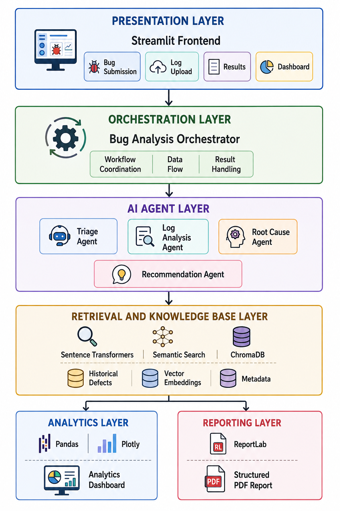
### 3.2 System Workflow

1. The user submits a bug description and optional logs through the Streamlit frontend.
2. The Bug Submission Module forwards this information to the Bug Analysis Orchestrator.
3. The orchestrator invokes the Triage Agent and Log Analysis Agent, which run against the submitted information.
4. Their outputs are passed as context to the Root Cause Agent, which proposes a probable cause, confidence score, and affected component.
5. The orchestrator invokes the Duplicate Detection Agent (similar-bug retrieval), which embeds the current defect and performs a similarity search against ChromaDB to retrieve related historical defects.
6. All prior outputs — triage, log analysis, root cause, and retrieved historical evidence — are passed to the Recommendation Agent, which generates fix suggestions, preventive actions, and best-practice guidance.
7. Results are displayed in the frontend, can be recorded for analytics, exported as a PDF report, and — once a resolution is verified — added back into the knowledge base.

### 3.3 Component Interaction

Each agent operates as an independent, specialised component, but all communication is mediated by the orchestrator: outputs from an earlier stage become contextual input to a later stage (for example, triage and log-analysis results feed the root-cause stage, and root-cause plus retrieved historical evidence feed the recommendation stage). This keeps the agents loosely coupled while still producing a single coordinated diagnosis per bug.

---

## 4. System Design and Components

### 4.1 Streamlit Frontend

The user-facing component of the platform, built with Streamlit. It provides the bug-submission workflow and displays analysis results (severity, priority, business impact, exception type, error message, stack trace summary, root cause, confidence score, affected module, similar historical defects, recommended fixes, preventive actions, and best-practice suggestions). It also provides access to the analytics dashboard, knowledge-base update controls, and PDF report generation. The frontend is a presentation layer only — it does not perform AI reasoning, vector search, or analytics processing itself.

Figure 3 – Streamlit Frontend Interaction Flow

 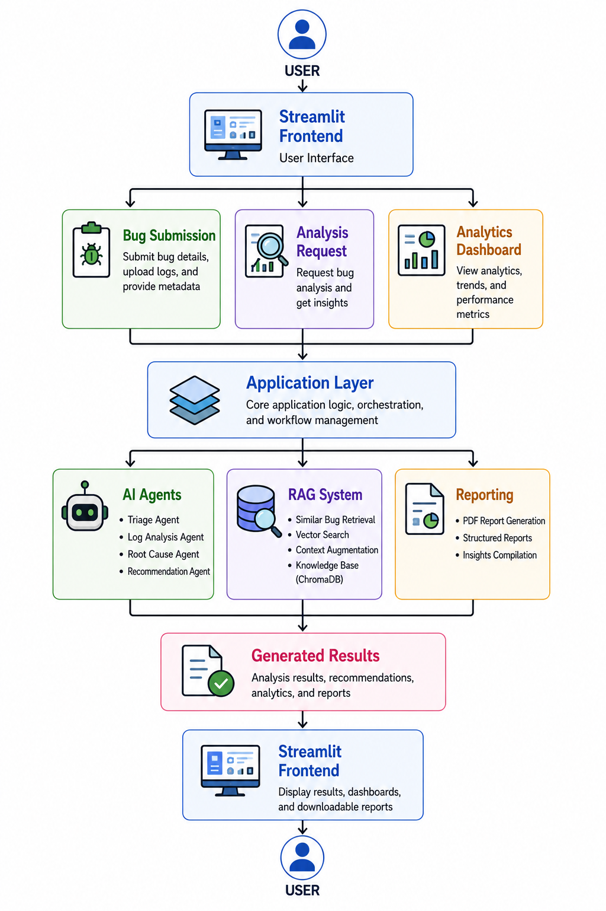

### 4.2 Bug Submission

Collects the information required to start an analysis: a natural-language bug description and, optionally, supporting logs or stack traces. This information is passed to the orchestrator and forms the initial diagnostic context for the rest of the workflow.

[INSERT FIGURE: Bug Submission Workflow]
Figure 4 – Bug Submission Workflow

### 4.3 Bug Analysis Orchestrator

The central coordination component. It receives submitted bug information, invokes the Triage, Log Analysis, Root Cause, Duplicate Detection, and Recommendation agents in sequence, passes contextual information between them, combines their outputs, and supports downstream analytics and report generation.

Figure 5 – Bug Analysis Orchestrator Workflow

 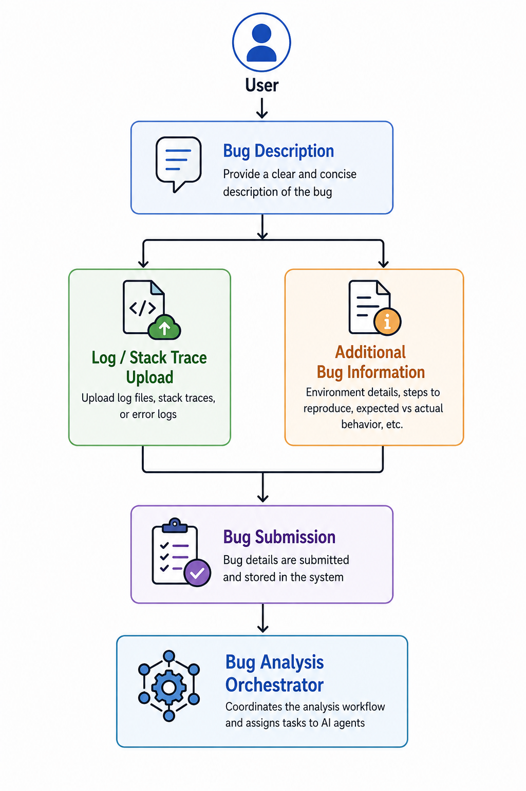

### 4.4 Triage Agent

Performs the initial classification of a submitted defect, producing severity, priority, an estimated business impact, a confidence value, the affected component (where determinable), and the AI's reasoning. This classification is shown to the user and included in the generated report.

Figure 6 – Triage Agent Workflow
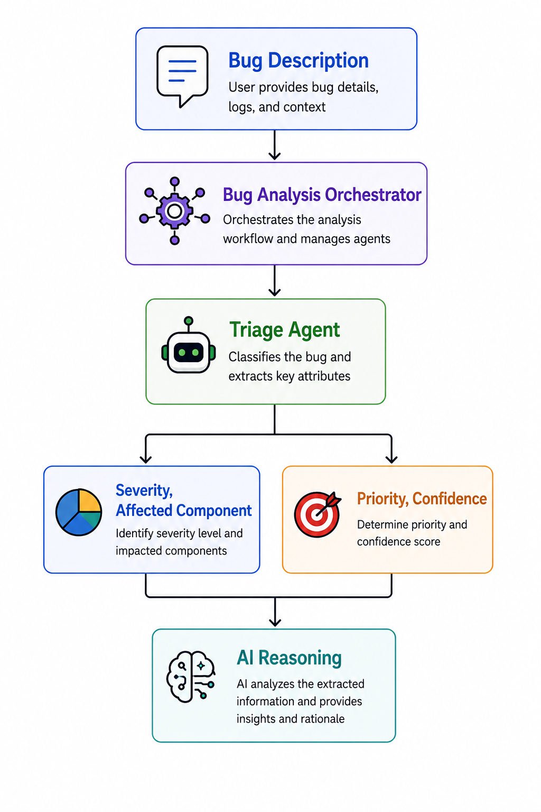

### 4.5 Log Analysis Agent

Extracts technical evidence from uploaded logs and stack traces that may not be captured in the natural-language bug description: exception type, failure point, likely cause, affected part, and a confidence value. Its output feeds the Root Cause Agent.

Figure 7 – Log Analysis Agent Workflow
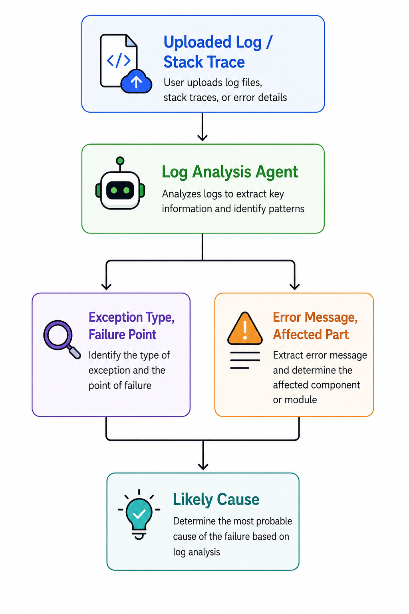

### 4.6 Root Cause Agent

Uses the bug description together with the triage and log-analysis outputs to propose the most probable underlying cause. Outputs include a root-cause hypothesis, confidence score, affected module, technical explanation, and any supporting historical evidence. Because this is an AI-generated hypothesis, it should be reviewed by a developer before being treated as a confirmed cause.

Figure 8 – Root Cause Agent Workflow

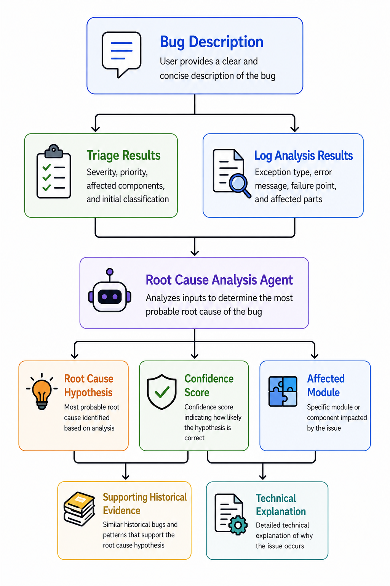

### 4.7 Duplicate Detection Agent (Similar-Bug Retrieval)

Performs semantic similarity search over the historical defect knowledge base stored in ChromaDB, returning historical defect details, a similarity score, and a summary of historical resolutions. This both provides supporting evidence for diagnosis and flags potential duplicates of previously recorded defects. Implementation detail is covered in Section 6.

[INSERT FIGURE: Duplicate Detection / Similar-Bug Retrieval Workflow]
Figure 9 – Duplicate Detection Agent Workflow

### 4.8 Recommendation Agent

Generates AI-assisted remediation guidance using the triage, log-analysis, root-cause, and retrieved historical results. Its output falls into three categories: **recommended fixes**, **preventive actions**, and **best-practice suggestions**. Recommendations are not applied automatically — the final technical decision remains with the developer.

Figure 10 – Recommendation Agent Workflow
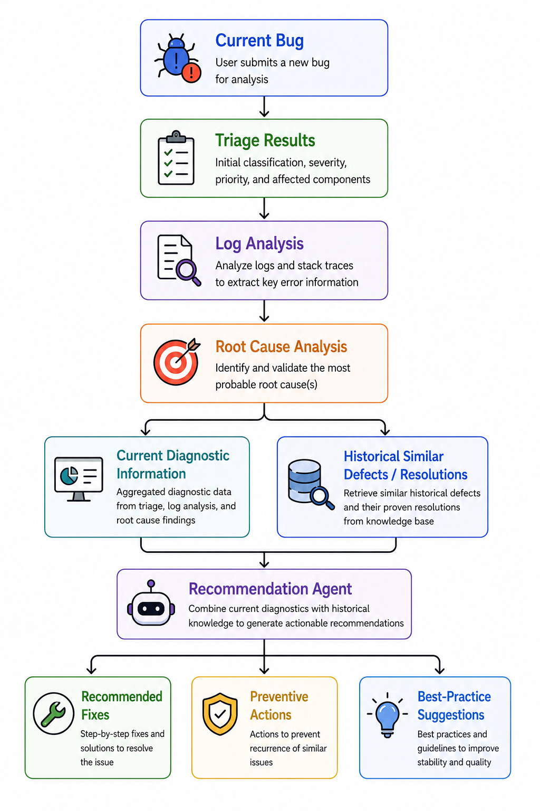

### 4.9 Analytics

Records structured information from completed analyses (exception type, severity, component, root cause, confidence score) and produces severity distributions, affected-component frequency, root-cause pattern trends, and recurring-defect patterns, presented through a dashboard built with Pandas and Plotly.

Figure 11 – Analytics Workflow

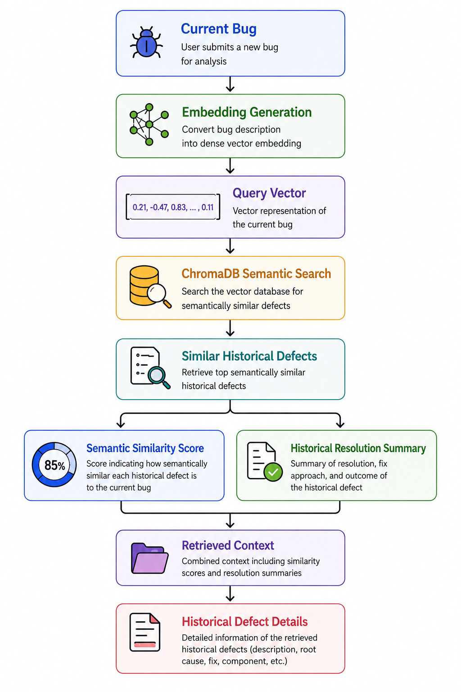
### 4.10 Knowledge Base Growth

After a defect has been analysed and its resolution verified, the defect and resolution information is embedded and stored in ChromaDB, making it available for future semantic retrieval. This creates a feedback loop in which the knowledge base grows as more verified defects are processed.

Figure 12 – Knowledge Base Growth Workflow
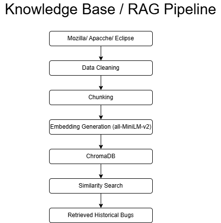 

### 4.11 PDF Report Generation

Converts a completed analysis (bug report, triage, log analysis, root cause, similar historical defects, and recommendations) into a structured PDF document using ReportLab, providing a portable record for technical review, documentation, and defect tracking.

 
Figure 13 – PDF Report Generation Workflow

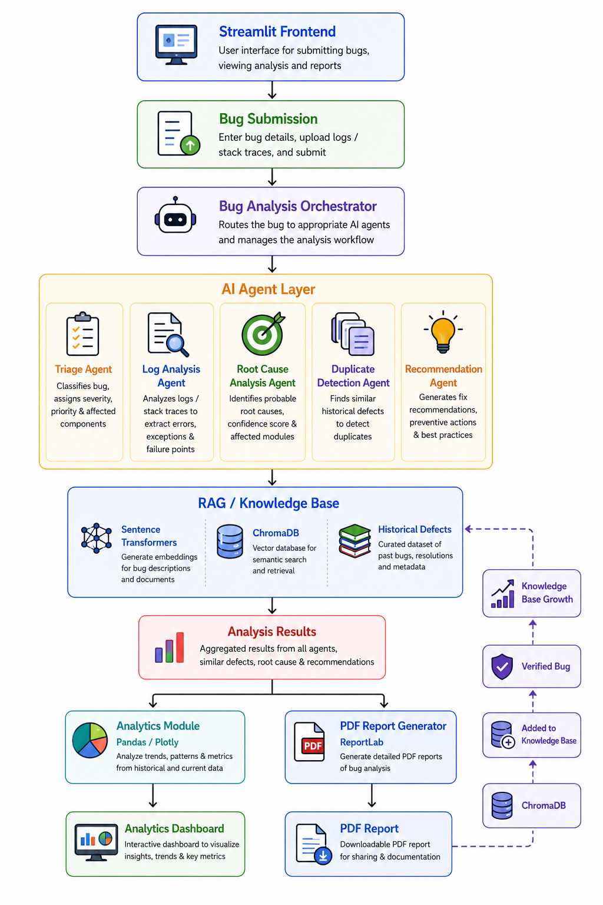 
Figure 14 – Summary of Relationships Between Major System Components

---

## 5. Implementation

### 5.1 Frontend and Submission

The frontend is implemented in Streamlit and provides the controls for bug submission, log upload, analysis execution, and result review across all downstream stages (triage, log analysis, root cause, similar bugs, recommendations, analytics, PDF generation, and knowledge-base updates). The Bug Submission implementation preserves the submitted description and any supporting logs so they can be passed consistently to the orchestrator.

### 5.2 Multi-Agent Orchestration

The orchestrator implements the control flow that chains the Triage, Log Analysis, Root Cause, Duplicate Detection, and Recommendation agents, passing each stage's output as context to the next (component responsibilities and outputs are described in Section 4). This keeps each agent's responsibility isolated while still producing one coordinated result per bug.

- **Triage stage:** invoked first, on the bug description alone (see §4.4).
- **Log Analysis stage:** invoked in independently with triage, on any uploaded logs/stack traces; contributes less evidence when no logs are supplied (see §4.5).
- **Root Cause stage:** invoked with the bug description plus the triage and log-analysis outputs as context (see §4.6). Its confidence value is an AI-generated assessment, not a guarantee of correctness.
- **Duplicate Detection stage:** invoked using the embedding and vector-retrieval pipeline described in Section 6; its retrieved evidence is passed to both the Recommendation Agent and the results interface (see §4.7).
- **Recommendation stage:** invoked last, using all prior stage outputs as context (see §4.8).

Figure 15 – Multi-Agent Orchestration Sequence

 

### 5.3 Analytics Implementation

Analytics processing uses Pandas to organise the structured output of completed analyses and Plotly to visualise it, allowing users to review defect trends across multiple analyses rather than one bug at a time.

### 5.4 Knowledge Base Growth Implementation

Once a resolution is verified, the relevant defect information is embedded and stored in ChromaDB alongside its metadata, becoming available to future similarity searches. This implements the feedback loop described in Section 4.10.

### 5.5 PDF Report Implementation

The reporting component is invoked once the analysis pipeline has produced results and uses ReportLab to assemble them into a document. It performs formatting and presentation only — it does not perform any of the underlying diagnosis.

### 5.6 Error Handling

The platform includes error handling around the components most likely to encounter runtime or external-service failures: file uploads, AI model access, embedding generation, ChromaDB operations, data processing, and PDF generation. Input is validated before operations that depend on it. AI-model failures, retrieval failures, file-processing failures, and PDF-generation failures are each handled so that a failure in one stage does not silently propagate misleading output to the user, and so that the underlying cause of a failure can be more easily identified during testing and maintenance.

---

## 6. RAG and Knowledge Base

### 6.1 Historical Defect Knowledge Base

The knowledge base preserves information from previously recorded software defects — description, error message, exception information, affected component, severity, root cause, and resolution — so that it can be retrieved as supporting evidence for new defects. It is the persistent source of historical context for the RAG pipeline.

### 6.2 Document Processing and Embedding Generation

Before retrieval is possible, each historical defect is prepared as a structured textual representation combining its description, exception information, affected component, root cause, and resolution. This text is converted into a numerical vector using a Sentence Transformer embedding model — the same embedding process used for newly submitted bugs, so that both are represented in the same vector space.

### 6.3 Vector Storage and Similarity Search

Embeddings and their associated metadata are stored in **ChromaDB**. When a new bug is submitted, it is converted into a query embedding, which ChromaDB compares against the stored vectors to return the most similar historical records. Because this is a semantic comparison rather than exact text matching, defects with related underlying problems can be retrieved even when described with different wording.

### 6.4 Similarity Scoring and Retrieval

Retrieved defects are ranked by similarity score, which measures semantic relatedness rather than confirming an identical root cause — two defects can be described similarly while requiring different fixes. Retrieved records (bug description, exception information, affected component, previous root cause, resolution, and similarity score) are supplied to the Recommendation Agent and support the platform's duplicate-detection function.

Figure 16 – RAG End-to-End Retrieval Pipeline (Embedding → Vector Search → Historical Evidence Retrieval)

### 6.5 Knowledge Base Growth and Validation

Once a defect's resolution has been verified, it is embedded and added to the ChromaDB collection, becoming retrievable for future analyses. Validating this end-to-end requires confirming that: the record is accepted and embedded; it is stored in ChromaDB; a related bug submitted afterward returns it during similarity search; and the retrieved information matches the stored record. This validation is described further in Section 7.

---

## 7. Testing and Validation

### 7.1 Testing Strategy

Because the platform combines a Streamlit frontend, orchestration logic, multiple AI agents, RAG-based retrieval, analytics, knowledge-base growth, and PDF reporting, testing is performed at multiple levels: unit, component, integration, and end-to-end. Where AI-generated results are involved, testing verifies that the system produces a valid, well-formed result — not that the AI-generated diagnosis is necessarily technically correct.

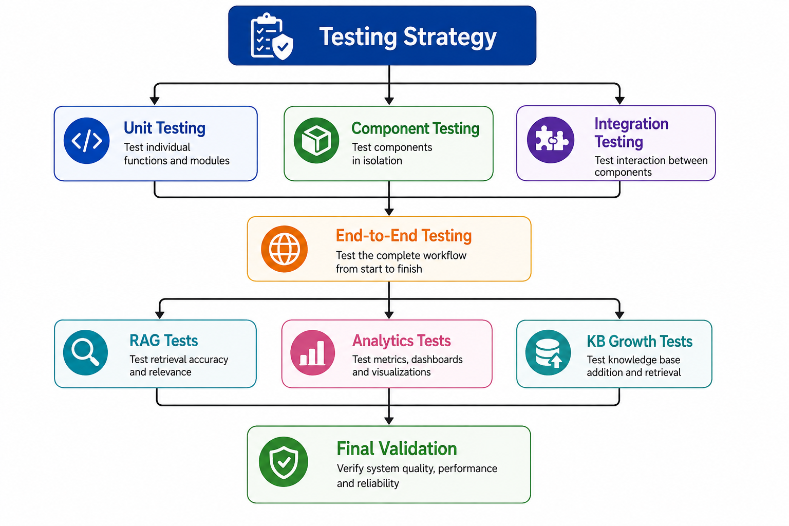 
Figure 17 – Overall Testing Approach Across Levels

### 7.2 Test Environment

Testing was performed against the configured application stack described in Section 2: the Python/Streamlit application, the configured AI model, the Sentence Transformer embedding model, and the ChromaDB vector store. Test cases assume this environment is correctly configured before execution.

### 7.3 Test Levels

- **Unit testing** covers individual functions — input processing, data preparation, embedding preparation, similarity-result handling, analytics calculations, PDF content preparation, and error-handling functions.
- **Component testing** covers each major component independently: the Streamlit frontend, Bug Submission Module, Orchestrator, each agent, the RAG retrieval component, the Analytics Module, the Knowledge Base Growth Module, and the PDF Report Generator.
- **Integration testing** verifies the handoffs between components — frontend to orchestrator, orchestrator to agents, analysis to RAG, RAG to recommendation, analysis to analytics, analysis to PDF generation, and knowledge base to RAG.
- **End-to-end testing** validates the complete workflow from user submission to final displayed results, including that a failure at one stage is handled without producing misleading output.

### 7.4 Test Cases

| ID | Test Case | Expected Result |
|---|---|---|
| TC-01 | Application startup | Streamlit interface loads and is accessible |
| TC-02 | Bug submission | Bug information is accepted and analysis can be initiated |
| TC-03 | Log upload | Log/stack trace is accepted and available to the Log Analysis stage |
| TC-04 | Triage analysis | Severity, priority, and business impact are produced |
| TC-05 | Log analysis | Exception type, error message, and stack trace interpretation are produced |
| TC-06 | Root cause analysis | Probable root cause, confidence, and affected component are returned |
| TC-07 | Similar bug retrieval | Relevant historical defect(s) are retrieved for a related new bug |
| TC-08 | Recommendation generation | Recommended fixes, preventive actions, and best-practice suggestions are returned |
| TC-09 | Analytics dashboard | Severity, component, root-cause, and recurring-pattern analysis are displayed |
| TC-10 | PDF report generation | PDF is generated and contains the expected analysis sections |
| TC-11 | Knowledge base update | A verified resolved defect is embedded and stored in ChromaDB |
| TC-12 | Knowledge base retrieval | A newly stored defect is returned by a subsequent related-bug search |

**Bug submission**
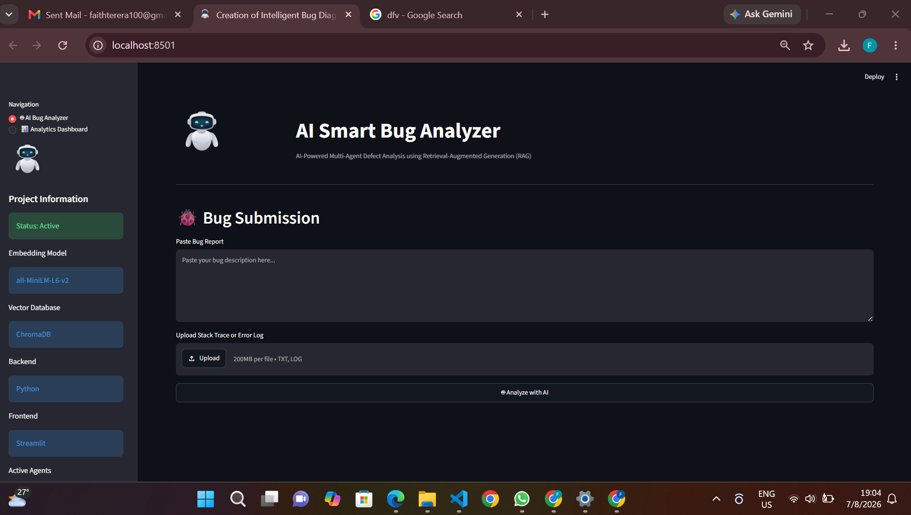 

**Triage analysis**
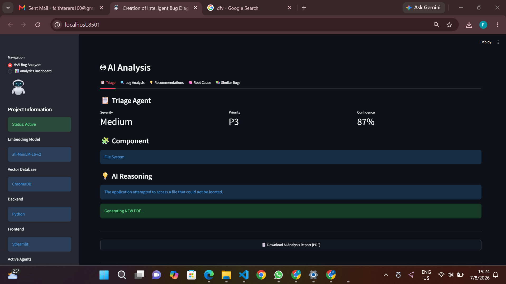 

**Log analysis**
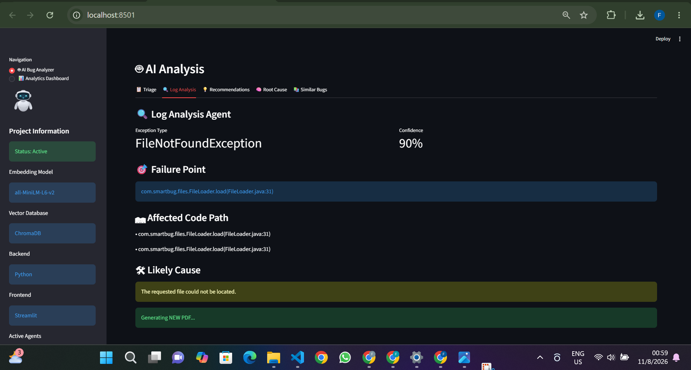 

**Root cause analysis**
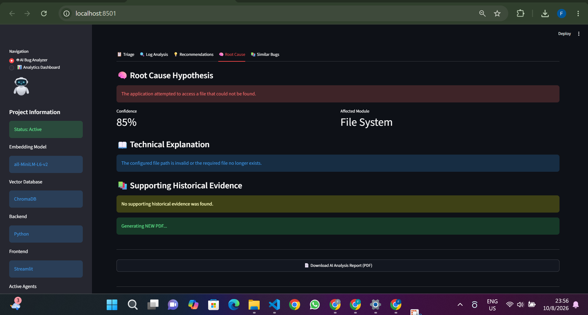 

**Similar bug retrieval**
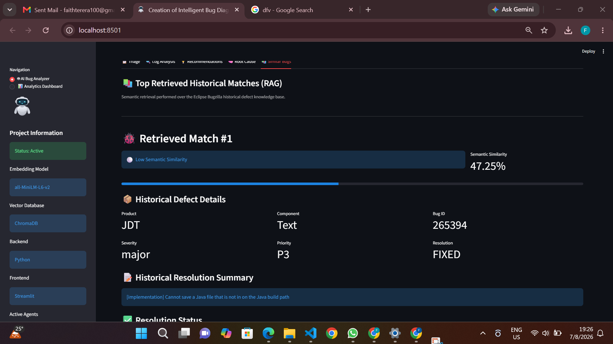 

**Recommendation generation**
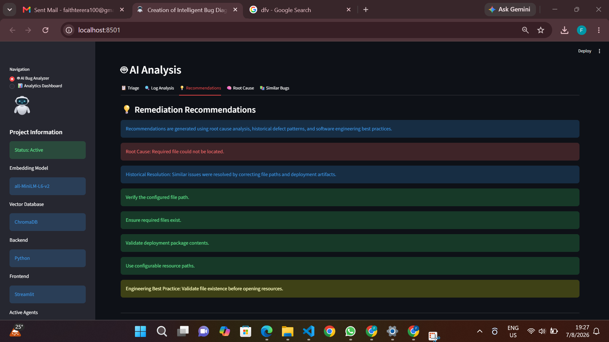 

**Analytics dashboard**
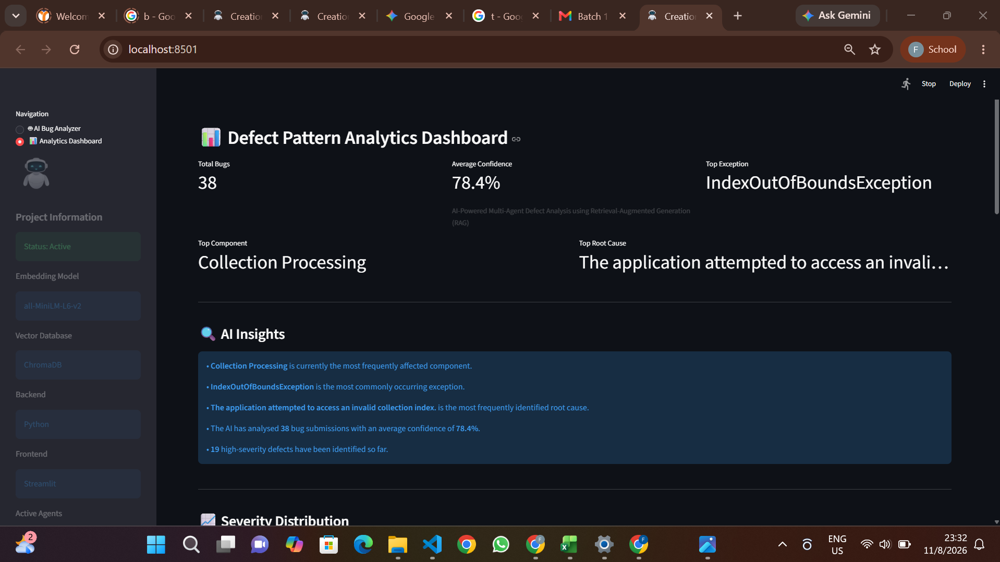 

**Pdf generation**
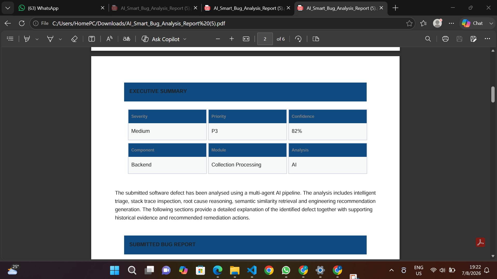 

**Knowledge base update**
 

### 7.5 Knowledge Base Growth Validation

This validation traces the full cycle from a verified resolved defect being added to the knowledge base through to its retrieval by a later, related submission: the record is accepted, embedded, and stored; the vector store remains accessible after the update; a related test bug can subsequently be submitted, converted into a query, and matched against the newly stored record via semantic search; and the retrieved information corresponds to the correct historical record. A successful result confirms that Knowledge Base Growth is correctly integrated with the RAG retrieval pipeline.

---

## 8. Results and Discussion

The platform was exercised across the workflow described in Sections 4–6: bug submission, triage, log analysis, root cause generation, RAG-based similar-bug retrieval, recommendation generation, analytics, knowledge-base growth, and PDF report generation. Each stage produced output in the structure described for it — for example, the Triage Agent returned severity/priority/business-impact classifications, the Root Cause Agent returned a probable cause with a confidence score and affected module, and the Duplicate Detection Agent returned semantically related historical defects with similarity scores.

The source project documentation records the intended test cases and their expected results (Section 7.4), but does not retain numerical pass/fail outcomes, timing figures, or retrieval-accuracy metrics from an executed test run. Consistent with the instruction not to invent metrics, no quantitative performance figures are reported here; an actual-result/status column should be added to the test-case table and completed from execution records if a formal results appendix is required.

Qualitatively, the architecture is designed so that:

- The multi-agent pipeline correctly threads context from one stage to the next (triage and log-analysis output inform root-cause analysis; root cause and retrieved historical evidence inform recommendations).
- The RAG pipeline is capable of semantic (non-exact-text) matching between a new bug and historical defects, and of returning that evidence to both the recommendation stage and the user interface.
- Knowledge Base Growth closes the loop between a verified resolution and future retrievability of that resolution.
- Analytics and PDF reporting both operate on the structured output of the analysis stages rather than performing diagnosis themselves.

Retrieval quality, recommendation usefulness, and analytics insight are all directly dependent on the size and quality of the historical defect dataset available at the time of use — a small or narrow dataset will yield correspondingly limited retrieval and pattern results (see Section 9).

---

## 9. Limitations and Future Work

### 9.1 Current Limitations

The platform is an AI-assisted diagnostic tool, not a fully autonomous debugging system. Its outputs depend on the quality of the submitted bug description and logs, the available historical dataset, and the configured AI and embedding models. Human review of AI-generated root causes, recommendations, and retrieved historical matches remains necessary before any of them are treated as confirmed.

### 9.2 Technical Limitations

- **AI service dependency** — triage, log analysis, root cause, and recommendation stages depend on the configured AI model being available and correctly configured; an unavailable or misconfigured model can cause the corresponding stage to fail or produce incomplete results.
- **Processing time** — the multi-stage, multi-agent architecture (model calls, embedding generation, vector search) introduces more latency than a deterministic rule-based system.
- **Local scalability** — the current architecture is intended to demonstrate the workflow rather than to support production-scale concurrent usage, authentication, access control, or distributed processing.
- **Vector store dependency** — RAG retrieval depends on ChromaDB's correct operation and persistence; loss or misconfiguration of the vector store reduces the historical context available for diagnosis.

### 9.3 Dataset Limitations

Retrieval and analytics quality are both bounded by the historical dataset. A small or incomplete dataset can return no relevant result, weakly related results, or results from an unrelated technical context; the absence of a retrieved match does not prove that no similar defect has occurred, only that it is not represented in the current knowledge base. Incomplete historical records (missing root cause, resolution, or affected-component information) reduce the usefulness of future retrieval, so well-structured, verified records should be preferred when growing the knowledge base.

### 9.4 AI / Model Limitations

- **Triage** — severity/priority/business-impact assessments may not match an experienced team's judgement, since these can depend on project-specific context.
- **Log analysis** — quality depends entirely on the completeness of the submitted logs.
- **Root cause** — the agent identifies a *probable* cause, not a proven one; a high confidence score is not a guarantee of correctness.
- **Recommendations** — plausible but not automatically validated; a recommended fix must still be reviewed for technical correctness, compatibility, security, performance, and side effects before use.
- **Embedding/retrieval** — semantic similarity indicates relatedness, not identical root cause; two defects can be described similarly while needing different fixes, so retrieval should be treated as supporting evidence rather than a definitive diagnosis.

### 9.5 Future Enhancements

- Larger and higher-quality historical defect datasets, with additional validation before a defect is added to the knowledge base (to reduce duplicate, incomplete, or low-quality records).
- Improved RAG retrieval — combining semantic similarity with additional filtering signals.
- Formal evaluation metrics for the AI and RAG components (e.g., triage classification accuracy, root-cause agreement with verified diagnoses, retrieval relevance, false-positive retrieval rate, end-to-end success rate).
- Expanded analytics (defect trends over time, component-level severity trends, resolution frequency, defect ageing).
- Integration with external issue-tracking/defect-management systems to reduce manual data entry.
- UI improvements — better progress indicators, more detailed retrieval explanations, interactive analytics filters, and knowledge-base management controls.
- Production-oriented deployment — separating the application into independently scalable, monitored services, with proper authentication and access control.

These are intended to extend the current system rather than change its core design: the combination of multi-agent analysis, retrieval-augmented generation, analytics, reporting, and knowledge-base growth is retained as the foundation for future work.

---

## 10. Conclusion

The Intelligent Bug Diagnosis Platform implements an end-to-end, AI-assisted workflow for software defect analysis: a Streamlit frontend for submission and review; an orchestrator that coordinates specialised Triage, Log Analysis, Root Cause, Duplicate Detection, and Recommendation agents; a RAG pipeline built on Sentence Transformer embeddings and ChromaDB for historical similar-bug retrieval; a Pandas/Plotly analytics dashboard for defect-pattern analysis; a Knowledge Base Growth mechanism that lets verified resolutions expand the historical dataset; and a ReportLab-based PDF report generator.

The system was designed, implemented, and exercised against defined test cases covering each component and the integration paths between them. It functions as a decision-support platform: it surfaces structured diagnostic information, historical context, and candidate fixes for a developer to review, rather than autonomously diagnosing or repairing software. Its effectiveness in practice depends on the quality of submitted evidence and the size and quality of its historical knowledge base — both identified as the platform's primary current limitations and its clearest directions for future improvement.

---

## 11. References

1. Python Software Foundation. *Python Documentation.* https://docs.python.org/3/
2. Streamlit. *Streamlit Documentation.* https://docs.streamlit.io/
3. Chroma. *Chroma Documentation.* https://docs.trychroma.com/
4. Hugging Face. *Sentence Transformers Documentation.* https://www.sbert.net/
5. Meta AI. *Llama Documentation.* https://www.llama.com/
6. Ollama. *Ollama Documentation.* https://docs.ollama.com/
7. Pandas. *Pandas Documentation.* https://pandas.pydata.org/docs/
8. NumPy. *NumPy Documentation.* https://numpy.org/doc/
9. Plotly. *Plotly Python Documentation.* https://plotly.com/python/
10. ReportLab. *ReportLab Documentation.* https://docs.reportlab.com/
